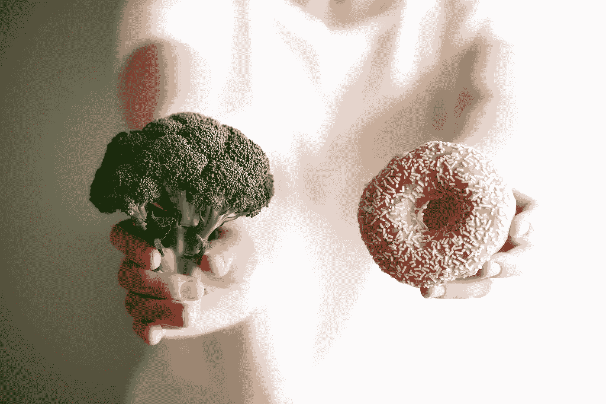

# 3 又 1/2 个策略将帮助你掌握每一个生活方式的改变

> 原文：<https://medium.com/swlh/3-and-1-2-strategies-that-will-help-you-to-master-every-lifestyle-change-12623356ece5>

我认为，当谈到更健康的生活或改变你的身体时，行为改变是最关键的因素。为什么？我们大多数人都知道蔬菜比冰淇淋更健康，运动比看《网飞》燃烧更多的脂肪。但是你猜怎么着？我们大多数人仍然选择不健康的食物，或者躺在沙发上休息，而不是去健身房…