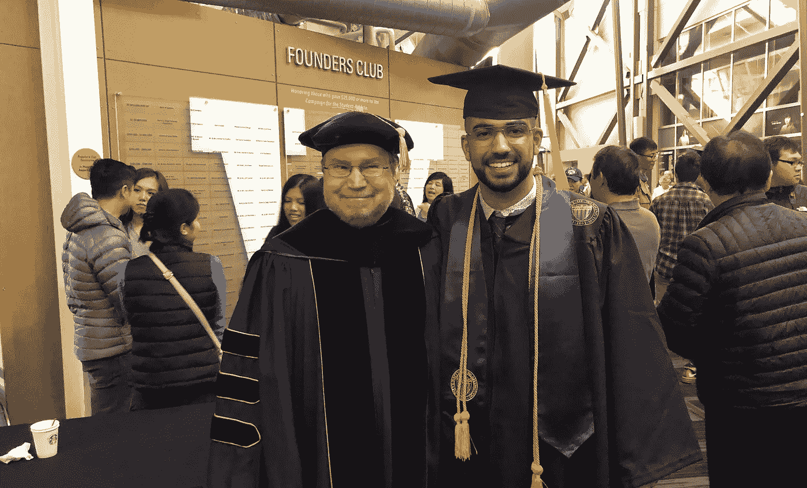

# 让我准备在大学创业的 3 个重要教训

> 原文：<https://medium.com/swlh/3-important-lessons-that-prepared-me-to-run-a-startup-in-college-802d8d046e54>

我叫 Amin Shaykho，2018 年春天毕业于华盛顿大学西雅图分校。在我的大学旅程中，我创办了多家公司和俱乐部，这不仅让我成为了一名更好的领导者，也影响了许多人的生活。

我最著名的创业项目之一是一个名为 Kadama 的应用程序，它获得了数千名用户，有一个由 12 名实习生组成的实习计划，在多个出版物上出现，获得了 200，000+社交媒体浏览量，1，500+社交媒体关注者，App Store 上的 100+评论，并通过它与我们社区中的组织(如微软)建立了多种关系，所有这些都是在推出几个月内完成的。

我想分享三个重要的经验，它们帮助我在大学做全职学生时创建并平衡了我的公司和俱乐部。

# **将自己推出舒适区**

在大学期间，当我接触一些东西时，99%的时间我都不知道自己在做什么。在那一刻，我从来不明白为什么这是一件好事。事实上，我认为我变笨了，因为在高中我得了 4.0 分，并且知道自己在做什么。我参加了高中足球队，并加入了几个俱乐部。然而，我不知道我想成为什么，对任何事情都没有热情。我如此舒适地过着普通的生活，以至于我从来不去探索我周围不同的活动。当我在高中期间开始参加大学课程时，我开始看到将自己推出舒适区的价值，通过一个名为 Running Start 的项目，我在大学度过了高中的低年级和高年级。我想你现在开始把点点滴滴联系起来了——我的傲慢导致了探索的缺乏，我擅长于我正在做的几件事情。然后，当我在大学的环境突然改变时，我意识到我有太多东西要学。虽然我在大学里上的课非常丰富和重要，但真正塑造我生活的是我在课堂外与其他学生和工作人员的经历。我见证了与来自世界各地不同文化的人一起工作的好处。我学会了倾听每个人的心声——因为我周围的每个人至少在一件事上都比我强。我意识到人际关系网和好奇心是推动我走出舒适区并成长的动力。最后，我建立了许多关系，这些关系塑造了我，并有助于我的职业发展。最重要的是，我认识到当我做新的事情时，我会受到挑战。我越是把自己推到舒适区之外，我就会在不同的领域获得更多的知识。如果我没有在 16 岁时做出那个挑战性的决定开始我的大学之旅，这一切都不会发生。然而，我不知道从 16 岁到 18 岁，我将学到我人生中最重要的一些课程，这些课程将为我人生中最美好的 2018 年做准备。

# **力求有所作为**

上大学几个月后，我开始注意到自己长得有多快。不是只有一件事决定了我将成为什么样的人。这是我遇到的多种经历和人的结合。比如一些经历让我更有同情心。结果，我开始帮助非营利组织。我花了数百个小时为青年之友、贝塔社、荣誉社、钥匙社、柯克兰公园和娱乐等组织做志愿者。我不知道这会给我带来什么好处，但我尽了最大的努力，并带着改变现状的意图去做。其他课外活动，如兼职项目和在科技公司实习，帮助我发现了自己的兴趣。所有这些经历一起开始塑造我的梦想。我想成为一个利用技术帮助全世界人民的组织的领导者。尽管我当时没有意识到，但事实证明我已经开始为我的梦想而努力了。我所做的所有志愿者工作都向我展示了站在他人立场上的感受。我正在成为一名更好的团队成员，并向与我合作的人学习。参与所有这些不同的组织使我变得全面。最重要的是，我亲眼目睹了我给周围社区带来的变化。最终，通过参与这些组织，我开始对自己创办一家感兴趣。所以，我这么做了。在我高中的最后一年，我成立了一个名为 Code for Care 的俱乐部，在那里我们开发移动应用程序来帮助那些需要帮助的人。我把这个俱乐部发展到 20 个成员，我们一起致力于使用技术来帮助我们社区的人们。领导这个俱乐部基本上是我小规模的梦想。此刻，我绝不会想到，我所做的志愿工作帮助我理解了弱势群体所面临的困境，这让我更容易创造出符合他们需求的产品。

# **以开放的心态对待一切**

那是我高中最后一年，我刚刚接受了华盛顿大学保罗·艾伦计算机科学学院的邀请。在这一点上，当我准备毕业时，一切都开始慢下来。当我回顾这两年的生活时，我可以自信地说，我想要有所作为的动力和走出舒适区的步伐将我推向了新的高度。然而，如果头脑清醒，这一切都不会发生。我绝不会这么早就离开我的舒适区。我绝不会花费数百小时去做志愿者。我永远也不会建立必要的关系来获得实习机会。我永远不会发现我对技术、领导力和帮助他人的热情。我仍然不知道我想做什么。

高中毕业后一个月我就要跳楼了。到目前为止，我所做的一切都是为这一刻做准备。我在过去两年中积累的肾上腺素，我学到的东西，以及所有的想法都激励我去创造一些可以有所作为的东西。我遇到了我的朋友 Marwan El-Rukby 和兄弟 Dani Shaykho，并讨论了可能的商业想法。我将跳过本文中的许多细节，但我们最终意识到，对一个平台的巨大需求是，让消费者更容易地请求服务，为服务提供商打开一个新的市场以获得客户，并允许无法从事传统工作的人赚钱。这变成了一个名为 Kadama 的应用程序，现在正在影响成千上万人的生活。Kadama 于 2018 年正式推出，现在正在为许多人提供机会，如需要兼职的单亲父母或需要支付学费的大学生。这对双方来说都是一个胜利，一方是自由的，另一方是与工作相匹配的。

现在，说了这么多，我想说失败没什么，这是你下次面对挑战时学习和变得更强大的方式。其实大学就是失败还好的地方，只要你爬起来再努力。在你需要的时候会有那么多人在你身边帮助你。当你专注于变得全面发展时，你不仅会找到你的激情，还会在许多不同的领域获得经验。我会鼓励每一个有梦想的人问自己，“这是我能看到自己余生都在做的事情吗？”如果你能真诚地回答是，那就去做吧。剩下的就是努力和克服逆境。

如果你有兴趣阅读更多的文章，请随时关注我。你也可以在 Instagram 和 Twitter @ aminshaykho 上找到我。要了解更多关于卡达马的信息，请访问 www.kadama.com。

 [## 卡达马-请求你附近的服务-通过做任务赚钱

### 省钱。赚钱。简单。Kadama 是最简单的方式来要求和执行服务，如辅导，家务…

www.kadama.com](https://www.kadama.com)  [## 两个东区的朋友开发一个服务提供商应用程序

### Amin Shaykho 和 Marwan El-Rukby 开发了一个名为 Kadama 的本地创业公司。老朋友阿明·夏科和马尔万…

www.bellevuereporter.com](http://www.bellevuereporter.com/life/two-eastside-friends-develop-a-service-provider-application/)  [## Kadama，一个帮助破产大学生的应用程序

### UW 西雅图新闻实验室两位华盛顿大学的学生开发了一款名为…

www.nwnews.com](http://www.nwnews.com/index.php/news-features/features/16773-kadama-an-app-to-help-the-broke-college-student)  [## Amin Shaykho(@ aminshaykho)* insta gram 照片和视频

### 1，974 名关注者，550 名关注者，5 篇帖子-参见来自 Amin Shaykho (@aminshaykho)的 Instagram 照片和视频

www.instagram.com](https://www.instagram.com/aminshaykho)