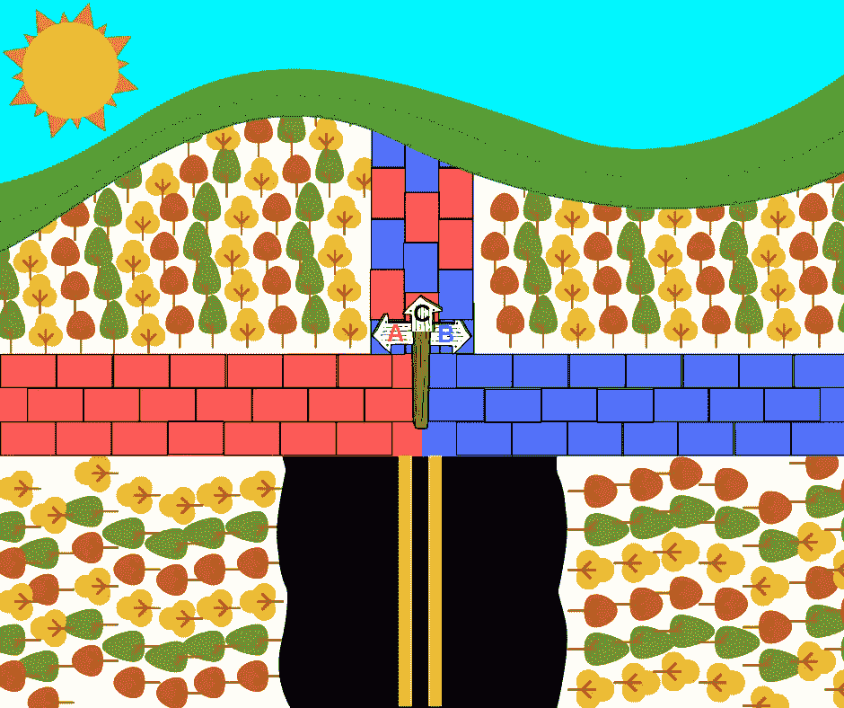

# 改善决策的 3 个强大框架

> 原文：<https://medium.com/swlh/3-powerful-frameworks-for-improving-your-decisionmaking-2249e383f55a>

Illustration by author.

我的迈尔斯-布里格斯类型指标显示我是一个 ENTP — [“辩论者”](https://www.16personalities.com/entp-personality)。

> ENTP 人格类型是终极的魔鬼代言人，在粉碎争论和信仰的过程中茁壮成长，让丝带在风中飘动让所有人看到。不像他们更坚定的判断(J)同行，ENTPs 不这样做，因为他们试图实现一些更深层次的…