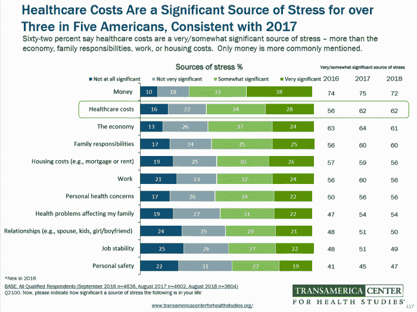

# 3 个迹象表明你的保险代理人重视你

> 原文：<https://medium.com/swlh/3-signs-your-insurance-agent-values-you-672759585585>

**一个好的倾听者:**

当你四处购买健康保险时，你希望你的代理人能听到你所说的过去的病史。我们都听说过，美国破产的头号原因是由于[医疗费用](https://ajph.aphapublications.org/doi/10.2105/AJPH.2018.304901?eType=EmailBlastContent&amp;eId=a5697b7e-8ffc-4373-b9d2-3eb745d9debb&amp;)。所以，在与你沟通时，你的代理需要遵守 75%倾听，25%交谈的原则。最重要的是，你的代理人问正确的问题，以涵盖所有潜在的暴露点。当保险代理人问你深思熟虑的问题并关注你的回答时，你会知道他们重视你。在众多运营商中精确定位一个计划需要高超的倾听技巧。您的代理人有责任确保，如果您确实发生了意外，您所拥有的保险将会减轻您的家人的最大自付费用风险。

**清晰与知识:**

重视你的保险代理人会掌握他们的产品知识，因为他们知道对客户的信托责任。有代理人的目的是让他们清楚简明地解释你的政策选择。作为一个潜在的客户，如果有什么困惑的地方，一定要问问题。重视你的代理人会非常乐意给你你想要的答案。如果不是，他们很可能更担心销售而不是你的需求。无论健康保险的预算是多少，一个有见识的代理人应该为你找到某种形式的保险。他们在解释你的政策选择时态度真诚。如果你正在和一个不愿花时间亲自帮助你的代理人谈话；他们的知识是有限的，最有可能是佣金思想。

此外，你可能想询问寻找一个独立的经纪人。这些代理人与数十家保险公司签约，可以根据您的需求而不是某家公司的产品来制定保单选项。以这种方式，你通过选项和选择有更大的清晰度。以这些方式提供价值的代理是友好的，不好斗的，并且致力于帮助你。

**保持连接:**

如果你的代理人符合以上两个标准，保留他们是一个很好的主意。他们现在知道了你的病史，你们已经建立了相互信任和理解。重视这种长期关系的代理将全年定期联系您。他们的目的应该是审查政策，并在必要时进行调整。您的代理应该想知道保单是否提供了价值。这也是你提问的好时机。

此外，如果您目前有一个代理人向您签发了一份保单，但此后没有联系过您；你可能想要接触或者考虑找一个新的代理人。这听起来可能很自私，但你必须为你的家人着想，让他们安心。保险经纪人有很多，但你们只有一个。与你的经纪人交谈时，要放慢速度，花些时间。确保他们展示了上面列出的价值观，你会对成为他们终身客户的决定更有信心。