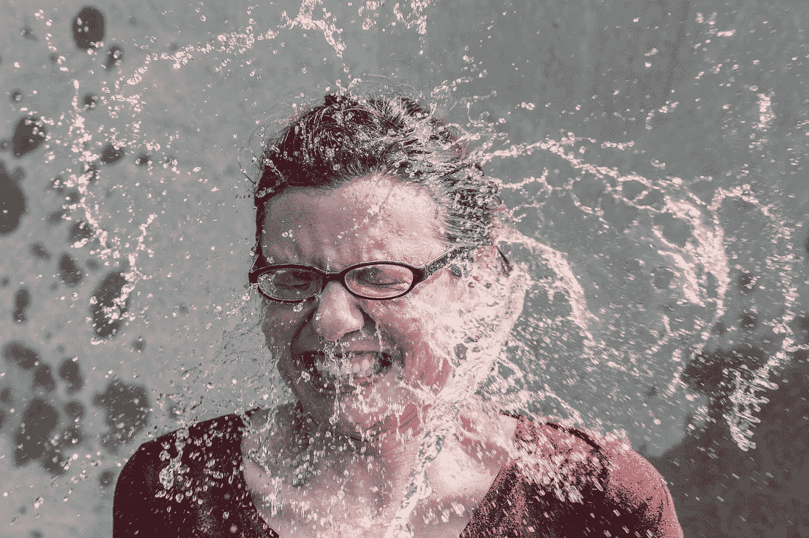

# 3 个让你痛苦的愚蠢的自我意识错误

> 原文：<https://medium.com/swlh/3-silly-self-awareness-mistakes-that-make-you-miserable-86913398b022>

自我意识的技巧就像开车一样。每个人都认为自己很擅长。

但是自我意识是一把双刃剑。它可以给你在生活中出类拔萃所需的洞察力，也可以让你痛苦。

根据《洞察》一书的作者塔莎·欧里奇的说法，大多数人认为他们有自我意识，但只有 10-15%的人符合标准。

毕竟没有自我意识医生告诉你有多自我意识。

首先，我们先明确什么是自我意识。

# 自我意识的定义(简单来说)

> 自我意识是了解自己的能力，以及你对他人的影响。随着自我意识的增强，你可以识别自己的优势和劣势，更好地评估自己的想法和情绪。

变得有自我意识听起来可能很简单，但这要复杂得多，也是一项很难掌握的技能。所以现在我有好消息和坏消息要告诉你。

> **好消息:**自我意识是一项可以发展的技能。在这篇文章的最后，你会知道如何建立自我意识技能。
> 
> **坏消息:**变得有自知之明有正确和错误之分。所以我也将分解人们在练习自我意识时犯的最大错误。

但是在我开始之前，你可能会想——“为什么我要关心变得更有自我意识？”。这就是为什么自我意识很重要:

# 自我意识的 5 大好处

> “当我发现我是谁时，我就自由了。”—拉尔夫·埃利森

# 1.增加自知力

当你了解自己的时候，你就能根据什么对你重要，你是谁，你想成为什么样的人，做出更好的决定。所以你最终会减少在地球上浪费的时间。

# 2.准确的自我评估

你更好地了解自己的优势和劣势，这样你就可以利用它们在生活和事业中取得成功。你也能更好地利用反馈和生活经验来改进你犯的每一个错误。

# 3.自信心增强

自信来自于对自己的清晰。当你不知道你是谁，你代表什么时，你在自卑和不自信中度过一生。

# 4.更多的情感意识(和快乐)

当你了解自己的情绪模式时，你就能更好地处理它们。当你理解和管理情绪对你的影响时，你利用你的情绪。

# 5.更好的关系

自我意识导致和别人的关系更好，和自己的关系也更好。人际关系是生活的关键，缺乏自我意识会把它们变成灾难。

既然你已经理解了自我意识的价值，那就让我们直接进入自我意识中要避免的错误:

# 3 个最大的自我认知错误

## 错误 1:你认为你有自我意识

是的，我说的就是你。你——阅读(或浏览)这篇文章。

让我们假设你是 10 %- 15%非常有自知之明的人之一。但这就结束了吗？当然不是。

自我意识是一项需要多年练习的技能，你永远无法停止变得更加自我意识，因为这是一个持续的过程。

但是如果没有人告诉你你做得对不对，那么你永远也不会知道你练习的方法对不对。

介绍约哈里自我意识窗口模型:

大多数人都在围绕着*竞技场*和*门面*打转。同时，我们忽略*盲点*和*未知*区域。

当你隐藏太多自己的时候，你会变得很痛苦。而且也没有揭开你的*盲点*。

解决办法？

> 与他人分享你自己，并不断寻求更多的反馈。

我的意思是。

与他人分享你自己会导致自我意识和发现，因为它会从未知的领域增加你的竞技场。获得反馈有助于你把你的*盲点*变成你的*竞技场*。

> **外卖:**你需要推你的*竞技场*，这样会占用更多空间。为了做到这一点，a)通过获得反馈来消除盲点 b)自信地展示你隐藏的自我 c)以正确的方式练习自我意识。

说到“正确的方法”…

## 错误 2:把自我反省作为变得更有自知之明的唯一方法

你认为如果你不停地问自己为什么，你会得到你想要的答案吗？

事实是:多问*为什么*不会给你更多的新知识。

结果是:你最终得到一个错误的答案，或者你停留在自省模式中，没有得到有用的洞察力。

更糟糕的是，内省可能会让你陷入自我强迫思维的恶性循环(沉思)，或者你可能会沉迷于寻找“真相”的重复性思维。

它是这样工作的:

有两种类型的自我意识——*内在自我意识*是关于我们如何看待自己，而*外在自我意识*是关于别人如何看待我们。你需要两者都成为真正的自我意识。

你是怎么做到的？

> 停止问“*为什么”*开始问“*什么”*。

比如:而不是问“我为什么讨厌我的工作？”或者“为什么这段感情没有结果？”，问“我不喜欢我工作的什么？”以及“在这段关系中什么是行不通的？”

*为什么*会导致肤浅的合理化，只支持或否认你已经相信的东西，而*什么*会把你引向具体的新信息，这些信息可能会帮助你识别你的行为模式、你的性格特征等。

> **要点:**a)问*什么*而不是*为什么* b)探索你的想法和情绪，c)从正确的人(你可以信任的人和希望你最好的人)那里寻求反馈，这三者的结合可以帮助你发现三种类型的失明——知识失明、情绪失明和行为失明。

## 错误 3:只顾自己而没有自知之明

正如塔莎·欧里奇所说，如果你想从自我专注转向自我意识，日益高涨的自我崇拜是你最大的敌人。

据她所说，80%的社交媒体用户是“Meformers”。这意味着大多数时候，他们谈论自己。而“告密者”则大多时候倾向于发布与自己无关的帖子。

发布关于你自己的信息没有错，但如果你只是发布自拍和谈论自己，我们就有工作要做了。**解决办法是开始关注别人，成为一个“告密者”。**

自我崇拜的另一个问题是，有时我们过于关注自爱，以至于忽略了自我提升的重要性。我们正从努力的时代(基于努力工作、勇气和韧性的原则)走向尊重的时代(目标只是自我感觉良好)。

人们可能会告诉你，你很特别，让你感觉很好，但你不是。你需要听到的是你并不特别，但是如果你愿意，你可以变得伟大。

> 并不是说要走自我厌恶的路线。相反，接受自己，然后提高自己，因为自我接受和自我提高可以齐头并进。

> **外卖:**逃避*对自我*的崇拜，关注他人，成为“告密者”。此外，监控你的内心对话(自我对话),远离自我破坏。然后，[同时爱自己，提升自己](https://designepiclife.com/how-to-love-yourself/)。

# 发展自我意识的技能

> 如果你没有情绪能力，如果你没有自我意识，如果你不能管理你的痛苦情绪，如果你不能有同理心和有效的关系，那么无论你有多聪明，你都不会走得很远。—丹尼尔·戈尔曼

自我意识是需要掌握的永无止境的技能。需要练习才能变得擅长。但是现在你知道了人们在试图变得更有自知之明时会犯的最大错误，你将会在这场游戏中遥遥领先。

你不会犯同样的错误。相反，你会客观地审视自己，并利用这些知识在工作、生活和人际关系中变得更加自信、快乐和成功。

# 自我意识只是在变得更加情绪化的道路上需要掌握的一项技能

如果你想深入了解*情商*，我已经为你创造了一个控制情绪的终极指南，这样你就可以**过上更加平静和充实的生活。**

## 点击此处免费获取指南。

*原载于*[*DesignEpicLife.com*](https://designepiclife.com/self-awareness-skill/)

## 这篇文章发表在 [The Startup](https://medium.com/swlh) 上，这是 Medium 最大的创业刊物，拥有+431，678 名读者。

## 在这里订阅接收[我们的头条新闻](https://growthsupply.com/the-startup-newsletter/)。

