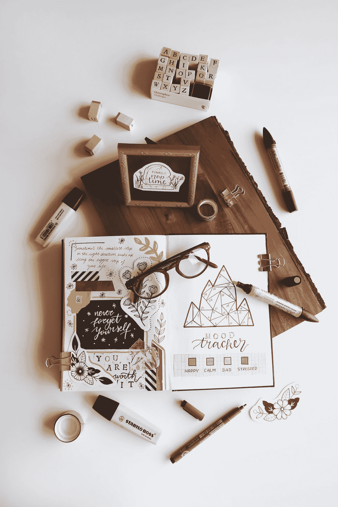

# 3 个简单的工具来设计你热爱的生活

> 原文：<https://medium.com/swlh/3-simple-tools-to-design-a-life-you-love-4d53e251c934>

## 你可以成为充满激情、目标和意义的生活的创造者。

Photo by [Estée Janssens](https://unsplash.com/@esteejanssens?utm_source=medium&utm_medium=referral) on [Unsplash](https://unsplash.com?utm_source=medium&utm_medium=referral)

如果我告诉你过自己喜欢的生活其实很简单，你会怎么说？

你会相信我吗？

你可能会想，如果真的这么简单，为什么不是每个人都在做呢？毕竟，我们不都想热爱我们的生活，充分利用我们在地球上的时间吗？

*当然！*

我不想让你把简单和容易混淆。过自己喜欢的生活并不意味着很容易。

*容易令人厌烦。*

如果事情很简单，你永远也学不会。学习对成长至关重要——对我们在身体、心理、情感和精神上“成为”我们应该成为的人至关重要。

只有当我们完全融入并拥抱我们自己，我们才能开始过我们真正热爱的生活，不管前方的路看起来有多容易或多困难。

这需要勇气和努力，但你需要设计和过你喜欢的生活的工具是简单的，但真正的挑战是如何实际应用它们。

# 找到你的目标

不久前，我是那种一听到类似“你知道你的人生目标是什么吗？”的话就会翻白眼的人。

对我来说，这些都是开悟的瑜伽士和自我提升的古鲁所说的空话。

作为一个忙碌的职业母亲，我坚定地认为，我的目的是让我的家人吃饱、被爱和安全。我的任务是完好无损地结束一天的工作，然后入睡，以便第二天醒来时再从头开始。

继续做一份我并不真正喜欢的工作，抚养我的儿子，花时间陪我的丈夫，尽可能延长周末短暂的时间来放松，这就足够了。

思考一个更大的人生目标感觉像是浪漫的、理想主义的——甚至是被禁止的。

你的意思是生活中除了激烈的竞争还有更多？

然后没想到，我失业了。我从在托儿所、办公室、足球训练和去动物园之间跑一分钟一英里，变成了坐在家里思考下一步该做什么。

从那时起，我真的开始问自己——我做这些到底是为了什么？

此时，我坐下来，开始更开放地思考目标。我开始更多地阅读我崇拜的人的作品，如米歇尔·奥巴马、奥普拉、布伦·布朗和格伦农·多伊尔。

越来越多的时间花在媒体上，浏览那些过着非凡生活的人写的精彩文章，有一个共同的主题变得非常清晰。

每个人都有明确的人生目标。

通过找到他们的目标，每个人都能够有意识地、有目的地构建一种生活，以实现他们存在的更大理由。他们与这一目标的联系成为他们职业决策、关系选择的指南，并知道何时后退一步，让世界掌控自己。

很明显，对我来说，要知道我的下一步应该是什么，我需要弄清楚我的目标。

我评估了自己所有的职业变动、教育选择、人际关系挑战、财务决定和养育子女的斗争，并后退一步，看看自己是否能理解自己走过的路。

原来有一些共性，我的目标开始变得更加清晰。

随着这项内部工作的进行，很明显我是来为人们创造意义的；帮助他们在生活中导航，给他们解释、处理和收集经验所需的工具。

这听起来像是一次学术练习或某种存在主义之旅，但这是大量写作、冥想和灵魂探索的真实结果。

我深入思考了最让我兴奋和激起我激情的事情。其中许多是我在职业生涯取得重大进展后忘记的事情，我认为我必须更认真地对待自己。

例如，我一直喜欢写作，但为了我认为更有意义的其他工作，我把它放在了一边。或者考虑一下，尽管日复一日和人们一起工作，我已经忘记了如何联系和倾听他们的故事——这是一项给我带来快乐的活动。

我贬低了我的激情，最终也贬低了我的目标，以至于它们变得看不见了。

现在我有了明确的目标，我可以带着目标和信心前进，因为我知道我在走我注定要走的路。我如何去实现我的目标仍是一项进行中的工作，但我的脚步正朝着正确的方向前进。

对于构建、生活和维持一个充满意义的生活——一个你最终热爱的生活来说，目标是必不可少的。

# 确定你的价值观

既然我已经牢牢把握住了我的人生目标和方向，我开始了更艰难的工作，那就是确定我的核心价值观——那些与我的目标一致并提醒我为什么首先出现的价值观。

布伦·布朗写道:

> “如果我们没有清晰的价值观，如果我们没有其他地方可以寻找或关注，如果我们没有那盏明灯来提醒我们为什么在那里，愤世嫉俗者和批评家会让我们屈服。”

这是一些强有力的话，我已经铭记在心。当我开始这项工作时，我列出了大约 15 件我认为有价值的事情。它包括可靠性、独立性、平衡、学习、家庭和幽默。

但我知道我需要缩短清单，专注于真正让我兴奋的事情。当我想逃跑和躲藏的时候，问是什么照亮了我，激励了我。我带着两个着陆了。

*勇气和感激。*

我看到这两种价值观一直出现在我的生活中，并影响着我的决定，但直到现在我都没有意识到它们在我的人生旅途中的作用。

只有用心思考，我才能欣赏这些作为礼物，以及它们是如何作为向导的。

但现在我知道勇气和感激是我最重要的价值观，当我面临重大决定或发现自己处于黑暗中时，我可以使用它们。

这两个价值观可以指导我如何为人父母，我的事业方向，我如何与他人互动，以及最终我如何走自己的路。

确定你重视什么不仅仅是笔和纸的练习，它需要自我反省和批判性思考。这可能会让人不舒服，还有点乱，但是你需要这些工具来设计一个你热爱的真实的生活。

# 创造愿景

在你第一次遭遇艰难的磨练后，或者在遭受了巨大失败的痛苦后，你可能已经不再做白日梦了。

虽然现实一点，关注我们的梦想作为一种脚踏实地的方式有很多好处，但我相信，当我们停止对未来可能会是什么样子的想法时，我们不会给自己带来任何好处。

活在当下，培养对我们所拥有的东西的感激之情是至关重要的，但同样重要的是创造一个愿景，告诉我们如何挑战自我以实现我们的目标，改变现状，过上我们热爱的生活。

梦想或对世界的憧憬，以及最终你如何设计自己的生活，可以帮助我们找到前进的道路。

> “如果你没有远见，你就会被困在你所知道的东西里。你唯一知道的就是你已经看到的。”—伊雅娜·范赞特

陷在你已经知道的事情中是让你偏离你的目标和价值的最快方式。没有目标和价值观，你就像一艘没有舵的船。

我又开始做梦了，考虑到我已经理清了我的目标和价值观，我可以打开所有的可能性。我已经开始了自己的事业，并优先考虑与儿子在一起的时间，这两者直到短短几个月前还只是“白日梦”。

允许自己想象与现在不同的生活，但仍然怀着感激之情尊重它，关注现在，这给了我一种宁静的满足感，我以前不知道这是可能的。

所以，花点时间大胆梦想，为你想要去的地方、你想要改变的东西以及你想要的生活展现出一个愿景。最终，你是这些结果的主人，如何规划你前进的道路取决于你。

目标、价值观和愿景是简单的工具，但它们不容易使用。这些需要你愿意做一些艰苦的工作和自我反省。过你热爱的生活并不意味着它不会没有挑战、挫折和失败，但建立你的基础和存在的理由将帮助你穿越生活抛给你的东西。找到你的目标，确定你的价值观，创造一个愿景——这样你就能过上充满意义、激情和爱的生活。

加入我的简讯吧！提高你的生产力，平衡工作和生活，向自主创业迈进。