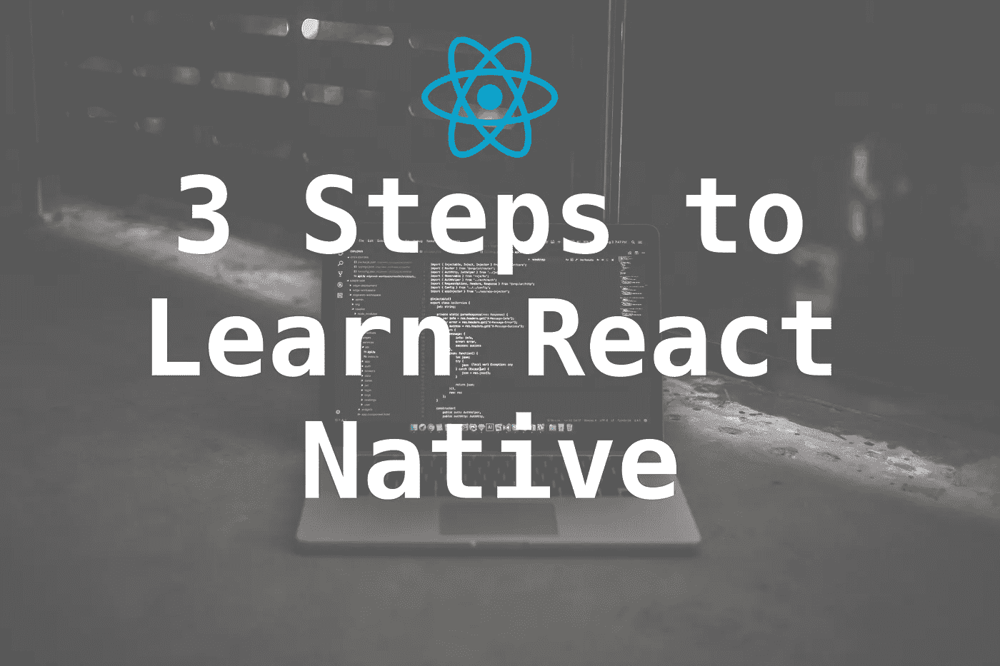

# 2019 年学习 React Native 的 3 个步骤

> 原文：<https://medium.com/swlh/3-steps-to-learn-react-native-in-2019-5cdb3d1e1c84>

Credit: Unplash/@blakeconnaly

如果您对使用 JavaScript 编写移动应用程序代码感兴趣，那么您正在阅读合适的帖子。React Native 由脸书开发和维护，是一个使用 JavaScript 编程语言开发跨平台移动应用的开源框架。

目前在其 **0.57 版本中，** React Native 基于脸书的前端库 ReactJS，并共享许多概念。如果你熟悉 React，恭喜你！你已经越过了第一个障碍。React 来自前端开发背景，它使用一个虚拟 DOM 作为真实 DOM 的影子。当一个元素发生变化时，虚拟 DOM 使用对应于每个元素的节点将这种变化反映在真实 DOM 上。

然而，在 React Native 中，除了 iOS 和 Android 等平台提供的原生组件之外，没有 DOM。此处没有 web 视图。React Native 有一个**[**JavaScript core**](https://facebook.github.io/react-native/docs/javascript-environment.html)**的实例，在应用启动时执行 JS 代码。React Native 使用 RCTBridgeModule 在本机代码和 JavaScript 代码之间建立连接。它目前正被脸书、Instagram、优步、Wix、特斯拉和许多其他公司使用。****

****下面是我认为你可以做的来推进 React 本地开发。****

# ****从基础开始****

****本文只是简单地向您概述了 React 原生应用程序开发过程中的内容以及幕后的工作方式。我经常遇到(特别是通过[*# 100 daysofcode*](https://twitter.com/_100DaysOfCOde)*campaign)努力学习新框架的开发人员，他们几乎没有特定编程语言的背景。我的建议是，在你开始大工程之前，先从基础做起。将概念作为曲线的每个特定组成部分来学习，确保尽可能多地应用它们，并构建小东西。*****

*****比如学习如何使用`FlatList`组件。尝试用自己的数据集创建一个列表，或者在互联网上找到一个模拟/伪造的数据集，并尝试用它构建一个小应用程序。永远记住你创建第一个 *Hello World* 程序时的感觉。你还记得那种成就感吗？*****

*****在深入研究状态管理库(如 Redux 和 Mobx)或持久化数据、使用第三方 API、使用 TypeScript 或 Flow 等的复杂性之前，先采取小步骤，构建小东西。*****

*****这些只是工具，你不需要在第一天就了解它们，但我并不是说你必须永远不了解它们。这里的关键词是它们是工具。如果您是 JavaScript 新手，请确保您清楚 ES6 的基本特性，如类、箭头函数等。然后，您必须大致了解基本的 ReactJS 概念，如属性、状态和无状态组件。*****

*****总之，首先让自己熟悉:*****

*   *****ES6 功能*****
*   *****ReactJS 组件 API 和生命周期方法*****
*   *****为 React Native 设置开发环境*****
*   *****Flexbox*****

# *****前进吧*****

*****一旦你头脑中有了清晰的基本概念，并且已经玩了一会儿，获得了一些实践经验，是时候进一步发展了。开始构建更大的应用程序，像真正的应用程序一样工作或行为，并与实时数据进行交互。这里有一个清单，你可以在旅途中学习进步。*****

*   *****用`AsyncStorage`离线存储数据*****
*   *****使用第三方 API*****
*   *****地图*****
*   *****闪屏*****
*   *****航行*****
*   *****Redux(用于状态管理)*****
*   *****还原传奇和坚持*****
*   *****测试和 TDD*****
*   *****推送通知*****
*   *****用户界面动画*****
*   *****构建并发布您的应用程序*****
*   *****连续交货或 CI*****

*****请注意，这些只是让您开始的宽泛主题。在这个过程中，你会学到很多其他的东西。不要被这个打击到。*****

# *****个人挑战:你想从中获得什么？*****

*****也许你想成为一名专业的 React 本地开发人员，并在一个使用这种技术框架的组织中工作，或者你想为你的客户/顾客开发应用程序。以这种方式设定你自己的个人挑战是完成事情和学习的好方法。*****

*****给自己一个承诺，并为之努力。在手机或商店中查找您想要克隆或添加额外功能的应用程序，或者了解用户界面。*****

*****不要被你犯的错误或你得到的错误的数量压倒。整天在互联网上感到沮丧和抱怨是很容易的，但是要明白这并不能解决你的问题或者让你成为一个更好的开发者。所有这些都是你旅程的一部分。不断提醒自己。*****

# *****结论*****

*****简单来说，React Native 将 React 带到了移动应用开发中。它的目标不是写一次代码就能在任何平台上运行。这里的主要目标是一次学习，随处书写。这是一个重要的区别。*****

******在接下来的帖子中，我将介绍 React 本地开发的基础知识，并为此设置合适的环境。******

*****如果你期待学习 React Native，可以考虑订阅我的时事通讯。我通常每周只发一封邮件，内容是我写的所有博客文章。通过订阅，你将**能够直接从你的收件箱中阅读我所有的教程**📧*****

*****[**在这里加入每周简讯。**](https://tinyletter.com/amanhimself)*****

*****如果您正在开始 React 本机开发，让我们一起来做这件事。我在推特上有空(*，你可以给我发短信*)👇*****

***** [## 阿曼·米塔尔·⚛️☕(@阿曼本人)|推特

### 阿曼·米塔尔·⚛️☕的最新推特(@阿曼本人)。👨‍💻# Developer # full stack # Nodejs # react native |📖#博客作者…

twitter.com](https://twitter.com/amanhimself) 

## 这篇文章发表在 [The Startup](https://medium.com/swlh) 上，这是 Medium 最大的创业刊物，拥有+406，714 名读者。

## 订阅接收[我们的头条新闻](http://growthsupply.com/the-startup-newsletter/)。

*****