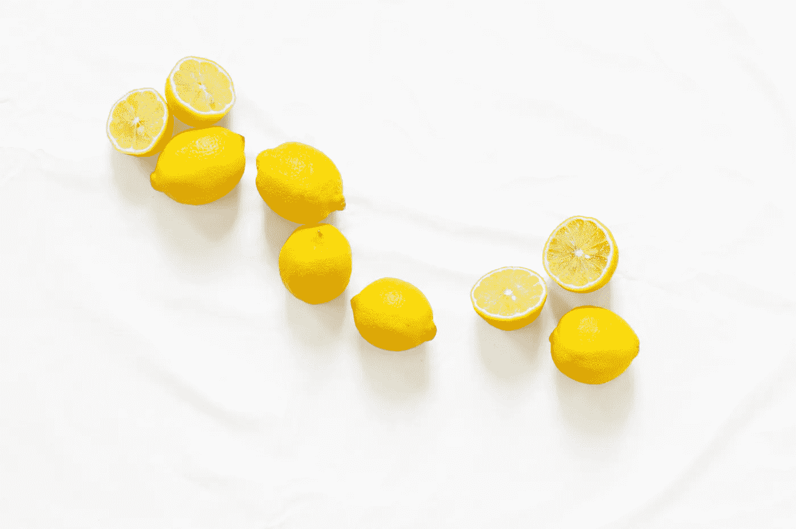

# 将改变你生活的 3 个超级简单的健康秘诀

> 原文：<https://medium.com/swlh/3-super-simple-health-hacks-that-will-change-your-life-5255744b8003>

Photo by [Lauren Mancke](https://unsplash.com/@laurenmancke?utm_source=unsplash&utm_medium=referral&utm_content=creditCopyText) on [Unsplash](https://unsplash.com/search/photos/health?utm_source=unsplash&utm_medium=referral&utm_content=creditCopyText)

> 保持身体健康是一种责任。否则，我们将无法保持头脑清醒。*佛*

健康是你最宝贵的财富之一。年纪越大，身体越不会原谅。你的健康并不完全在你的控制之下:遗传可能很糟糕:我可以告诉你一两件事。然而，有些事情是在我们的控制之下的，而且…