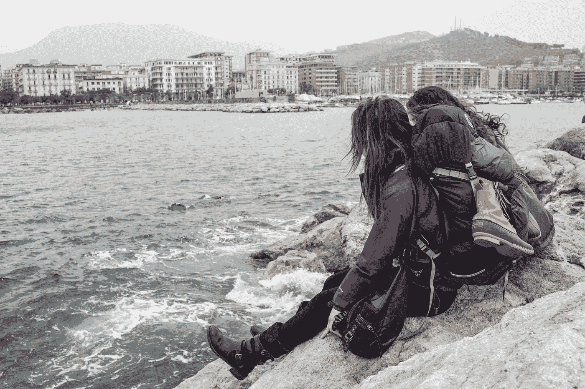

# 旅行时坚持新习惯的 3 个小贴士

> 原文：<https://medium.com/swlh/3-tips-for-sticking-to-new-habits-when-travelling-826d22e71b0a>

## 从我自己的旅行中学到的经验

Photo by [Annie Niemaszyk](https://unsplash.com/@annieniemaszyk?utm_source=unsplash&utm_medium=referral&utm_content=creditCopyText) on [Unsplash](https://unsplash.com/search/photos/travel%2C-bag?utm_source=unsplash&utm_medium=referral&utm_content=creditCopyText)

下面是我喜欢旅行的一系列原因，但我喜欢探索新的地方和重访熟悉的老城市的一个主要原因是，每次我出来都学到一些关于我自己和我与外部世界的关系的新东西。