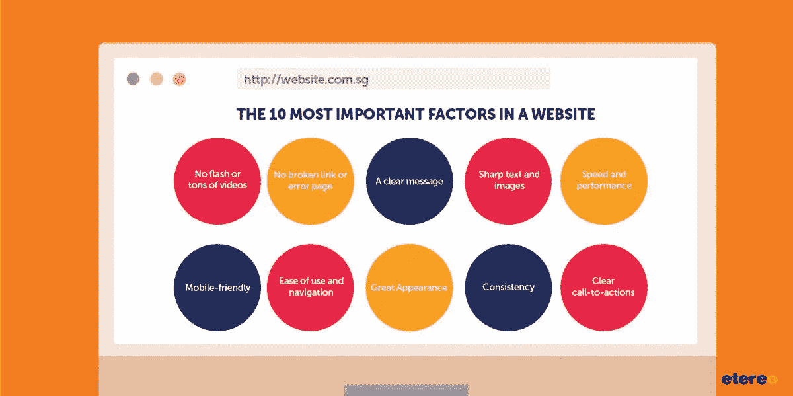
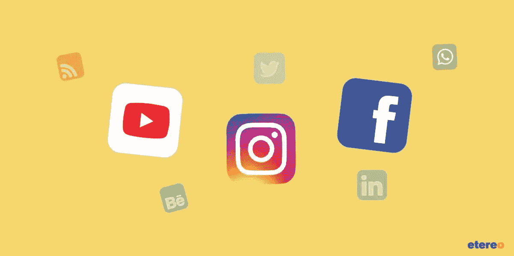
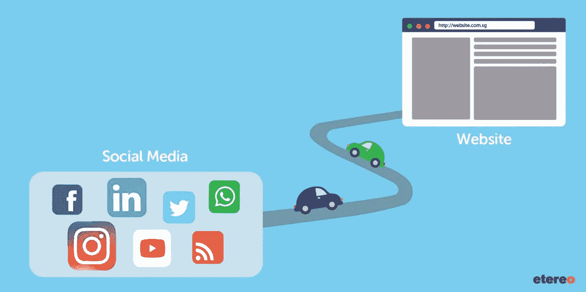

# 2019 年优化您数字形象的 3 种方式

> 原文：<https://medium.com/swlh/3-ways-to-optimize-your-digital-presence-in-2019-ffbfb7cea519>

## 当企业的潜力未被挖掘，其数字存在未被优化时，企业的机会成本会成倍增加。以下是 2019 年的 3 条简单规则，告诉你小企业如何脱颖而出，打造卓越的在线业务。

企业不再局限于实体。然而，许多企业主继续以旧的和传统的方式做生意，按照传统的商业模式经营，忽视他们的在线品牌声誉和资产。

多年来，消费者行为的动态本质和不断发展的技术为企业打开了无尽的大门，但现实是，许多企业仍然没有做出转变，以利用这一机会之窗。因此，许多机构要么落后，要么完全停止运作。

为了使小型企业可持续发展并实现盈利增长，同时最大限度地提高客户满意度，这些企业将他们的线上和线下接触点连接起来以实现无缝的客户之旅是至关重要的。

这里有 3 条规则可以优化你的数字形象，建立你的在线品牌声誉，并更好地与你的客户互动。

# 规则 1:建立一个吸引客户的网站

仅仅因为你的网站在 10 年前看起来很突出，并不意味着它在今天也是如此。遗憾的是，毫无疑问，一个吸引人的网站现在可能已经过时、乏味，并失去了吸引力。

如果你的网站属于上述类别，通过不断改进来完善你的网站策略。与大公司相比，小企业的优势在于通过创建一个反映其品牌的创造性和个性的网站，一个真正代表企业、品牌、产品和目的的网站，在网站上创造更多的乐趣和灵活性。

把网站的重点放在你的客户身上，设身处地为他们着想，理解他们的需求和关注点。投入尽可能多的时间和精力为你的品牌建立一个完美的网站，因为它是你在网上所做的一切的支柱，所以尽可能使它有影响力和令人难忘。

你想知道顾客想从网站上得到什么吗？从用户的角度收集，我们有正确的答案如下。

# 网站最重要的 10 个因素

一个成功吸引客户的网站必须具备以下 10 个特征:

1.  很棒的外观
2.  易用性和导航
3.  手机友好型
4.  速度和性能
5.  明确的信息
6.  一致性
7.  明确行动要求
8.  清晰的文本和图像
9.  没有断开的链接或错误页面
10.  没有闪光灯或者很多视频

无论您的网站需要一些润色，翻新，或彻底检修，你有绝对的控制权。为了抓住和吸引企业和客户，你首先需要提供良好的用户体验。

# 规则 2:保持最多 3 个社交媒体平台

可以理解的是，许多小企业缺乏时间、资源和专业知识来管理他们的社交媒体营销策略。因此，他们中的许多人相信，仅仅是“在”这些社交媒体平台(脸书、Instagram、Twitter、LinkedIn、YouTube、Pinterest 等)上的出现和存在。)足够了，他们的工作结束了。

如果你的社交媒体没有更新，缺乏内容，或者仅仅是没有互动性，这可能会让用户失去兴趣。这种忽视导致不满，进而损害企业的销售、收入和品牌声誉，最终弊大于利。

你不需要在所有可能的渠道上留下社交媒体的足迹。想象一下，如果一个对你的品牌和产品感兴趣的客户访问你的社交媒体页面，发现你的一些不活跃的社交媒体渠道已经一年多没有更新了。

那位顾客可能不愿意从你这里购买。它给客户一种即时的感觉，你根本不在乎你的品牌或你的产品，如果你不在乎，客户为什么要在乎？他们会直接走开。

现在，无论你有零个、三个或更多的社交媒体平台，我们建议你至少与一个、最多三个平台合作，并尽善尽美。在你能够投入足够资源的平台上占有一席之地。

让每一个社交媒体页面都更新精彩有趣的内容，增加你的粉丝和追随者。

不可否认，社交媒体已经成为每一个成功企业的重要组成部分，并且是一种锁定和吸引受众的经济有效的方式。通过社交媒体，许多品牌的销售额和品牌认知度都出现了正增长。

因此，企业必须整合社交媒体作为其销售和营销战略的一部分，而不要在太多平台上过度扩张。

# 规则 3:将社交媒体的流量带回你的网站

在社交媒体上建立品牌认知度可能很重要，但如果你没有将你的受众带回你的网站或销售点(实体店、在线商店或移动应用)，那么这将导致你完全浪费时间和资源。

您知道吗 [81%的社交媒体用户通过社交媒体](https://visualobjects.com/web-design/top-web-designers/how-social-media-helps-businesses-increase-website-traffic)访问公司网站？你的业务需要能够成功地推动这种流量。

当你不鼓励用户向你购买，那还有什么意义？我们并不是建议你坦率和“销售”，但必须有一个目的，一个微妙的提醒，与你的受众接触，让他们信任你，并引导他们从你这里购买。这就是神奇之处。

无论你在什么社交媒体平台上，我们都鼓励你使用行动号召来引导你的观众点击进入你的网站。

# 推动社交媒体流量流向您的网站/销售点的示例

有许多不同的方法可以让你的网站从社交媒体获得流量:

*   社交媒体广告(付费)
*   博客内容推广
*   可见网站链接
*   促销代码
*   分享正面评价
*   共享功能和优势
*   分享有价值的相关内容
*   强调独特的卖点
*   告诉用户如何以及在哪里购买你的产品

不幸的是，许多小型企业根本没有时间、资源和专业知识来管理和维护他们的数字资产和存在，最终对此无所作为。这就是营销代理的用武之地。

以下是你应该与营销机构(如 [Etereo](http://etereomedia.com/) )合作管理在线资产的五大重要原因:

1.  **成本效益**:与其为这项工作寻找一个新的雇员，这要昂贵得多(从长远来看)，不如外包给一个专门通过社交媒体营销、数字营销和内容营销创造品牌形象的机构更便宜。
2.  **一致性**:一家机构了解你的品牌，并向你的目标受众传达一致性，无论是设计、内容还是广告活动。一家代理机构专注于你的品牌身份，并准备在你的整个在线资产中产生相同的一致性。
3.  **规律性**:作为一个企业主，你可能不知道如何创造内容，或者你可以为你的品牌创造什么类型的内容，而一个代理机构会定期处理你的帖子和活动。
4.  **责任**:你可能不知道在你的网站和社交媒体的后台到底发生了什么，但是有一个机构可以帮助你从头到尾跟踪、监控和评估所采取行动的有效性。
5.  **专长**:你可以委托你的代理公司锁定正确的受众，知道如何、在哪里、何时锁定你的受众，并鼓励他们向你购买。

# 成功优化您的数字形象

2019 年，我们敦促企业拥抱数字革命，以便向前发展并保持可持续发展和竞争力。

真正的数字化转型不仅仅是权宜之计，还需要品牌所有者心态和精神特质的转变和认可。

Etereo 是一家全方位的营销机构，能够弥合和整合您所有的数字鸿沟。警惕 IT 供应商和/或甚至营销代理，他们口头上说要达到虚构的结果，甚至更糟——对结果没有承诺。Etereo 是一家 100%透明的营销机构，管理并向客户提供实时研究结果、报告，并不断手动引导客户，在每一步都照顾他们的账户。

一如既往，我们很高兴收到您的来信— [【受电子邮件保护】](https://clutch.co/cdn-cgi/l/email-protection#6b060a19000e1f02050c2b0e1f0e190e04060e0f020a45080406)。

[*原载 Lizzy Tan on Clutch 2019 . 2 . 27。*](https://clutch.co/agencies/digital/resources/3-ways-optimize-digital-presence-2019)

## 这篇文章发表在 [The Startup](https://medium.com/swlh) 上，这是 Medium 最大的创业刊物，拥有+438，678 读者。

## 订阅接收[我们的头条新闻](https://growthsupply.com/the-startup-newsletter/)。

