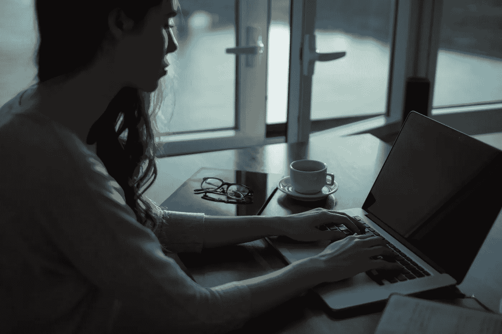

# 30 天没有社交媒体或新闻。个人实验

> 原文：<https://medium.com/swlh/30-days-with-no-social-media-or-news-a-personal-experiment-fbeb97a237db>

Photo by [Thought Catalog](https://unsplash.com/@thoughtcatalog?utm_source=unsplash&utm_medium=referral&utm_content=creditCopyText) on [Unsplash](https://unsplash.com/s/photos/concentration?utm_source=unsplash&utm_medium=referral&utm_content=creditCopyText)

## 彼岸的生活是辉煌的，还是在撤退的胎位中度过的？

我是卡尔·纽波特作品的忠实粉丝，最近听了他关于数字极简主义的采访后，我开始思考我的社交媒体习惯。我不是一个瘾君子，甚至没有接近，但它占用…