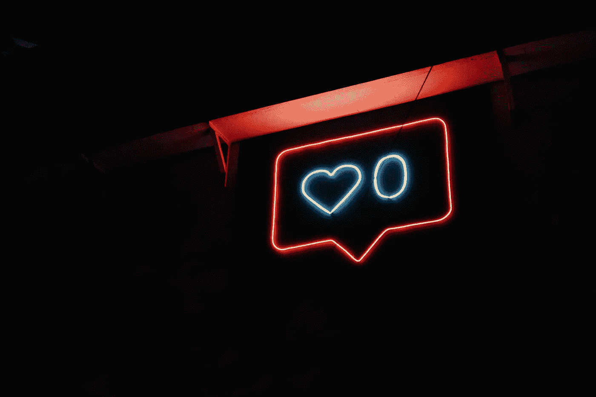

# 没有 Instagram 的 30 天:结果

> 原文：<https://medium.com/swlh/30-days-without-instagram-the-results-f52dea10bbdc>

你是否沉迷于 Instagram 和其他社交媒体？

Photo by [Prateek Katyal](https://unsplash.com/photos/xv7-GlvBLFw?utm_source=unsplash&utm_medium=referral&utm_content=creditCopyText) on [Unsplash](https://unsplash.com/?utm_source=unsplash&utm_medium=referral&utm_content=creditCopyText)

几个月前，我因为一个朋友编造了 Instagram 故事而让他的朋友们看到并羡慕不已。他转向我说，“你知道吗，我不知道我为什么要这么做。这让我感觉不太好。”我回应道，“那就停下来。”这全是玩笑。他的反驳？*“我不认为我能。我上瘾了。”*