# 32 个奇怪而成功的网上生意的例子

> 原文：<https://medium.com/swlh/32-examples-of-strange-and-successful-online-businesses-868817940fd8>

## 有趣的案例研究证明你几乎可以销售任何东西

有什么比举例子更好的教学方法？

当我从事个人发展业务时，这些天我的学生和客户渴望实用性胜过一切。

所以，这是我写的最完美的文章。我是来服务的，希望我能超额完成任务。

**这里有 32 个案例，展示了人们从仅仅是他们的笔记本电脑 ***** 开始的各种各样成功的企业

*请注意，我与这些企业没有任何关联，也没有从它们那里获得任何形式的报酬。这只是为了教育的目的，所以享受吧！*

[**1。布什威克厨房**](https://bushwickkitchen.com/)

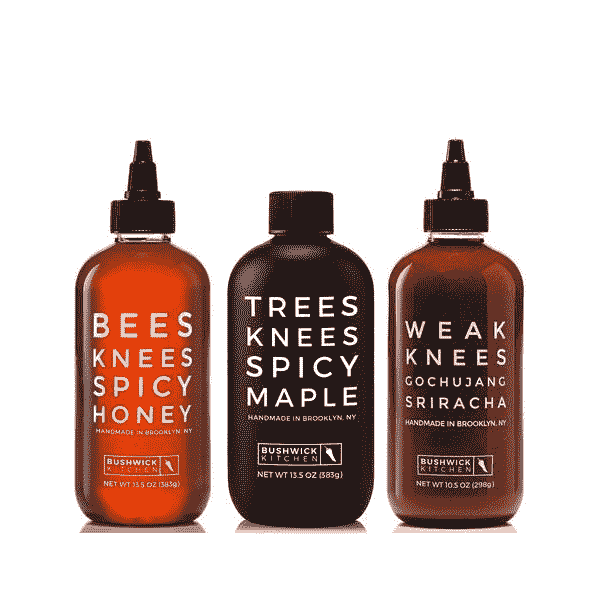

几个朋友在 10 个月内卖出了价值 17 万美元的辣蜂蜜。

令人难以置信的是，他们在 30 天内推出了他们的第一款产品。

我想我想自己尝尝辣枫树。

[②**。自由珍衣**](http://www.libertyjaneclothing.com/)

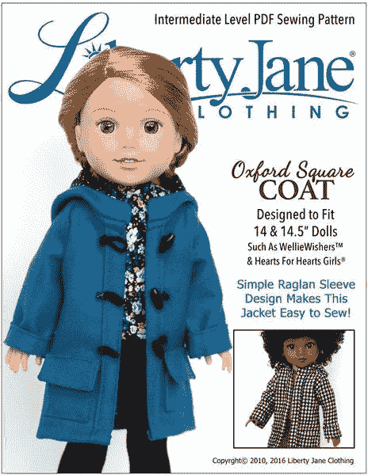

一对名叫 Cinnamon 和 Jason 的夫妇每年出售**60 万美元的*玩偶服装图案*** 。

是的，这些家伙知道如何销售迷你服装图案的 pdf，他们的大多数产品都是数字下载。

[**3。**生代](https://www.rawgeneration.com/)

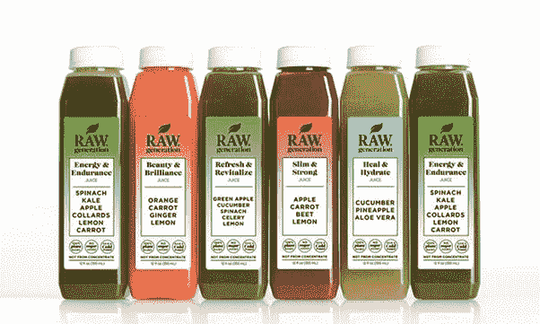

30 岁的杰西卡·盖尔在两个月内将她的果汁公司的收入从每月 8000 美元增加到每月 96000 美元！

开始时，她努力想喝出第一口好喝的果汁，说她感到恶心。

她觉得自己从一开始就是个失败者。但是她坚持下来了，很快，她的未经高温消毒的混合果汁就卖得非常好！

[**4。国家公园仓库**](http://nationalparksdepot.us/)

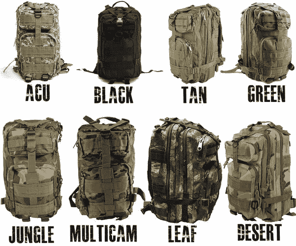

虽然网站现在看起来已经不存在了，但这项业务背后有一个奇妙的故事。

创始人有前科，20 多岁的时候在监狱里呆了大半辈子。

出狱后，他决定去上大学。在读工科学生时，他开始在网上向国家公园爱好者出售徒步旅行装备。

在巅峰时期，他卖衬衫、包包和帽子的月收入是 8 万美元。

[**5。奢华的头发**](https://www.luxyhair.com/)

Alex Ikonn 和他的妻子 Mimi 销售接发，YouTube 是他们的主要营销渠道。

他们的 [**YouTube 频道**](http://www.youtube.com/user/LuxyHair/) **开始于 2010 年，从那时起已经积累了 1，474，246 个用户和 173，657，125 次视频观看。**

虽然他们没有透露具体数字，但 Shopify 已经证实他们的收入达到了 7 位数。

这是一个很好的行业，因为我们的 Instagram 文化接管了美容世界。

[**6。手表用品商**](https://www.watchoutfitters.com/)

来自科罗拉多州丹佛市的 17 岁游泳运动员乔纳开了这家手表店，一年内每月收入超过 13k。

他将自己的成功归因于理解并适应客户的偏好，成为客户的仆人，而不是试图成为主人。

对一个如此年轻的人来说相当令人印象深刻！

[**7。**醇厚](https://www.cookmellow.com/meet-mellow)

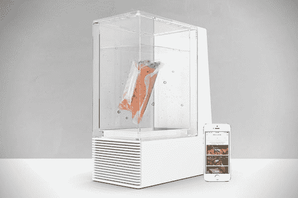

一名机械工程师/美食家和一名自由设计师结合他们的技能，发明了一个神奇的厨师机器人，它可以与你的智能手机同步，在你方便的时候为你做饭。

不到一个月，他们的预订销售额就超过了 20 万美元。

我认为它看起来很酷，但是它到底是怎么工作的呢？

[**8。胡子品牌**](https://www.beardbrand.com/)

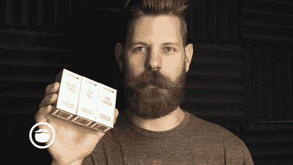

在不到一年的时间里，胡子创始人埃里克·班德霍尔茨建立了他的公司，销售胡子保养产品。

到第一年年底，每月收入从 0 美元增加到 12 万美元！

我自己也有胡子，但我怀疑我会留那么长。

[**9。塔夫脱服装**](https://taftclothing.com/)

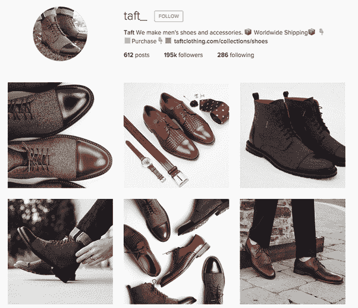

这家家族经营的服装公司是在 Kickstarter 上为不露面的袜子筹集了 4.7 万美元后起步的。

他们最终扩大了产品线，成为一家 7 位数的企业。

在 Reddit 上被曝光后，他们一天就赚了 40 万美元。

[10**。sriracha 2 go**](https://sriracha2go.com/)

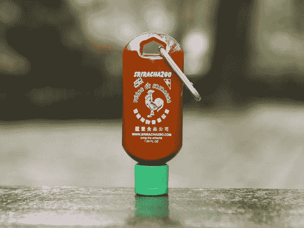

这家由两位辣酱粉丝创办的公司在 Buzzfeed 的一篇文章中出现并收到 10，000 多份订单后爆发了。

他们有一些制造问题，必须通过 3 个不同的制造商才能为客户提供高质量的产品。

我自己也很喜欢 sriracha，几乎每餐都要配着吃。也许我得买一两瓶这个。

[**11。**阿尔特弥斯设计公司](https://artemisdesignco.com/)

米莉森·阿姆斯特朗(Milicent Armstrong)是一名训练有素的室内设计师，她的灵感来自于她在土耳其伊斯坦布尔旅行时在市场上发现的配饰。

她发现的配件是从设计复杂的土耳其地毯中重新利用的。

她深受启发，决定为设计师的包包和鞋子设计创意。

**虽然生意起步缓慢，但她每年都能将销售额翻一番。**

[**12。房地产**所有东西](https://allthingsrealestatestore.com/)

特雷西·希克斯在做了 13 年的专业房地产经纪人后，开创了房地产公司。

当她注意到她的客户很难记住他们已经看过的房子时，她有了为购房者制作笔记本的想法！

特蕾西意识到她的笔记本可以兼作其他房地产经纪人的营销材料，于是所有与房地产有关的东西都诞生了。

令人难以置信的是，一个随机的想法如何激发了一个成功企业的诞生。

[**13。奥拓的冒险**](http://altosadventure.com/)

这款由 Snowman(位于多伦多的开发工作室)**制作的热门独立游戏已经获得了数十万次下载，在苹果应用商店的售价为 4.99 美元。**

在谷歌 Play 商店，它已经获得了数百万次下载，并通过应用内购买获得了收入。

说实话，我曾经和我哥哥在 App Store 上发布过一个游戏，但是从来没有成功过。叫做[鸟涌](https://itunes.apple.com/US/app/id961509946?mt=8)。

哦好吧！有些事情没有结果，所以我们需要继续努力，直到他们成功。

[**14。是的理论**](https://www.youtube.com/channel/UCvK4bOhULCpmLabd2pDMtnA)

四个从陌生人变成朋友的人在 20 多岁时放弃了稳定而有前途的职业，创建了一个围绕一个想法的 YouTube 频道:说好！

我们当中有多少人在生活中有几十个，如果不是几百个的人和信念告诉我们，我们不能做一些事情？我们内心都有一个小小的声音说我们可以。

这四个不可思议的家伙利用这一理论与亿万富翁和名人交往，不顾一切地表演疯狂的特技，并会见了加拿大总理贾斯廷·特鲁多。

他们的频道有超过 300 万的用户，这可以很容易地转化为 7 位数的收入。

[**15。我定制的糖果**](http://mycustomcandy.com/)

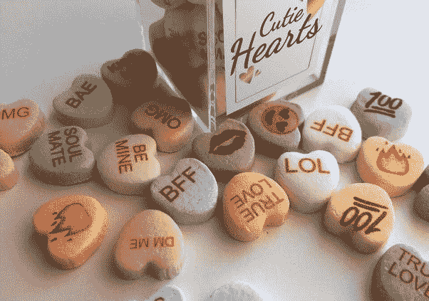

莎拉·汉宁顿正在为情人节寻找定制的糖果印花，当她在网上找不到时，她开始自己制作！

令我惊讶的是，她白天是全职营销专家，也是全职母亲，但仍能经营这项复杂的业务(尽管这是季节性的，所以这很有帮助)。

**她的收入主要来自 JCrew 和维多利亚的秘密等客户的大额 B2B 销售。**印象深刻！

[**16。birch box**](https://www.birchbox.com/)

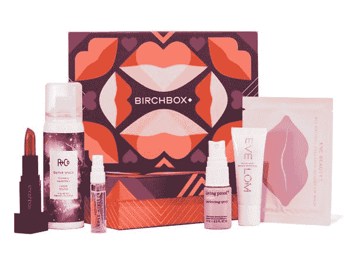

当订阅盒在 2010 年开始流行时，这家美容公司抓住了这个机会。

他们以 10 美元一盒的价格提供个性化的美容套餐，生意大增！**2014 年，该品牌的年销售额为 1.25 亿美元。**

嗯，我想知道我的女朋友会不会对这个感兴趣？

[**17。写记事本&Co**](https://www.writepads.com/)

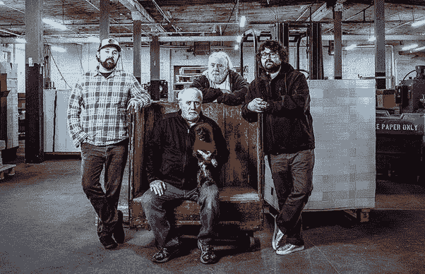

克里斯·罗斯和他的兄弟是第三代商业装订商，他们开始接管他们祖父开创的家族企业。

虽然克里斯的父亲和祖父发展了 B2b 业务，专注于区域公司，但克里斯希望向不同的方向发展。

**他创建了公司的 B2C 分公司，开始接触全球的客户！**

我不知道你怎么想，但我可以肯定所有这些家伙都有关系。

[**18。**灵魂巧克力](https://www.soulroasters.com/)

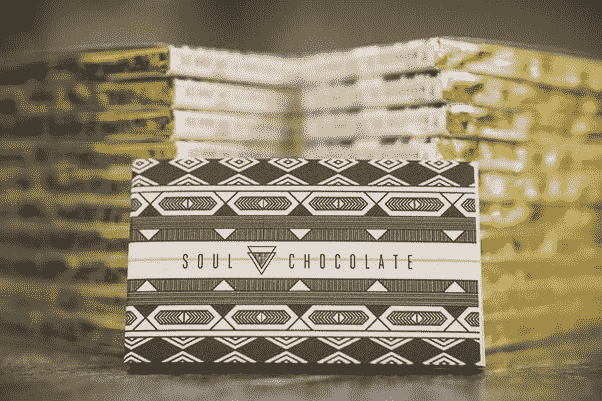

凯蒂·巴特利特(巧克力制作人)和凯尔·威尔逊(咖啡制作人)结合他们的天赋，制作了来自异国巧克力豆产地的颓废巧克力。

他们的生意让他们赚到足够的钱，而他们可以环游世界，制作美味的巧克力！谁会不喜欢呢？

人们说他们的巧克力堪比美酒。我说，为什么不同时享受葡萄酒和巧克力呢？

[**19。曾经的婚礼**](https://www.oncewed.com/)

令人难以置信的是，这个每年有 600 万访客的婚礼博客和礼服列表服务是由一个从未举办过真正婚礼的人发起的！

八年前，艾米丽·纽曼和她的丈夫私奔了，然而今天她的生意以销售婚礼课程而大获成功。

她已经把她 700 美元的课程卖给了成千上万的婚礼策划人，而且人数还在增加。

这太神奇了！

[**20。蜜糖店**](https://thehoneybunchshop.com/)

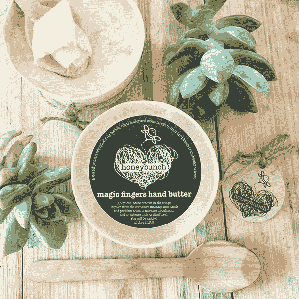

这位即将成为奶奶的企业家推出了一项奇特的黄油状肥皂和沐浴炸弹业务。

作为努力的一部分，她实际上通过在新西兰的公路旅行向顾客亲手递送沐浴炸弹。我认为这是线上和线下品牌的一个非常独特的组合。

这是她展示自己创业初期最美好的一个月的照片:

**对于那些不想转换的人来说，这是 52500 美元的收入。**

[**21。漂亮预置**](https://www.lightroompresets.com/)

劳拉·托马斯(Laura Thomas)是两个蹒跚学步的孩子的母亲，她辞去了全职工作，创办了一家婚纱摄影公司。

当她意识到她的业务变得太耗时时，她创建了照片预设，有点像 Instagram 滤镜的专业版本，以加快速度。

劳拉发现人们非常喜欢这些预置，她决定把它们卖给其他摄影师，而不是自己做摄影！

她现在已经在 Pinterest 上建立了一个超过 30000 名摄影师的社区，其中许多人都是她的顾客。

[**22。边缘运动**](https://www.fringesport.com/)

随着 CrossFit 越来越受欢迎，企业家彼得·凯勒和他的合伙人看到了一个机会。

他们开始销售专门为 CrossFit 和家庭健身房制造的健身器材，65%的销售额来自网上。

**虽然开始只是一个副业，但这些家伙已经能够在短短三年内将边缘体育从每年 10 万美元提高到每年 300 万美元！**

[23**。黑色奶衣**](https://blackmilkclothing.com/)

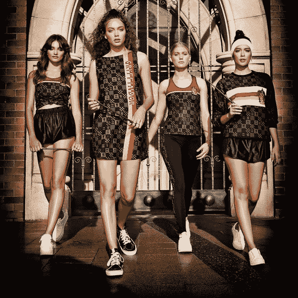

这家受澳大利亚流行文化启发的服装公司由詹姆斯·莉莉斯于 2009 年创立。

他们开始卖 10 美元的打底裤，后来扩大到卖各种设计有趣的服装(见上图)。

今天，Black Milk 服装公司是一家价值数百万美元的公司。

他们的产品销往世界各地，他们雇用了 150 多名员工！

[24 日**。**幼子](https://us.saplingchild.com/)

这个婴儿品牌已经在超过 196 个国家销售他们的产品，这一数字还在增加，这都要归功于他们的在线业务。

善待动物组织和查尔斯·斯丁森希望他们所有的婴儿服装都由有机材料制成。我觉得很好看！

像大多数这些成功的故事一样，这项业务是作为副业开始的。

永远不要让全职工作阻止你兼职追求你的商业理念。

[**25。马克西姆斯和佩内洛普**](https://www.maximusandpenelope.com/)

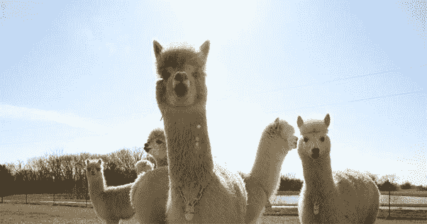

伯尼·罗斯洛克(Bernie Rothrock)在教了 30 年书后退休，接管了他姐夫的羊驼牧场。

在他的姐夫去世，羊驼市场崩溃后，他有了一个创新的想法。

你知道，羊驼讨厌夏天的炎热，所以每年夏天你都要给它们剪羊毛。这是一个无痛的过程，羊驼对此心存感激。

**伯尼决定出售羊毛制成的袜子和其他服装，因为它比绵羊毛更柔软，也更保暖。**

他以两只羊驼命名了这家企业，马克西姆斯和佩内洛普。

[**26。着火的企业家**](https://www.eofire.com/)

约翰·李·杜马斯和他的搭档凯特致力于帮助企业家创办和发展他们的企业。

多亏了他们成功的播客和拥有成千上万订阅者的电子邮件列表，**他们能够通过他们的教育产品每月创造超过十万美元的收入。**

当你想到他们不卖任何实物产品的时候，那真是不可思议！

[**27。西班牙语移动**](https://www.spanishtomove.com/)

但是你不一定要像上一个例子中那样成为一个创业专家才能开始教育事业。

路易斯·佩拉约 **仅仅通过在网上教授西班牙语课程就开创了一项事业。**

当他在不到 30 天的时间里让 70 多名学生注册他的课程时，他成为了 Thinkific(一个在线课程托管网站)30 对 30 挑战的获胜者。

如果你有别人愿意花钱学习的技能，你也可以像路易斯那样做！

[**28。广告技巧**](https://www.adskills.com/)

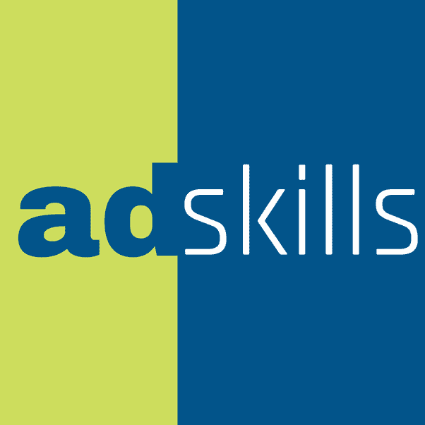

贾斯汀·布鲁克(Justin Brooke)创办了一家名为 Ad Skills 的数字广告培训公司，该公司帮助营销人员获得所需的技能，以便在网上发布能引起人们共鸣的优秀广告。

他通过在线课程建立了一个 6 位数的生意。

以下是他在接受 Thinkific 采访时对在线课程的看法:

每个人都有擅长的事情。有些人知道如何做烤奶酪，无人能及。有些人知道如何如入无人之境地叠 t 恤。有些人知道如何打扫房子。每个人都知道一些事情。贾斯汀说:“我见过一个家伙在 90 天内通过一门关于如何制作油炸猪皮的课程赚了 6 位数的钱。”。

*“所以不要低估你的知识。有些东西你知道怎么教。这不会花你太多钱。而今天，你有了像*[*thinkfic*](http://www.thinkific.com/)*这样的工具。这是显而易见的。”*

[**29。自己选！**](https://jamesaltucher.com/)

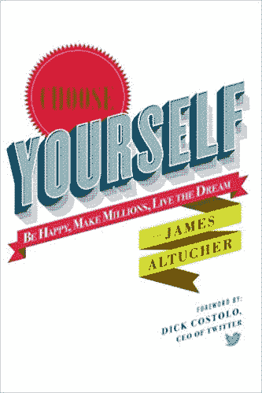

詹姆斯·阿尔图切，播客，作家和企业家是这个成功的在线企业列表中的一个例子。

**他的书，*自己选！*截至 2018 年销量已超 100 万册。**

最重要的一点是，詹姆斯是自我出版的，这意味着他和我们其他人在同一个竞技场上比赛。这本身对你应该是鼓舞人心的。

如果有优秀的图书和营销策略，任何人都可以自助出版，并使自己的书成为亚马逊上的头号畅销书。

[**30。**酒库](https://tv.winelibrary.com/)

好吧，现在几乎所有对在线商务感兴趣的人都知道加里·维纳查克了。

但我们中有多少人记得他在葡萄酒图书馆的日子？

他录制了 1000 多集，通过游击式的网络营销，将他家的实体店从 300 万美元发展到 6000 万美元。

恭喜你，加里。我从不希望有你的成功；我想努力拥有让你成功的品质。

[**31。**男人的知识](https://www.knowledgeformen.com/)

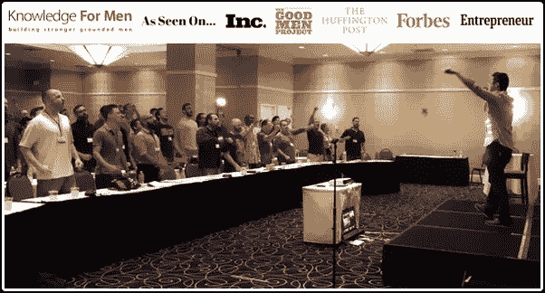

Andrew Ferebee 在网上生意上取得了令人难以置信的成就。

他自己出版并在亚马逊上销售了三本畅销书，并且**建立了一个 7 位数的在线教练业务，教男人如何在生活中获得更多的成功、自由和快乐。**

安德鲁是一个我很想成为导师的人，因为他比我年长很多，也更有经验。

如果他是“竞争对手”，我为什么要提拔他？因为我更关心的是*改变人们生活的全球运动*而不是我的生意超过他的生意。

他为个人发展运动增色不少，所以如果你是男的，不先跟着我就跟着他。

[**32。我的 Excel Online**](https://www.myexcelonline.com/)

这个在线业务只有一个目标:教人们如何在他们的组织中成为微软 Excel 的头号高手。

想象一下，这样一个简单的想法每月带来超过 2 万美元的收入！

创始人 John Michaloudis(如果我说错了，请纠正我)主要利用免费网络研讨会和 excel 指南完成了大部分销售。简直牛逼。

**企业，尤其是百万美元的企业，不是来自笔记本电脑。*

这个问题给我的感觉是，提问者在寻找一个快速致富的方案。

***新闻快讯:*** 暴富*故意*不存在。至少不要抱着只想着轻松赚钱的心态。

所有这些业务有什么共同点？他们所有的创始人都有正确的思维方式。

**他们都专注于通过低成本媒介(互联网)向正确的市场提供独特的价值。**

光是这个 Quora 答案就花了我 4 个多小时的时间来写。

所以，我希望这 32 个案例研究能帮助你认识到，生意成功不像打开笔记本电脑印钞票那么简单。

建立在线业务需要高质量的工作、纪律、专注、时间、耐心和坚持。

## 这篇文章发表在 [The Startup](https://medium.com/swlh) 上，这是 Medium 最大的创业刊物，拥有+405，714 名读者。

## 在这里订阅接收[我们的头条新闻](http://growthsupply.com/the-startup-newsletter/)。

