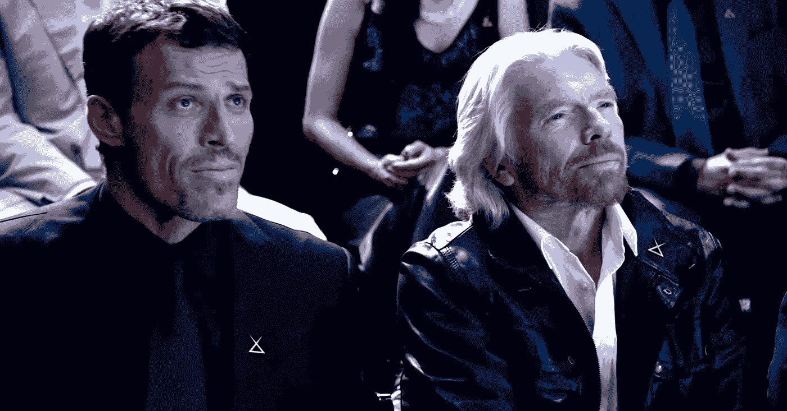

# 成功领导者放弃的 33 件事

> 原文：<https://medium.com/swlh/33-things-successful-leaders-have-given-up-83b058f79df9>

## 你需要阅读的最后一篇领导力文章。

Image credit: Nike/[Virgin](https://www.virgin.com/)

这里有一篇你可能想不到的文章。这里的建议很苛刻，它将帮助你理解领导力和存在的陷阱。

在我的一生中，我遇到过一些领导人，他们非常努力，但似乎永远也不会有所成就。他们挠头想知道为什么。让我们来看看…