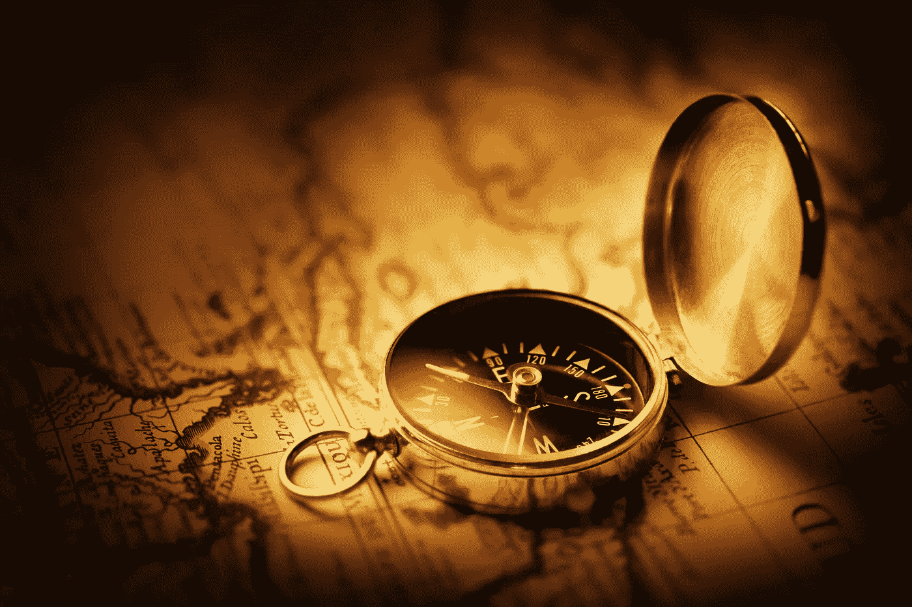

# 34 堂你在学校学不到的人生课

> 原文：<https://medium.com/swlh/34-life-lessons-you-wont-learn-in-school-9dc6b979d52f>

Photo Credit — [iStock_NandoCastoldi](https://www.istockphoto.com/ca/portfolio/Castoldi?mediatype=photography&assettype=image&sort=best)

我们在生活中所学的一切都不会太迟。那些不顺心的经历是为了教育我们，丰富我们，强化我们，指引我们。

***“没有比逆境更好的了。每一次失败，每一次心碎，每一次失败，都包含着它自己的种子，它自己的教训，告诉你下次如何提高自己的表现。”马尔科姆·Ⅹ***