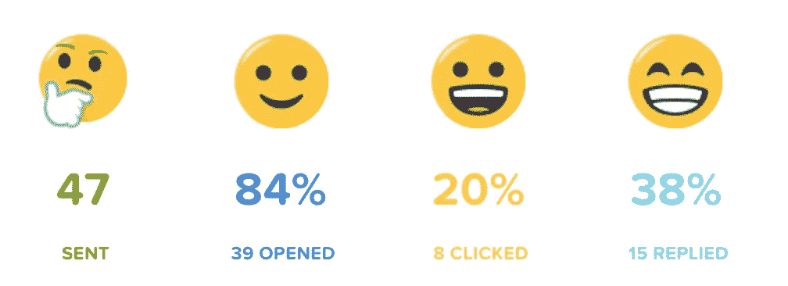

# 如何成为播客的特色[38%回复率的电子邮件模板]

> 原文：<https://medium.com/swlh/38-reply-rate-email-template-how-to-get-featured-on-podcasts-16621b20ca>

几天前，我们开始发送我们的*播客 2.0 推广活动*，以努力在今年夏天将纪尧姆置于麦克风之后。

今天，我将向大家展示我们是如何做到这一点的，以及我们使用的电子邮件模板。但是首先，第一次冲刺的结果。

在这篇文章中，我将分享我们的游戏计划…非常详细，并会分解…