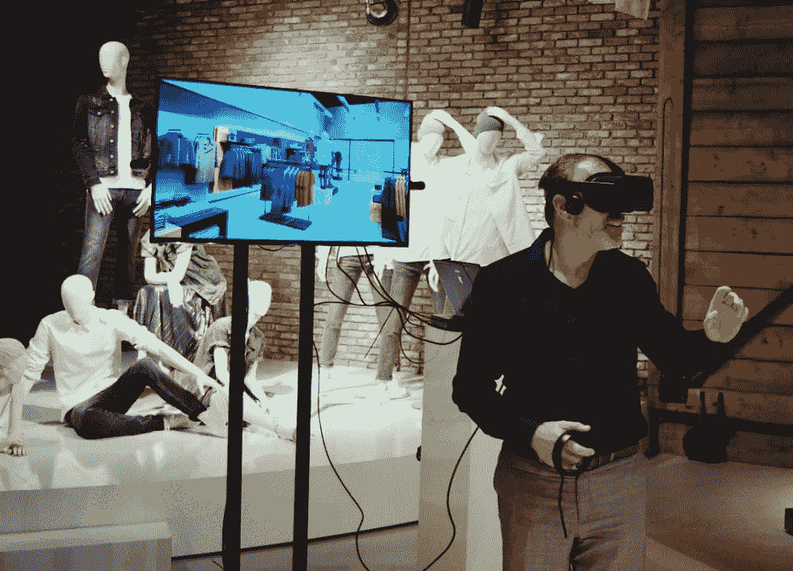

# 3D 技术:时尚的新维度

> 原文：<https://medium.com/swlh/3d-technology-a-new-dimension-for-fashion-6d5407ed880d>

正如人们所说，迟到总比不到好。虽然到了 20 世纪 90 年代早期，3D 设计技术已经普遍应用于汽车、航空和家具设计行业，但时尚行业还没有利用它。具体来说，原始 3D 程序的复杂性使得时装设计师很难采用它们。