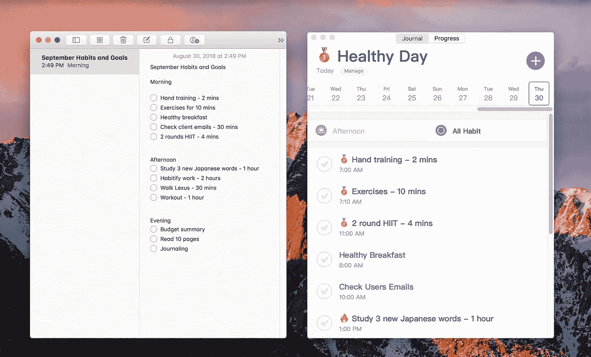

# “谋杀”生产力的 4 个常见误解。

> 原文：<https://medium.com/swlh/4-common-misconceptions-that-murder-productivity-feb912ec2cfa>

以及我的团队如何用它们来构建一个今日应用程序(苹果公司)

A lovely pic of a Vietnamese garage by [Arthur Lambillotte](https://medium.com/u/af800762a6ce?source=post_page-----feb912ec2cfa--------------------------------)

***前言***

我写这篇文章首先是为了我的用户。我相信你已经熟悉了我的变更日志和说明，但不知道 Habitify 背后的哲学。我真诚地希望这篇文章能阐明我们是如何开发这款应用的，以及如何以更好、更高效和更有创造性的方式使用这款应用。

其次，我写这篇文章是为了其他开发者。了解 Swift 并不意味着我们可以编写一个非常棒的 iOS 应用程序。这都是关于研究和不断用市场验证你的想法。我并不认为我的应用程序的发展完全归功于我将在下面介绍的研究和哲学，但我知道它们是指引我们前进的坚实指南针。

—

我们是人类。不是人为的。

但是没多少人懂。

我们试图在短时间内做尽可能多的事情，并自豪地称自己“富有成效”。我们发明笔记本电脑只是为了把自己锁在椅子上几个小时，打字，阅读，再打字。没有灵魂。

看到很多人盲目地跟随这个恶性循环，我们不禁感到有一种做点什么的冲动。有了编码和设计背景，我们选择创建一个 app 来帮助人们打破那个圈子，拥有更好的工作生活平衡，回归真正的“生产性”状态。我们所说的“真实”是指:

> 在一段时间内高质量地完成我们的任务。

我们的第一款应用 [Habitify](https://habitify.me) 就是围绕这一愿景开发的。因此，所有的核心特性都是为了应对人们最常见的生产力误解。

# 1.“如果我采纳埃隆·马斯克的习惯，有一天我也能成为他”

我相信你一定听说过类似于*成功人士的 10 个习惯*或者 *10 个晨间常规杀手，它们会让你的工作效率暴涨*。许多人盲目地认为，如果他们只是养成这样的习惯，1-2 周后，他们就会成为下一个埃隆·马斯克(据说他每周有效工作 100 小时)。我看到很多朋友都失败了。我失败了。

我们在成功秘诀中缺少的是:

> 富有成效等于倾听我们身体的声音。

我们人类的功能彼此不同。你充满活力的早晨可能是我充满活力的下午。我们一天只有几个小时是有效率的，而那个圣杯时刻因人而异。像埃隆·马斯克或史蒂夫·乔布斯这样的超人只占人口的 1%。当我们等待那 1%奇迹般地降临到自己身上时，采取行动成为其余 99%中最优秀的 1%不是更好吗？

与其套用别人的习惯，我们应该建立自己的系统，让*为我们*服务。更具体地说，我们应该在一天中的不同时间承担不同的任务，以最大限度地发挥我们的潜力，从而在更少的时间里取得更多的成就。

如果你在早上感觉最有活力，选择那些需要最大脑力/体力努力的任务。如果你总是像我一样在早上感到疲倦和流泪，那么把它们移到下午/晚上。毕竟，如果早晨第一件事“吃青蛙”是你一天中能做的质量最低的事情，那就没有用了(正如许多生活专家建议的那样)。

*I learned to track my productiveness by the Circadian Rhythm method. Kudos to Barbara Atkinson who has explained it thoroughly* [*here*](https://evernote.com/blog/the-most-and-least-productive-hours-in-a-day/)*. Image source: Google.*

将这个技巧传达给我们的用户并不容易(开始时我们的用户基数相对较小)。出于这个原因，我们决定让它成为每个人都必须经历的 Habitify 的核心功能。

最原始的版本是**按一天中的不同时间对习惯进行分组:**早上、下午、晚上，而不是按类别(健康、工作……)(我会在第 2 部分给你展示一个变通方法)。

你必须填写这份表格，这样才能培养新的习惯，作为回报，它会鼓励你思考*处理它的最佳时间*。

选择合适的时间是保持连续不断的关键因素，因为你的身体更有可能做一些它需要做的事情，而不是你强迫它去做。

*I can’t meditate in the morning because I’m too sleepy. I choose to do it before sleep as it makes me a lot relaxed and easier to drift asleep.*

然而，在对一组人进行测试后，我们真的惊讶地发现:人们喜欢计划。喜欢，很多！他们在每天的日程中安排了很多事情，并且倾向于查看这些事情来检查他们已经完成了多少。

可悲的是，这样做的坏处是，看到一长串未完成的任务，甚至错过的任务，他们会变得非常消极。因此，我们的保留率非常低。

在成功地确定了根本原因之后(感谢与我们最忠实的用户的几次热情交谈)，我们只让他们看到在特定的时间段内接下来会发生什么。

这意味着如果现在是早上，他们只能看到早上的任务；如果是下午——下午的任务，等等。他们不能像以前一样选择一天中的任何时间去看。(当然，他们仍然可以检查所有习惯，但至少我们减少了他们这样做的倾向)

*You can still see all habits by clicking “Reorder”*

如果你有一台 Mac，你不应该忽视强大的组合功能——Notes！

首先，你可以用笔记列出每月重复的任务或你想形成的习惯(脑补)，然后在 Habitify 中按一天的不同时间进行整理。

这是 Mac 的优势所在，因为你有更多的屏幕空间来全面查看你的一天(和笔记)，而手机屏幕有限，你必须永远滚动屏幕。

*Habitify — Notes is a perfect duet!*

# 2.“我明天会记住的”

我们上面的解决方案带来了一个结果:人们认为他们记得他们昨天停止的地方，所以他们可以继续未完成的任务或改善他们今天的表现。他们认为简单地通过记忆，他们明天会更有效率。

恰恰相反。

根据赫尔曼·艾宾浩斯做的一项流行的研究，我们在 20 分钟后会忘记 40%刚学过的东西，而在 9 个小时后会忘记 60%以上。好吧，那么，我们怎么能在 24 小时后依靠我们的大脑回忆起我们到底停在哪里呢？

*Remember the legendary forget-it-all Dory? Our forgetfulness, though not as severe as hers, can sometimes cause bad consequences. Image source: Google.*

为了解决这个问题，我们设计了笔记来记录人们当前的进展。这可能是他们的成就(跑 1 公里，锻炼 10 分钟)，也可能是他们的失败(只做了 45s/60s 的手部训练，因为手太弱，还没回汤姆的邮件……)。

第二天，在开始所有工作之前，他们最多只需要 1-2 分钟来阅读这些笔记，并立即让他们的大脑进入正确的框架。

(罗伯·南丁格尔在一篇名为[“T3 的注意事项是什么”的文章中精彩地解释了这一点。)](https://www.makeuseof.com/tag/time-blocking-secret-weapon-better-focus/)

因此，笔记功能可以帮助我们立即继续工作。有时，如果我们选择只比昨天好 1 个单位(多跑 1 公里，多锻炼 1 分钟)，就能让我们的表现变得更好。换句话说，我们每天都在赢。

我们深受这个 [HBR 邮报](https://hbr.org/2011/05/the-power-of-small-wins)关于日常小胜利的启发，所以我们设计了笔记，让我们的用户在一个地方查看他们所有的笔记——他们的小胜利:

*Putting Notes side-2-side with the graphs gives a better overview. In the habit name you can also set a goal, then use Notes to jot down your progress like me.*

# 3.“如果我承担更多的工作，我会更有效率”

生产率最大的讽刺之一是:

> 实现更多*需要你做更少*

等等。不要离开。我知道你非常困惑。让我解释一下。

过度扩张自己，也就是说，对朋友/同事的所有要求说“是”，是让自己被压倒性的工作量累垮的最快方法。

此外，在一天中为自己承担更多的工作/习惯/目标，你的注意力就会被分割成多个彼此完全没有联系的微小部分。

当你的身体和大脑在“工作”间隙不断要求休息时，你会开始分心，因为它厌倦了每天适应太多的事情。如果有的话，拖延是一个迫在眉睫的敌人，导致你在一天结束时(持续)失望。

因此，与我们的良好意图相反，我们不小心挤压我们的身体，使其效率更低，使其更容易无效。

*Oops, backfired! Image source: Google*

我们每个人一天只有 24 小时。减去我们基本需求和社会交往所需的所有时间，我们只剩下 10-12 个小时(这是一个非常乐观的计算！).如果我们不选择在那 10-12 小时内我们要做什么，事实是我们根本不会产生任何有价值的东西。简而言之，我们在 10-12 小时内没有创造价值。

一天中只选择几件具体的事情去做，你会在更高的层次上看到结果。你开始创造价值。你的身体和思想都集中在几个“话题”上。他们很快就习惯了，而且他们不需要为其他事情“腾出”一点精力。他们处于“最佳状态”。

我们也想帮助我们的用户“进入状态”。我的意思是，如果在一天结束的时候，一个习惯应用程序让人们更加疲惫，对自己更加失望，因为他们无法实现一件事情，那它还有什么用？

我们没有用太多的标签和类别来分散用户的注意力(就像许多传统的追踪器和待办事项应用程序一样)，而是通过在他们的习惯名称和默认的“日志”文本中添加表情符号来让他们专注。

这个功能帮助人们“标记”他们当天最专注的习惯。例如，在周一、周四和周五，我关注的是我的健康(因为周一是一周的开始，所以我需要感觉健康，周四是为了平衡一周，周五是为了准备周六和周日的所有碳水化合物)

*I love “medal” emoji as it gives me a sense of achievement. I know it’s funny, but, who cares?*

从心理学角度来说，一个拥有特殊表情符号的习惯会告诉他们优先考虑其他任务。由于这种专注只存在于白天，他们只能“战胜它或错过它”。

# 4.“当我在工作时，我只工作”

因为许多人声称重视工作与生活的平衡。他们不想把工作带回家，所以他们在办公室里尽可能多地工作。

从某种意义上说，这并不是特别错误，人们应该明确区分工作和享受业余时间。然而，工作难道不是我们生活的一部分吗？如果我们在工作，我们也在生活。在这种情况下，如果我们只工作，不做其他事情，这听起来是不对的。

一方面，不停地工作实际上会降低你的生产力。

另一方面，只工作会剥夺人们一生中可能拥有的许多黄金机会。

我们中的一些人，包括我们的联合创始人，在创建这家公司之前，曾经在一家拥挤的公司工作。我们非常理解，在休息时间在办公室里散步会让我们遇到一个有创造力的同事，他碰巧有一个有趣的解决你的问题的方法。或者，在咖啡机旁偶然遇到的同事可以成为我们未来的妻子/丈夫(哦，相信我，这在我以前的公司偶尔会发生)，或者是潜在的伴侣。

*We’re strongly inspired by Google’s idea behind many coffee corners in the company. They spark new chats, hence, new ideas and opportunities.*

我们不知道我们的用户做什么，他们是谁。但我们知道，通过设计 Habitify 将他们拉出工作区，我们会给他们机会为自己创造更多的机会。

它们可以是社会互动、锻炼或自我保健(例如冥想)。它们可以是任何让创造力流动的东西，或者给我们的血液增加额外的多巴胺(微笑！).就我们的研究而言，它们使人们的生产力提高了许多倍。

因此，我们为 Mac 构建 Habitify。这需要整个团队的努力和资源，但(我们相信)这是值得的。如今，人们花在笔记本电脑前的时间越来越多，可悲的是，他们把自己变成了他们“心爱”工具的自愿奴隶。他们需要一些东西来拯救他们可怜的不安的灵魂。如果我们能做些什么，我们就去做。

第二，我们创建多个提醒。我们都认为，提醒是让用户离开笔记本电脑去慢跑或喝杯水的关键。

> 养成没有提醒的习惯就像没有风的航行。

遵循这个目的，Habitify 的提醒声音被设计成具有高、向上和充满活力的音调。它们最有用的是向用户的大脑发出信号，让他们从正在做的事情中休息一会儿。

*I have about 10 reminders to drink water throughout the day…*

“多重”功能将抵消人们打盹提醒的倾向。如果你发现自己是那个动作的粉丝，设置 10 个提醒，彼此间隔 1 分钟。我很确定你会选择远离工作，而不是时不时地被打扰。

—

尽管我们已经尝试并完善了每个功能，但我们的解决方案并不是一刀切的。我们仍然在采访许多用户以获得更多的见解，希望 Habitify 能够解决的不仅仅是上述的误解。

同时，如果你喜欢这篇文章，我希望你能抽出一些👏帮助其他人找到它。

同样，如果你是我的一个用户(或我的潜在用户)，我希望你能了解这个应用程序是如何工作的。如果你是一名开发人员，我希望这篇文章能为你当前或下一个大项目提供一些想法:)

## 这篇文章发表在 [The Startup](https://medium.com/swlh) 上，这是 Medium 最大的创业刊物，有+431，678 人关注。

## 订阅接收[我们的头条新闻](https://growthsupply.com/the-startup-newsletter/)。

