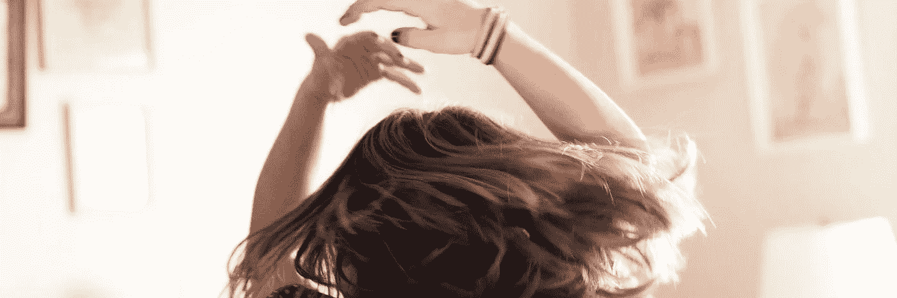
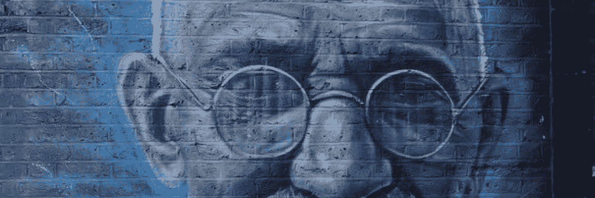
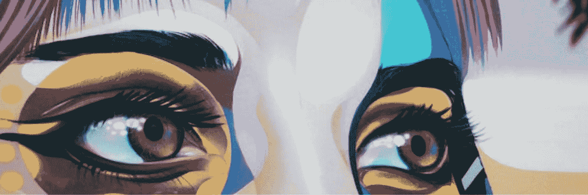

# 我指导一位女性做出改变时的意外发现

> 原文：<https://medium.com/swlh/4-discoveries-i-made-mentoring-a-woman-advocating-for-change-6fc3a76635e0>

那些被看到跳舞的人被那些听不到音乐的人认为是疯了 —弗里德里希·尼采

你可能已经看过《权力的游戏》的很多集了，但你还看过亚历山大·奥卡西奥·科尔特斯的《来自未来的信息》吗？

如果没有，我建议你在重新看另一集《GOT》之前先看看。

看过 AOC 的 [*来自未来的消息；*](https://www.youtube.com/watch?v=d9uTH0iprVQ) 然而，她可能只是一个女人随着别人听不到的音乐跳舞……或者是不愿意？

无论你是否听到奥卡西奥·科尔特斯跳舞的特定曲调，她都是勇敢、勇气和脆弱的杰出典范，需要改变事物，做出必要的改变。

她不是一个人。

数百万像她一样勇敢的女性，无论是政治上的还是非政治上的，都在她们的社区、企业和世界各地震动和隆隆作响。

这启发了我，也是我成为导师的原因。

今年早些时候在 Instagram 上，我注意到一位前同事的帖子里充满了迷人的夏威夷图片和令人振奋的阿罗哈氛围。并列的是快速时尚产业的生态混乱和道德不负责任的信息，遍布她的墙壁。

点击她的[网站](https://www.imbued.co/)，我了解到她设计了一件环保、合乎道德的浴袍，以此来教育消费者关于快速时尚的肮脏生意，成为 [#fashionrevolution](https://www.fashionrevolution.org/) (呼吁时尚行业的透明度、可持续性和道德)的一员，并用一部分收入来回馈参与环境和社会的非营利组织。

接下来，我知道我给她发了一条私人信息，给她发了一个“击掌”表情符号，并表示愿意帮忙。

于是我开始指导一位听到音乐并开始跳舞的年轻女士。

以下是我的四个意外发现。

## 发现 1:我们比他们更需要我们

甘地和他的真理运动认为“我们需要他们多于他们需要我们；非暴力反抗组织听到了一种激进音乐，并及时震撼了整个国家。

今天这个充满激情的年轻一代(和我的女性朋友)，有他们的新音乐，他们的魔力正在发挥作用，没有什么能阻挡他们。

甘地的话提醒我，我们不能单干；我们需要导师，导师也需要我们。我们每个人都在参与塑造我们想象中我们的子孙想要生活的未来。

## 发现之二:这与背景有关

你、我和每个人都有过作为无附加条件礼物的给予者和接受者的相互满足的经历。

当自嘲或微妙的，不那么微妙的，“有所回报”是我们的动机时，我们也一直在“给予”的滑坡上。

在他的书《给予与索取:通往成功的革命之路》中，作者亚当·格兰特对环境和给予有这样的评价:“……当参与者大声朗读诗歌直到他们的声音嘶哑时，他们可以毫无困难地抱怨这项任务。而且他们抱怨的时候，声音也不再沙哑了。根据兰格[研究人员]的说法，他们没有作假。相反，环境的变化带来了新的能量。

太酷了。

对我来说(也许你也是)，有时候我付出我的时间、专业知识或智慧，纯粹是为了让别人的伟大闪耀光芒，或者让别人找到自己的声音和最佳状态，这让我充满活力！

我也曾有过出于其他动机而捐赠的时候，比如认可或赞同，但我觉得自己在某种程度上被贬低了，或者很讨厌。

在这个过程中，我发现没有给予的“正确方式”;做导师或给予者没有道德制高点或完美方式(或*完美*任何东西，但那是另一篇文章的主题)。

我们是复杂的，每种情况都是不同的，所以在我看来，这两种动机可以而且经常共存。

当我们感受到给予的欲望时，我说我们会去争取…在我们的能力范围内，也就是说…我们会通过实践来了解上下文是如何决定一切的！

## 发现#3:给予它，然后放手

通过交换想法，然后退一步看着这个年轻女人使用对她有用的东西，抛弃无用的东西，用她自己的方式应对每个挑战，这是一种快乐，也是一个激励我并让我充满持久价值感的过程。

最终，我们的价值不是由我们积累的知识、我们赚的钱……或者我们拥有的东西来衡量，而是由我们有多在乎以及我们在力所能及的时候付出了多少来衡量。

给它，让它去吧！

## 发现 4:我们将成为我们有勇气看到的任何人！

当我听到召唤我的导师并对她说*是的*我爱的人，做着我钦佩的事情时，我不知道我会成为她勇敢和坚韧的恩人。如果奥卡西奥·科尔特斯说得对，“……我们将成为我们有勇气看到的任何人，”我将被我所看到的改变。