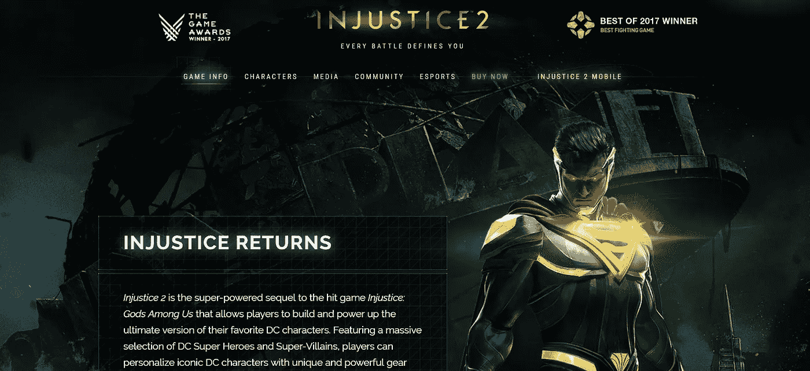

# 创建一个优秀游戏网站的 4 个想法

> 原文：<https://medium.com/swlh/4-ideas-for-creating-a-smashing-game-website-f899d43abfa2>

不言而喻，在过去的几年里，视频游戏行业经历了一次重大转变。

如果我们对现在的游戏和 10 年前的游戏做一个快速的比较，每个人都会注意到他们的技术和视觉能力之间的主要差异。

每一年，视频游戏产业都会生产出数以千计的升级游戏，这些游戏根据用户日益增长的需求和要求进行了微调。

自然，这也导致了相关行业的重大变化。例如，网页设计师的任务是通过最好的网站向公众展示游戏，他们也面临着不断变化的行业的挑战。

说到这里，我们已经决定着手一项任务，看看不同游戏类型的游戏网站的不同例子，并概述它们的一些细节。

# 排名第一的独立推广网站

这无疑是最受欢迎的，如果不是最受欢迎的游戏网站设计类型之一，不管它们是什么类型。

独立的推广网站完全是为了增加游戏的可见性，同时向用户提供尽可能多的信息。

设计和开发这样的网站应该考虑到目标受众。当然，每个游戏都是为特定类型的玩家开发的，网站也需要抓住这一点。

独立促销网站的一个很好的例子是[不公正](https://www.injustice.com/)。非正义是一款游戏，灵感来自于 DC 大部分漫画中展示的宇宙。游戏中的角色是一些最具里程碑意义的角色，熟悉 DC 宇宙的人都知道。这些名字包括蝙蝠侠、超人、原子、忍者神龟等等。

这款游戏由[虚空世界工作室](http://www.netherrealm.com/)与华纳兄弟娱乐公司合作开发。

网站本身做得特别好，它展示了用户需要知道的一切。它概述了游戏的主要人物，同时也强调了关键人物，例如蝙蝠侠和超人。它利用了现代的、反应灵敏的网站设计技术，使其在桌面和移动设备上都可用。

# 排名第二的虚拟现实游戏网站

虚拟现实和增强现实已经成为游戏行业的热门话题。将体验扩展到电脑屏幕之外的能力无疑为全新的、看不见的机会打开了大门。

最受欢迎的基于 VR 的动作游戏之一是 [Sairento VR](http://www.sairentovr.com/) 。这个游戏本身是针对那些喜欢动作场面，不介意在玩的时候出汗的人。由[混合领域](http://www.mixedrealms.com/)、 [Swag Soft 的游戏开发](https://swagsoft.com.sg/game-development/) arm 开发，专注于虚拟现实技术的 Sairento VR 是新兴技术如何应用于游戏开发的一个伟大代表。

网站本身相当简单。这个设计相当简单，它设法抓住了用户需要知道的一切。马上，它打开了一个评论报价，旨在从一开始就获得信任。

以下是一些视频剪辑，暗示了游戏的一些关键特征，进一步激发了用户的好奇心。

当然，这种设计反应灵敏，便于移动。网站的整体主题是现代主义的，这在总体上符合游戏性。

# #3 创造性方法:用网站设计激发好奇心

没有什么比好奇心卖得更好。如果这是由出色而迷人的创意人员实现的，那就更是如此。

创意网站设计一直是一个东西，但现在比以往任何时候都更多地应用于游戏网站设计。人们总是被创造力所吸引。它引发思考、赞美，最重要的是，引发好奇心。

由创意艺术家 [Sarit Evrani](https://www.saritevrani.com/) 开发的死亡即将来临，是这一概念的完美体现。

从一开始，网站就吸引用户，让用户向下滚动以查看网站内容。这，就在这里，已经引起了轻微的承诺。

该网站巧妙地暗示这款游戏是关于人的死亡，但它没有透露更多，这引发了任何喜欢神秘/犯罪类型的人的极大好奇心。

所有这一切都被包装在精彩而简单的创意中，它们看起来很容易，同时又非常不同。

# #4 企业网站

最终，一些公司更喜欢创建一个公司网站来展示他们的游戏。他们选择这样做是为了避免为他们开发的每个游戏创建独立网站的麻烦。

当我们谈论一个游戏开发公司，它的投资组合中有数百个简单的游戏时，这是合适的。这些并不总是证明需要一个专门的网站，特别是如果他们是面向移动玩家的。在这种情况下，游戏可以很容易地作为其投资组合的一部分显示在公司网站上。

# 结论

总结一下，值得注意的是游戏开发的变化正在引起各种相关行业的严重变化。以上举例，网站设计只是其中之一。

然而，重要的是要明白这不是一次性的过程。随着行业的发展，这种事情还会继续发生。创建一个伟大的游戏网站有许多想法，但最基本的是正确识别你的潜在玩家，并在设计时考虑到他们。

## 这篇文章发表在[《创业](https://medium.com/swlh)》上，这是 Medium 最大的创业刊物，有+434678 人关注。

## 订阅接收[我们的头条新闻](https://growthsupply.com/the-startup-newsletter/)。

