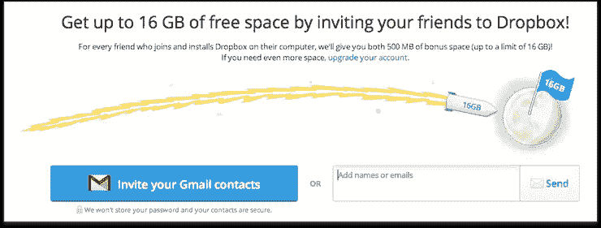

# 增加你的 SaaS 创业公司客户群的 4 个想法

> 原文：<https://medium.com/swlh/4-ideas-to-increase-the-customer-base-of-your-saas-startup-85f12d49ee6e>

软件即服务(SaaS)业务面临的最紧迫的挑战之一是吸引尽可能多的客户。你的 SaaS 创业公司成长的唯一途径是当你的新客户比不回头客多的时候。否则，你最终会被你的竞争对手推翻。

好消息是，SaaS 公司的潜在客户群逐年增长。SaaS 初创公司的创始人可以接触到 400 万每天使用互联网的客户群。如今，在 SaaS 创业变得比以往任何时候都更容易，成本也更低。

大多数成功的 SaaS 企业背后的秘密是订阅模式。客户通常按月收取服务费用，这些服务在云中交付和存储。这种订阅式商业模式确保 SaaS 的初创公司在一定时期内实现盈利，前提是它们能提供恒定的价值，并让客户更长久地着迷。

但大多数 SaaS 企业很难找到他们的早期客户。那么，你如何让人们看到你的 SaaS 创业公司的价值呢？在预算紧张的情况下，吸引顾客的最佳方法是什么？最终，这些问题会出现在每个 SaaS 初创公司创始人的脑海中。如果你在同一条船上，正在寻找让你的 SaaS 生意成功的方法，那么请继续阅读。

以下是一些易于实施的技巧和想法，可以增加你的 SaaS 创业公司的客户群:

# 1.实施推荐计划

相信朋友推荐的东西，而不是点击随机弹出的广告，这是人的天性。 [84%的客户](https://www.nielsen.com/us/en/insights/news/2013/under-the-influence-consumer-trust-in-advertising.html)认为朋友的推荐更有意义和说服力。

这就是为什么为你的 SaaS 创业公司实施一个推荐项目可以创造奇迹，增加你的客户群。这是吸引更多人注册你的平台的好方法。有许多[案例研究](https://www.incredo.co/blog/5-examples-of-excellent-saas-customer-referral-programs)支持这样一个事实，即推荐项目带来了客户群的瞬间激增。广受欢迎的 SaaS 公司优步向顾客发放 20 美元的信用卡，作为交换，他们会把这项服务推荐给朋友。

然而，如果你是一家相对较新的初创公司，没有多余的现金，你可以提供其他有价值的服务。例如，DropBox 向客户免费提供存储空间，供他们推荐朋友和家人。

[source](https://jonathanwylie.com/2013/12/04/how-educators-earn-more-space-with-dropbox-for-free/)

实施推荐计划是增加注册人数的万无一失的方法。更重要的是，它还能让你的现有客户更加投入，这样他们就会一次又一次地再次光顾。

# 2.制定内容营销策略

[内容营销](https://www.rightmixmarketing.com/startup/content-marketing-role-in-the-app-startup-growth/)对于为你的 SaaS 创业公司带来更多有机流量至关重要。智能内容营销策略可以降低您的客户获取成本并为您省钱。秘诀是为你的目标受众创造教育和吸引人的内容，增加品牌信任。它应该有能力将读者转化为顾客。

我们对 [Moz](https://moz.com/help/moz-pro/getting-started/checklist) 如何为其经过深思熟虑的内容创造声誉印象深刻。该网站有一个活跃的博客，大量的权威指南，以及白板周五视频，它们共同产生线索。

但是，不要忘记学习内容分发的基础知识。根据 HubSpot 的营销副总裁基兰·弗拉纳根的说法，在内容创作完成后，你应该把 [50%的时间花在分发上](https://www.linkedin.com/pulse/why-may-time-hire-content-distribution-team-kieran-flanagan)。

# 3.加入联盟营销网站

另一个增加 SaaS 创业公司注册人数的好主意是加入联盟营销网站。没有什么比拥有数百万追随者支持你的 SaaS 公司的顶级影响力更强大的了。

加入联盟营销网站给了你这个机会，这是一个增强品牌信任和增加客户群的绝佳方式。更重要的是，这种策略本质上是低风险的，因为你只在成功销售后向你的加盟合作伙伴付款。

最受欢迎的联盟营销网站之一是 Bluehost。您可以从与您的服务相关的不同影响者中进行选择，并获得更多曝光率。让网上有影响力的人支持你的 SaaS 创业公司将会提高品牌知名度，并为你的网站带来高质量的流量。

# 4.实施透明且易于扩展的定价模式

大多数 SaaS 企业未能扩大客户基础，仅仅是因为它们的定价模式过于复杂。用户没有时间花时间去尝试破译所有的选项和隐藏层。

一个混乱的演示也没有帮助。所以，关键是要尽可能的清晰透明。请朋友或焦点小组看看你的定价计划，并评估其用户友好性。

此外，在吸引更多客户时，不要低估正确定价模式的力量。例如，一些 SaaS 的初创公司提供了一种按使用量收费的模式，他们根据客户的客户群数量来收费。

更常见的是基于用户的模型，它依赖于使用软件作为服务的人数。这个模型完全透明，易于理解。用户可以在软件上享受无限的活动，公司也可以很容易地预测费用。

其他 SaaS 定价模式包括不同的功能，如每活跃用户、统一费率定价、分层定价、按功能定价、免费增值等等。阅读这篇文章，了解更多关于如何为你的 SaaS 创业公司选择最佳定价策略的信息。

# 额外小费

有这么多 SaaS 初创公司在争夺客户的注意力，这很容易让人迷失方向。要想脱颖而出，你需要提供更多东西来吸引人们付费。一个额外的建议是向你所有的顾客提供免费试用，这样他们在输入他们的卡的详细信息之前就知道他们会得到什么。你可以通过给你的用户有限的免费试用来证明你的价值。

一旦你的用户体验到你的业务能提供什么，以及它能如何帮助他们，把他们转化成付费客户就不难了。

# 结论

关键是不断尝试微小的改进。你永远不知道哪一个小小的改变可以提高点击率，吸引更多的用户注册。每一次优化都在加速您的 SaaS 业务增长方面发挥着重要作用。

将这些想法用于有效的客户获取策略，很快你就会看到巨大的回报。通过尝试这些简单的想法来增加你的客户群，今天就开始你的 SaaS 业务的增长。

对于如何扩大你的客户群，降低你的 SaaS 创业公司的流失率，你有什么更多的想法吗？请在评论中告诉我们！

如果你喜欢这个故事，请点击👏按钮并分享，帮助其他人找到它！

**Mehul Rajput** 是专注于网络和应用开发的 [Mindinventory](https://www.mindinventory.com) 的首席执行官和联合创始人。他把写博客作为业余爱好，写了大量与移动技术、创业、商业、企业家和应用程序开发相关的文章。

## 这篇文章发表在 [The Startup](https://medium.com/swlh) 上，这是 Medium 最大的创业刊物，有+422，678 人关注。

## 订阅接收[我们的头条新闻](https://growthsupply.com/the-startup-newsletter/)。

