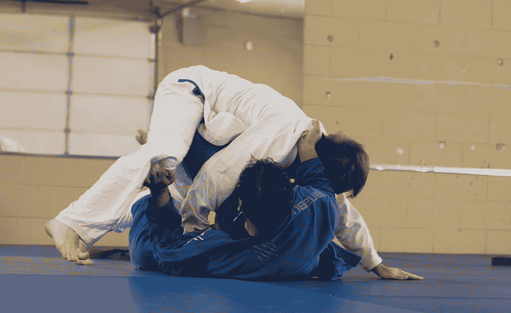

# 差点被噎得不省人事的 4 个领导力教训。

> 原文：<https://medium.com/swlh/4-leadership-lessons-from-almost-being-choked-unconscious-af7faa0ad0a4>

Photo by [Joshua Jamias](https://unsplash.com/@joshuajamias?utm_source=medium&utm_medium=referral) on [Unsplash](https://unsplash.com?utm_source=medium&utm_medium=referral)

## 测试

我站在对手的对面，专注地看着他们。他是不是要抓住翻领拉警卫？也许一个臀部投掷？或者来个双腿打垮？我讨厌那些。

## 有三种赢的方法。

1.点