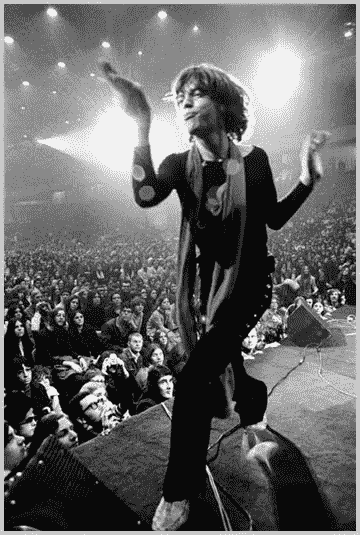
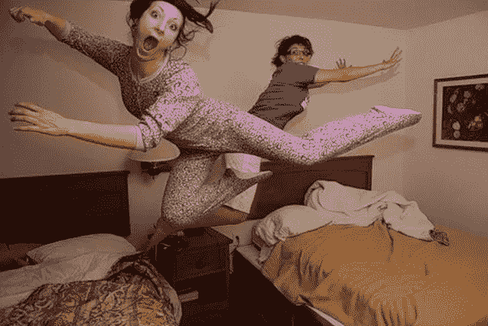

# 一位行为不端的导师教会我如何避免的 4 个领导力错误

> 原文：<https://medium.com/swlh/4-leadership-mistakes-a-misbehaved-mentor-taught-me-how-to-avoid-c43343386667>

在自然产品博览会上，我帮一个客户布置我卖的商品的贸易展览摊位，我问市场总监(一个好朋友)他们是否在招聘销售主管？

这句话还没到我嘴边，她就冲出了我的视线，像一只被扔得高高的回旋镖，回来确认新的销售副总裁将于周日中午在展位上与我见面。

## 错误#1:根据围巾来判断他人，或者 __(填空)

我如期到达展位，被告知销售副总裁(我们称他为乔治)已经出去了，随时会回来。我刚在椅子上坐下，就注意到一个六英尺左右的男人大摇大摆地走过商展的过道，就像滚石乐队演唱会上米克·贾格尔(Mick Jagger)走猫步一样。

这个家伙戴着墨镜(在里面)，黑色紧身牛仔裤，黑色紧身 t 恤，黑色牛仔靴，还有一条豹纹围巾！

没有为此图像提供替代文本

当他曲折地穿过人群时，他径直向我走来，瘫坐在我对面的座位上，把他摇滚明星般的刘海从脸上拂开，用洪亮的声音说:“哇。。。什么节目！”

我很少无语，但这一次，我是哑巴。他打破了沉默。

“那么你就是塔里尼？”他带着一丝惊讶说道。“……我听说了很多关于你的传奇故事！”然后凑过来，近得让我出汗，笑了笑，一种孩子般的和千里眼般的令人缴械的结合。

“嗯，是的。。。我是塔里尼。。。嗯，我猜你是乔治？”

我结结巴巴地说，既是因为紧张，也是因为不得不调整自己对他的印象。

他不符合我心目中他负责领导销售的有机公司的形象——在那里，伯肯斯托克、有机棉、大麻和扎马尾辫的男人似乎是必须的。

但事实是…

我没有时间想象他的样子。

如果我这么做了，他就不会穿得像约翰尼·卡什一样带着豹纹配饰，也不会有像贾格尔那样的舞步。

就这样，我在一家有机草药补充公司开始了我的职业生涯，我找不到比我自己打电话给中央选角更完美的导师了！

他是一个罕见的，完美的结合了疯狂的销售大师，公司不法分子，先验神秘主义者，和我成长所需要的行为不端者。

## 错误 2:不放弃我的议程去服务他人。

“投降，服役。。。太简单了，”乔治说。他的眼睛遥远而模糊，仿佛在回忆他没有听从自己建议的时光。“秘诀就是放弃我们的议程，让对方赢。。。这是您唯一需要的销售建议！”如果他说过一次，他会用同样多的方式说一百次。

# 错误#3:追逐销售目标，而不是转移热情和激励人们

在我和他一起发展这家公司的十三年里，我无数次迷失了自己的目标，固执己见，专注于数字。

当我被过多的数字所驱使，并对此感到厌倦时，乔治会开个玩笑，提醒我认真对待自己的责任，而不是轻视自己。

然后，他会提供一些疯狂的销售智慧，如…

"塔里尼，忘了那些数字吧！"他会爆炸。“你的工作就是转移热情，激发人们爱上这个使命，数字就跟着来了！”

## 错误 4:不放松

一天早上，我怒气冲冲地给乔治打电话，准备解雇我的一个销售代表。

我告诉他我的故事，我把它锁起来，最后说，“给我一个不解雇他们的好理由”？"

乔治毫不犹豫地回答道:“我给你两个。第一:这是你的自我妨碍了你，第二:早上你不会尊重自己。”

然后他补充说，“塔里尼，你的工作是成为一个平静的影响，并离开他们的方式。只是维生素。。。又来了-洛杉矶国际机场。

## 错误 5:基于简历而不是特质招聘

有一次，当我问他为什么要冒险让我去做销售经理……在我没有任何履历经验的情况下……他的回答是:“因为伟大的领导者有能力也有意愿向比他们自身更伟大的东西投降——你两样都有。此外，我看起来像是人力资源部的人吗？?"

## 史诗外卖:停止你自己的行为！

每当我看到保险杠贴纸上写着“行为良好的女性很少创造历史”，我就会想起乔治。

他有一种不可思议的时间感，知道什么时候需要行为不端，什么时候需要遵守规则。出于这个原因，他就是我所说的职业不端者。

“职业不端行为”这个术语是由我的朋友(另一位导师)兼作家里克·刘易斯创造的。按照里克的定义，做一名职业不端者就是聪明地打破规则——我们自己的规则，有时也打破规则——这样我们才能贡献真实的自我，并从我们的工作和生活中获得一种持久的意义感。

我犯的这些错误，或者说仅仅是有惊无险犯的错误，只是我从我的销售导师那里学到的许多教训中的一个例子，他要么聪明地打破规则，要么只是行为不端。

以下是我作为一名精神导师的学员，以及我的摇滚明星销售经理学到的重要一课:

1.脆弱；说出真相，寻求帮助。

2.努力从错误和不良行为中提取钻石，留下莱茵石。

3.做真实的自己(豹纹围巾是完全可选的)！