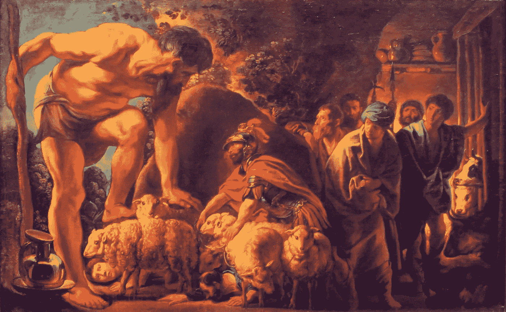

# 希腊英雄奥德修斯给我们上了 4 堂关于激励的课

> 原文：<https://medium.com/swlh/4-lessons-on-motivation-from-the-greek-hero-odysseus-2348d536571e>

## 坚持我们计划的伟大方式

Jacob Jordaens — Odysseus in the cave of Polyphemus

我们需要改变。我们想要改变。但是我们不会改变。

我们都有想要达到的结果或想要戒掉的不健康习惯。我们中的大多数人，在转型之旅的开始，展示了对我们目标的真实而真诚的承诺。然而很少有人能够…