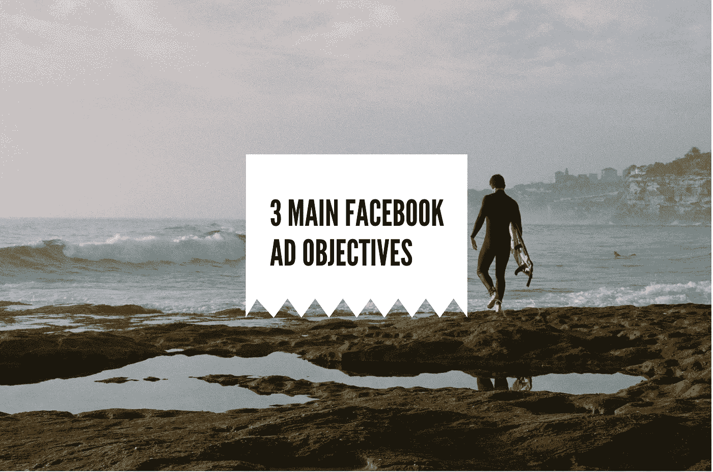

# 脸书广告的 4 个主要目标和你真正需要的目标

> 原文：<https://medium.com/swlh/4-main-facebook-ad-objectives-and-the-one-you-really-need-739f7c4cc4a8>

Photo by [Prescott Horn](https://unsplash.com/@prescott3?utm_source=unsplash&utm_medium=referral&utm_content=creditCopyText) on [Unsplash](https://unsplash.com/?utm_source=unsplash&utm_medium=referral&utm_content=creditCopyText)

我总是害怕刊登脸书的广告。事实上，我会向人们展示我的广告，但他们不会喜欢，这让我每次考虑我的业务时，都不再考虑这个渠道。可能这与童年有关——就像其他孩子一样，我被教导要尽可能不引人注目。如果他们不喜欢我的广告怎么办？如果他们会认为我的广告很可笑，会…