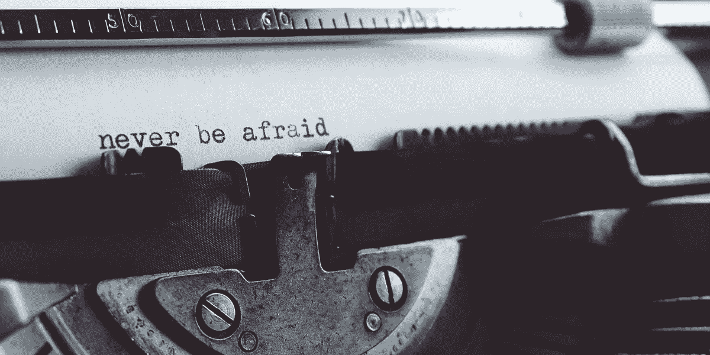

# 称自己为作家需要克服的 4 个心理障碍

> 原文：<https://medium.com/swlh/4-mental-barriers-that-i-had-to-overcome-to-call-myself-a-writer-e0142910a8b1>

## 有些你可能也面临着

Photo on [Stencil](https://getstencil.com/)

在我的生活中，没有什么比写作更失败的了。

这些年来我写了几个博客，但是我从来没有坚持写下去。

不是我缺乏想法，也不是我不想分享我学到的东西，不，我的…