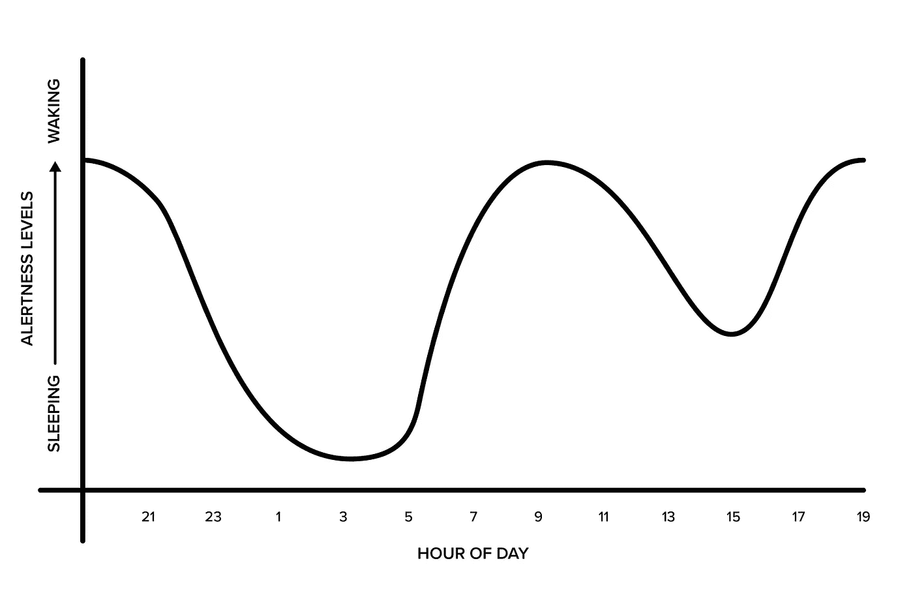

# 4 个强大的战略将使您的工作效率提高 40 倍

> 原文：<https://medium.com/swlh/4-powerful-strategies-that-will-40x-your-productivity-a6e9bfbcb578>

Photo by [Samuel Zeller](https://unsplash.com/@samuelzeller?utm_source=medium&utm_medium=referral) on [Unsplash](https://unsplash.com?utm_source=medium&utm_medium=referral)

如今，有一百万所谓的专家在兜售“生产力诀窍”，但老实说，这些诀窍中的大部分通常是无效的，或者一旦你恢复到正常的操作方式，这些诀窍的用处就会很快消失。

这些黑客大多失败了，因为他们只是一个权宜之计。如果你真的想要长期、持续的生产力，你需要创建万无一失的系统。

始终如一地完成高质量的工作是极其困难的。更不用说还有无数的干扰让你无法达到流畅的工作状态。你的电话、电子邮件、老板、同事和引人注目的应用程序都让你无法成为一个有创造力、高效率的摇滚明星。

这篇文章的目标是帮助你学会如何在尽可能短的时间内创建稳定的高质量工作流。

我们中的许多人依靠意志力来提高生产力，但这注定会失败。意志力是一种有限的资源，很容易耗尽，尤其是当你疲惫不堪、压力重重的时候。

如果你想成为那种人们停下来问你如何在这么短的时间内做这么多事情的人，你需要学习如何创建一个强大的系统，专注于创建一个最高性能的例行程序，知道什么时候根据你的内部生物钟工作，如何正确饮食以获得持续的能量，以及如何创造一个最佳的工作环境。

如果你掌握了这 4 件事，你会惊奇地发现你能在很短的时间内完成多少事情。

你会从盯着空白的屏幕，沮丧地揪着头发，变成源源不断地展示你最好的作品。你将不再因为不能完成简单的活动而责备自己，因为你的大脑感觉迟钝和疲劳。

准备好开始了吗？我们开始吧

# **创造最佳表现惯例**

有没有注意到职业运动员在比赛前有一套非常特殊的程序要反复练习？

这可能是他们的例行热身，伸展，锻炼，听某些音乐，或所有这些事情的组合。关键是，他们这样做是为了进入心流状态。释放最佳工作成果的最佳状态。

你没什么不同。你可能不是 NBA、NFL 或奥运巨星，但你可以是你办公室的会计巨星、博客写手、作家或设计师。开始把自己想象成一名职业运动员吧，尽管这听起来很荒谬。

惯例是强大的，因为它们帮助你做一些事情。首先，它们帮助你在精神和身体上为未来的工作做好准备。不热身就从 0-60 迈加速几乎是不可能的。你认为一个奥林匹克短跑运动员冷冷地走上跑道，进入他们的街区，然后期望赢得比赛吗？当然不是。他们可能会撕裂腿筋。他们在比赛前花时间热身。

第二，例行公事会节省卡路里和能量，而这些能量都花在了低价值的决定上。把你一天中做决定的能力想象成一种有限的资源。你所做的每一个决定，不管有多重要，都会从一天的剩余时间中减去一分。这就是为什么像史蒂夫·乔布斯这样的人每天都穿同样的衣服，为真正重要的事情保留决策权。

那么，如何才能进入最佳状态呢？简单。在前 60-90 分钟内，结合以下活动，为每日比赛做好准备。

*   前一天晚上有一个计划。知道你明天要做什么，你要做什么。俗话说，失败的计划，计划失败。
*   优先考虑以下活动的组合:阅读以获得灵感，合理饮食以获得持续的能量，补充水分，运动和锻炼以温暖你的身心，以及写日记。
*   如果你醒来的时候非常虚弱，考虑使用蓝光疗法来启动你醒来后 15-30 分钟的警觉性。
*   早上锻炼哪怕只有 10 分钟，也会让你的身体暖和起来，让你的头脑从昏睡中清醒过来。
*   写日记是一种重要的精神热身。它让你的头脑为你将要做的事情做好准备。专注于你最大的目标，你的抱负，以及你当天想要完成的主要活动。它不需要比这更复杂，它可以短至 5 分钟。

如果你建立了一个关注这些要素的早晨惯例，你将为接下来的事情做好准备，一系列高质量的工作。

# **生理节奏:知道什么时候上班比知道如何上班更重要。**

昼夜节律是 24 小时的生物节律，是你的生物钟。它决定了你大脑的警觉性和睡意水平。

了解和理解你的生理节奏可能是你所经历过的对你生产力的最大提升。如果你学会了根据你的身心何时最适合某项工作来做，你就不会再觉得自己是在推着一块巨石上山了。工作会毫不费力地从你身上流出。

在一天中，随着时间的推移，我们的思维最适合特定类型的工作。知道什么时候你的大脑为创造性工作或分析性工作做好了最好的准备，可以让你据此制定计划。这是你可以获得的非常不公平的优势。

来源:Guilhem Peremarty

无需深究科学，以下是大多数人生理节奏的一些小窍门。

*   首先，丹尼尔·平克在书*中描述了理解你的时间类型的重要性，例如，你是夜猫子、早起的人，还是像我们大多数人一样介于两者之间？不确定？进行这个测试来帮助你了解你的[计时类型](http://www.cet-surveys.com/index.php?sid=61524)。*
*   如上图所示，上午 10 点左右，人的警觉性达到顶峰。这是做你最费力、最耗费脑力的工作的最佳时间。这可以是写作、做分析工作、设计、销售等。
*   下午 3 点左右，你的警觉性会下降。下午通常是最难进行脑力劳动的时候，因此是小睡 20 分钟的理想时间。
*   下午晚些时候和晚上早些时候，我们有一个能量反弹，这是创造性工作和头脑风暴的好时机。
*   除了高度警觉，我们的[情绪随着我们的警觉](http://science.sciencemag.org/content/333/6051/1878.abstract)而起伏。上午 10 点左右，我们最警觉，最乐观。下午三点左右，我们更困，也更悲观。这里有一个与他人合作的快速提示，如果你需要客户或同事做出一个重要的决定，将会议安排在上午，此时他们更警觉，你更有可能获得积极的结果。

当你学会了你的自然生理节奏，你就学会了利用你的大脑获得最大的输出。你的同事和朋友会敬畏地看着你源源不断的高质量工作。

简单说说昼夜节律，知道你的节律是不够的，你必须像你的宝宝一样计划和保护你的节律！如果你在一家大公司工作，这可能很难做到。

在大公司里，人们经常试图把会议安排在他们最方便的时间，而不是你最方便的时间。知道你在上午最清醒，取消你的计划。这是会议的禁飞区。你需要保护好这段时间，这样你才能发挥出最好的水平。

遵循这个简单的规则:上午工作，下午见面。(如上所述，对下午会面的一个警告是，如果你需要某人做出重要决定，那就在早上做。这是自私吗？你打赌，但是它对你是必要的。)

# **吃正确的食物以获得最佳能量**

我们都有过这样的经历，一位同事带来了一大盒令人垂涎欲滴的美味甜甜圈。你内心的荷马·辛普森被激活了。嗯…油炸圈饼。

你的同事带甜甜圈来真是太好了。很好，只要你想在 3 小时内睡个午觉。

如果你想成为一台思想机器，那么你必须避免碳水化合物糖崩溃。

为了获得持久的能量，优先选择高蛋白、高脂肪的食物，而不是富含碳水化合物的食物。你想吃低血糖食物，这样你就可以避免崩溃。

这意味着吃蛋白质、坚果和低血糖的水果和蔬菜(避免像菠萝这样含糖量高的热带水果)。

像面包和含糖零食这样的高血糖食物会增加你的血糖，并提供短暂的能量爆发。最终结果是能量的快速下降和崩溃。

如果你吃低血糖的食物，并且喜欢复杂的碳水化合物而不是简单的碳水化合物食物，你的身体将会更慢地处理它们，并且你会经历一个更加缓慢的血糖上升过程。

你不仅会避免糖崩溃，而且如果你吃脂肪和蛋白质含量较高的低血糖食物，你会感觉[更饱，时间更长。](https://www.ncbi.nlm.nih.gov/pmc/articles/PMC4204795/)

# **创造最佳工作环境**

有了强大的最佳表现程序，了解什么时候工作和吃什么来保持精力充沛，最后要做的事情就是创造一个最佳的工作环境。没有它，其余的都浪费了。

以下是最佳工作环境的关键:

*   消除干扰:短信、电话、电子邮件、pings、蜂鸣器和通知。每次你分心的时候，可能需要长达 25 分钟才能回到你的工作中。尽量减少干扰，这样你就能保持专注。这里有一些优化你的手机以消除干扰的方法。
*   找到一个独处和不受干扰的安静的地方。如果你在一个大办公室工作，这可能会很困难，尤其是在开放式地板的概念下。如果可以的话，在办公室里找一个安静的办公室、房间或地方，拿着你的笔记本电脑工作。噪音、干扰和喋喋不休的同事会占用大量时间。这并不是说不友好，只是留出时间来打成一片，友好相处。
*   避免一心多用和在活动中跳跃。一心多用会耗费你高达 40%的工作时间。做一件事，把它做好。
*   批量活动。专注做一个工种半天。例如，如果你正在写作，就一直写到中午，这样你就能保持心流。如果你在写作、统计分析或研究等使用大脑不同部分的不同类型的工作中跳跃，就很难达到巅峰状态。以半天为单位执行类似的任务。
*   计划小小的精神假期。按照[番茄工作法](https://en.wikipedia.org/wiki/Pomodoro_Technique)工作，即工作 30 分钟，然后休息 3-5 分钟。在批量活动中重复此操作。
*   重复听没有歌词的歌曲。这可以阻挡嘈杂的干扰，帮助你进入精神状态。音乐的重复性逐渐消失在背景中，使你能够进入一种深度的、深思熟虑的工作状态。

有了合适的工具，你就能成为一台思想机器。你可以在中午之前完成比大多数人一周都要多的工作。关键是:创造一个最佳表现的常规，知道什么时候工作，吃得好，创造最佳的工作环境。

如果你做到了这一点，你就可以按需释放出稳定的高质量工作流。别人会敬畏地看着你。你会成为同事和朋友羡慕的对象。

# 想要发展您的业务吗？

下载 [5 步营销改造](https://www.parkertnash.com/5x-sales/)。这种免费资源将帮助您吸引更多的客户，在一片嘈杂中脱颖而出，并发展您的业务。

[点击这里获取清单！](https://www.parkertnash.com/5x-sales/)

## 这篇文章发表在 [The Startup](https://medium.com/swlh) 上，这是 Medium 最大的创业刊物，拥有+440，678 读者。

## 订阅接收[我们的头条新闻](https://growthsupply.com/the-startup-newsletter/)。

