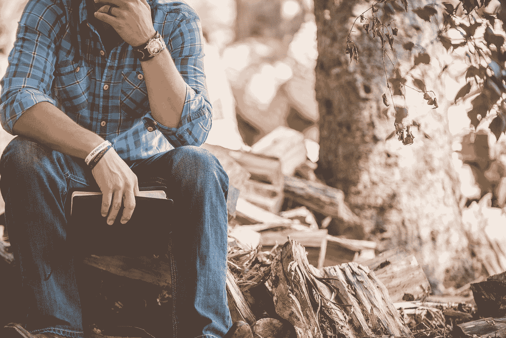

# 我从十几岁时的背部受伤中学到的关于生活的 4 件事

> 原文：<https://medium.com/swlh/4-things-i-learnt-about-life-from-a-back-injury-in-my-teens-18faba7fbda0>

Photo by [Ben White](https://unsplash.com/@benwhitephotography?utm_source=medium&utm_medium=referral) on [Unsplash](https://unsplash.com?utm_source=medium&utm_medium=referral)

我小时候很小。在我一生中的大部分时间里，我都低于平均身高，我也不是特别健壮。

当我 17 岁左右的时候，我开始在 YouTube 上观看健身改造。没过多久，我就决定尝试一下自己的转变。不幸的是，我带着太多的热情去做它，结果在我的…