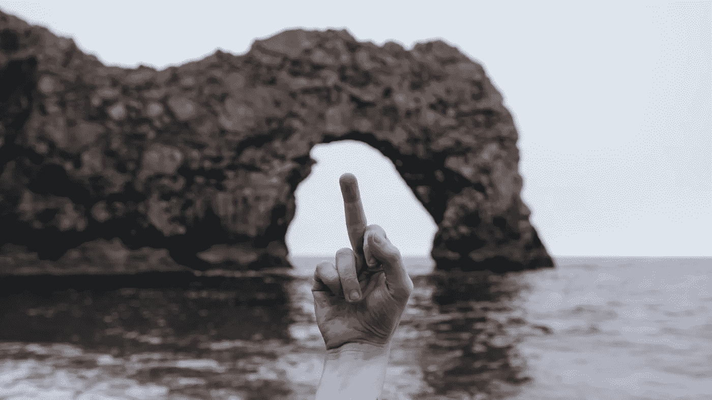

# 对付消极的人的 4 种方法

> 原文：<https://medium.com/swlh/4-ways-to-deal-with-negative-people-6d76e472bf2c>

Photo by [Jack B](https://unsplash.com/photos/VijQ60-SMnI?utm_source=unsplash&utm_medium=referral&utm_content=creditCopyText) on [Unsplash](https://unsplash.com/search/photos/anger?utm_source=unsplash&utm_medium=referral&utm_content=creditCopyText)

## “……尤其是消耗能量的吸血鬼。”

我们自然会被消极所吸引。这就是你今天站在这里的原因。为了生存，我们进化出了对消极的偏见。谨慎者生存，无畏者死亡——就这么简单。

想想你的祖先几千年前漫步在丛林中。如果灌木丛中有沙沙声…