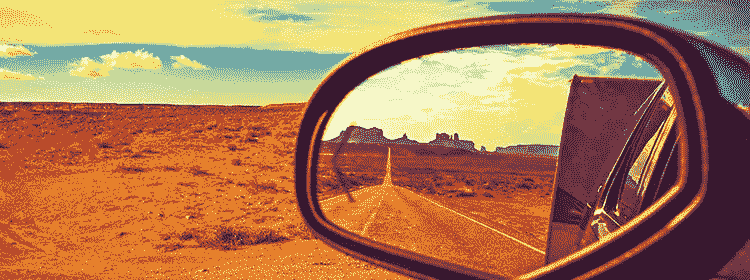

# 超越你现在所处位置的 4 种方法

> 原文：<https://medium.com/swlh/4-ways-to-focus-beyond-where-youre-at-right-now-7a712298666d>

如果你像我们大多数人一样，在本周所有的高潮和低谷中，会有被卡住和不知所措的感觉。我每天都和那些在个人和职业上感到紧张、挣扎和沮丧的人交谈。我们中的一些人在原地打转，还没有到达我们想要的地方。我们还没有“到达”，我们还在磨。