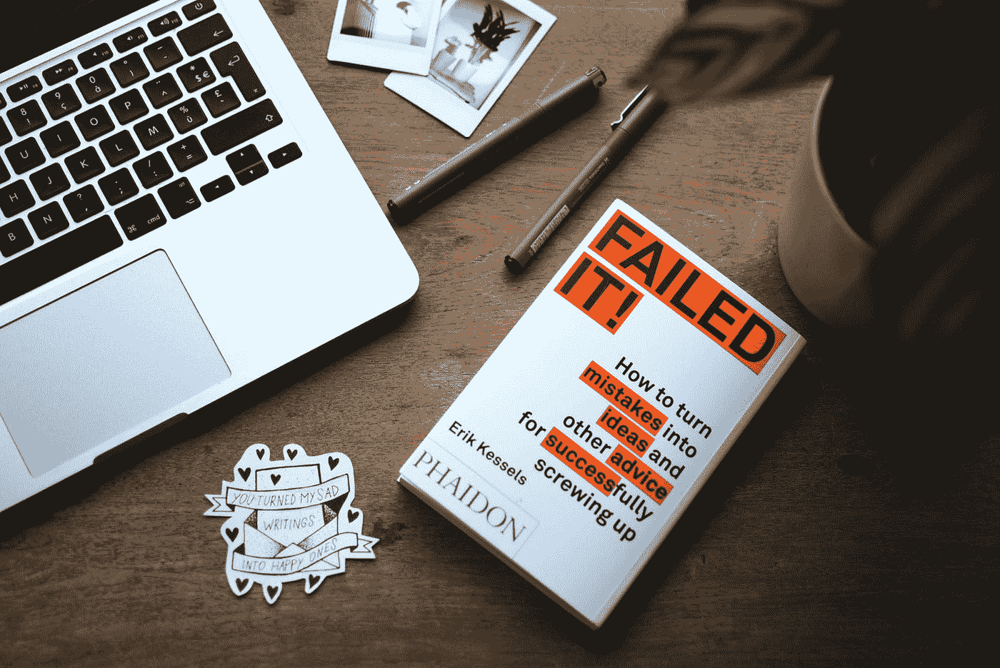
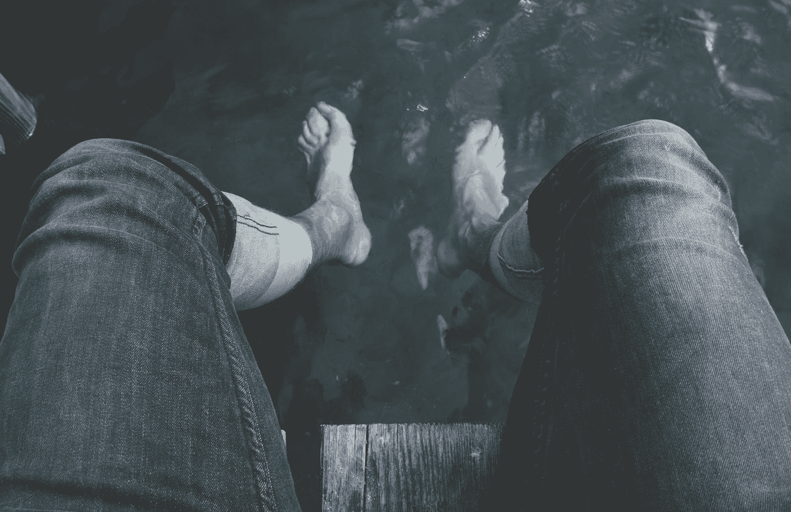

# 实践冒险的 4 种方法

> 原文：<https://medium.com/swlh/4-ways-to-practice-risk-taking-10e4bb4cab24>

## 害怕失败会让你不敢冒险吗？那么它也阻止了你发挥你的创造潜力。

Photo by [Estée Janssens](https://unsplash.com/@esteejanssens?utm_source=medium&utm_medium=referral) on [Unsplash](https://unsplash.com?utm_source=medium&utm_medium=referral)

乐于冒险是创造过程中必不可少的一部分。但是作为古典音乐家，我们在音乐学院的训练中很少学习如何锻炼这块肌肉。

这里有 4 种方法可以让你在舞台上和舞台下练习如何适应冒险:

# 1.从小处着手。

像任何技能一样，你可以从小的、低风险的练习开始，逐步积累到冒更大的风险。

我最初是在蒂姆·费里斯采访诺亚·卡根时听说“咖啡挑战”的。

挑战很简单:走进一家咖啡店，点些东西，然后要求你的订单打九折。不需要合理化或推销你的理由；就问一问，等一个反应。

Photo by [Patrick Tomasso](https://unsplash.com/@impatrickt?utm_source=medium&utm_medium=referral) on [Unsplash](https://unsplash.com?utm_source=medium&utm_medium=referral)

听起来很容易，但是大多数人都会找个理由不去做。根据 Kagan 的说法，这个练习的目的是坚持做一些稍微不舒服的事情。

> “如果你有一点不舒服，那就是你开始成长和学习的时刻……你会发现，‘嘿，我还活着’……很多人甚至在开始之前就已经让自己紧张了。”

每次你在一个小的、低风险的环境中冒险，下次你有机会冒更大的风险时，你会感觉稍微舒服一点。

你也可以在舞台上运用同样的想法。下次你在演奏音乐会时，尝试一种新的指法或弓法。只有一个。看看在这种情况下尝试新事物是什么感觉，并逐渐尝试措辞和时机。

# 2.让不舒服变得舒服。

斯坦福设计学院的一个基本信条是学习如何“让不舒服变得舒服”这听起来很老套，但这个想法的美妙之处在于，一旦你接受了不舒服的感觉，你就不再回避让你脱离舒适区的机会。

走出你的舒适区是非常重要的，因为这通常是最重要的学习和成长发生的地方。

Photo by [Sebastian Unrau](https://unsplash.com/@sebastian_unrau?utm_source=medium&utm_medium=referral) on [Unsplash](https://unsplash.com?utm_source=medium&utm_medium=referral)

这里有一个简单的(理论上)练习不舒服的方法，由“冰人”维姆·霍夫倡导:冷水浴。

> 为了获得最佳效果，将冷水淋浴纳入你的日常生活。由于这需要力量和奉献，Wim 建议逐渐增加持续时间和强度。如果你以前没有洗冷水澡的经验，从普通的淋浴开始，最后 30 秒保持冰冷。你很快注意到你越来越能忍受寒冷，最终[冷水淋浴甚至冰浴](https://www.wimhofmethod.com/cold-therapy)成为你期待的事情(相信我们)。

我还没有完全达到最后一个阶段，但我会说，早上突然感冒会让你在一天的剩余时间里对不适感觉稍微好一些。最重要的是，每天锻炼“不舒服”的肌肉，每当你发现自己处于舒适区之外的情况时，就会变得轻松一点。

# 3.把风险当成机会。

我无法告诉你有多少音乐人因为害怕失败的后果而不敢为某些作品编程，不敢参加试镜，或者说不敢去尝试。当然，没有人想让自己失败，但是有时候，最好的(也是唯一的)检验你能力的方法是延伸你自己，挑战你的极限。

我不认为这些风险是可怕的和注定要失败的，我喜欢把它们看作是学习、成长和测试自己的机会，看看我有什么能力。

Photo by [Samuel Zeller](https://unsplash.com/@samuelzeller?utm_source=medium&utm_medium=referral) on [Unsplash](https://unsplash.com?utm_source=medium&utm_medium=referral)

不要在心里说“我希望我不会搞砸”并祈祷这一刻尽快过去，而是挑战自己在整个经历中尽可能地意识到自己的情绪和行为。不要判断你做得好或差；在冒险的整个过程中，简单地观察自己，看看会发生什么。

当你观察自己而不是判断时，你会从学到东西的经历中走开，不管你是“失败”还是“成功”整个经历变成了个人成长，这是一种更可持续和更有益的方式来推动你的边界，继续成长为一名艺术家。

# 4.记住，你不是你的失败(或成功)。

像音乐这样私人的东西，很容易将你的自我价值与你的专业表现联系起来。

事实是，我们都有失败的时候。我们都成功了。

作为一名艺术家，学会在你的个人自我价值和你的成功与失望之间建立一种健康的分离，是在我们生活的这个艰难、竞争的世界中茁壮成长的唯一途径。

而且过程 100%值得。

在你自己的生活中，你还发现了哪些有助于冒险的做法或心态？在评论里留言吧！

# 关于作者

*中提琴手 Deanna Badizadegan 经常在圣保罗室内乐团和匹兹堡交响乐团担任客座音乐家，她在 2018-19 赛季担任了一年的职务。她在新英格兰音乐学院完成了研究生音乐学习，在那里她师从金·卡什卡希安。她还拥有斯坦福大学管理科学&工程硕士学位和组织设计&工程学士学位。在从事全职绩效工作之前，她曾在硅谷多家科技初创公司担任产品经理。*