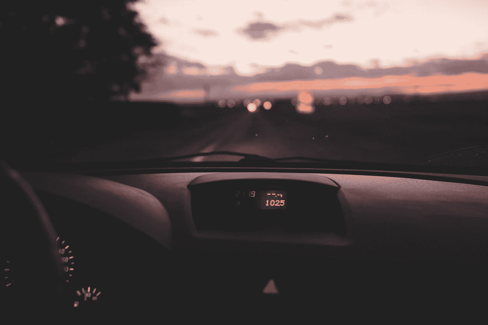

# 44 英里，一出独幕剧

> 原文：<https://medium.com/swlh/44-miles-a-play-in-one-act-74136f55650d>

场景 *:* *洛根和莎拉在参加完共同朋友的聚会后开车回家。气氛很紧张，谁也不和谁说话。*

**时间:** *现在，临近圣诞节的时候。*

第一幕:

*场景一:*

**场景** : *莎拉的 2005 年丰田凯美瑞，洛根和莎拉一起旅行过无数次的车辆——他们的安全空间，一个他们一起纵情歌唱和度过安静舒适时刻的地方。*

莎拉紧握着方向盘，她的指关节几乎发白。她似乎很尴尬，她一直在向前看和不安地审视洛根受伤的自我之间波动。她大声叹息。洛根似乎没有注意到；他不理她，拿出手机，好像在嘲笑她的不适。莎拉伸手去拿收音机的拨号盘，洛根意识到她要说话了，将注意力转向了乘客屏幕。

莎拉

对不起，那是错误的。我不该说的。我……我不知道为什么会这样。

**洛根**

(拒绝看她)

我现在真的不想谈这个，好吗？

莎拉

(她翻了翻白眼作为回应)

你又来了。

洛根

我发誓，我们能在接下来的 15 分钟里不说话吗？这真的很难吗？

莎拉

好吧。但是—

洛根低声咒骂着。他生气地敲打着仪表板。】

**洛根**

你刚刚错过的是我们的出口。天黑前我们肯定回不了家。你必须转过身去。

莎拉

(怒视着他)

我们在州际公路上，亲爱的。我不能在该死的中间带掉头。

**洛根**

如果你看到一个加油站，也许我们可以改变路线。我不知道。我只是……也许我们很快就可以不开车了。

莎拉

我不累。(她停顿了一下)

我只是不高兴你拒绝和我谈这个。你到底打算什么时候提起这些？

**洛根**

我不知道。

莎拉

请不要再说了，你很清楚。

*【玻璃上的雨水坑。莎拉打开了挡风玻璃雨刷；阴沉的天空似乎模仿洛根的沉思。)*

**洛根**

(被激怒了，明显在努力保持镇静)

你不应该看到那条信息，我仍然不知道你为什么认为翻我的旧短信是明智的。

莎拉

你真的想知道吗？

洛根揉了揉下巴，好像在考虑表达一些重大的秘密。莎拉沉思；她在座位上不安地转动着。]

**洛根**

(讽刺地)

为什么不呢？

**莎拉**

我以为你出轨了。我—

**洛根**

什么？！不-不—

**莎拉**

我现在知道，那显然没有发生，但那只是猜测。一件我不愿相信的事。但是你的行为很奇怪，我不知道。

*【沉默。洛根避免直视莎拉。他伸手去拨收音机，她也伸手去拨。不一会儿，他们的手擦过彼此，点燃了沉睡的记忆。洛根退到乘客一侧的窗口。]*

**洛根**

你想知道真相吗？

莎拉咬着下唇，与洛根疲惫的眼神相遇。一拍。】

我从未准备好以你应得的方式爱你。我知道我会搞砸的。我和以前伤害过你的人太像了。你太信任我了。给了我打败你的能力。这就是为什么我不能像我们计划的那样和你结婚。因为你我长大后都会后悔。

莎拉

(迷失方向)

不是这样的。

**洛根**

就这样，匈奴。这就是它的全部—

莎拉

(加热)

你不知道我为你牺牲了多少吗？我身体的任何一部分都没有被你改变。别告诉我这毫无意义。它不可能毫无意义。

*【莎拉故意呼气；她泪流满面，却无药可救。洛根闭上眼睛]*

**洛根**

对不起我们只是太…沉迷其中了。我想在你受到更多伤害之前结束这一切。你不应该读它。还不是时候。

*【莎拉轻轻拭去一滴泪水，洛根——似乎现在才意识到她有多难过——伸手去抓她的手】*

洛根

你还记得那次你在什里夫波特找到工作后，我们和你父母一起吃饭吗？我想这是我们第一次一起吃饭？

*【莎拉笑了，仿佛这一天发生的事情都是一种淡淡的记忆；她和洛根陈旧的现实从未停止]*

莎拉

(反思)

当然，我记得。那是你和我爸爸整晚争论政治的那部。我就知道他会把餐具扔向你。我还是不知道这是怎么开始的。

**洛根**

我也不是故意要和他吵架的。他是个大块头。他是我的四分之一。

莎拉

(笑)

别逗我笑了。我们要分手了，你这个白痴。

**洛根**

好吧，如果你这么说。

莎拉

这不好笑。

**洛根**

(开玩笑地)

那就别笑。

洛根微笑着。然后，莎拉把手放回方向盘上。轻佻的停顿。]

**莎拉**

(向服务站做手势)

那是你的加油站，你要什么吗？

**洛根**

离空还有多远？

莎拉

我们很好，你还记得去年夏天我们在穿越科罗拉多的时候，空车开了一个多小时吗？

她转动方向盘，凝视着他们的出口，观察着来往的车辆。)

**洛根**

(微笑)

美好的回忆。

莎拉

你觉得我们会是好父母吗？

(洛根冷漠地通过他的头发手。莎拉耸了耸肩，似乎是在表示她对他的谨慎做法感到沮丧)

我知道这是个跑题的问题，但如果我们只是随便说说，我想我还是问一下的好。

**洛根**

我能有多少种不同的回答方式？

莎拉

我想一个就够了。

**洛根**

好吧。你会做得很好的。我不知道我是否准备好了，但你会做得很好。我想。

莎拉

(惊呆了，差点脸红)

你这么认为吗？

**洛根**

是的，我已经想了很久了，即使是这样，我认为无论你和谁长期在一起，你都会很棒。

莎拉

我真的不在乎最后和别人在一起，就是这样。这就是我们谈论这个的原因。你知道还有什么吗？

洛根

什么？

莎拉

我不会后悔的，洛根。一个字也没有。另外，这不是你能选择的。它是我的。告诉我什么能忍受什么不能忍受，这有点自私。

**洛根**

(被逗乐)

是现在吗？

莎拉

好吧，这样如何——让我们一起后悔吧。让我们享受这一切，直到我们再也不能。无论好坏之类的东西。

**洛根**

如果我们最终只是互相憎恨呢？承诺并不能真正保护你。

莎拉

当然可以。这不就是爱情的全部吗？

*【长时间的停顿。洛根不知道如何回答。他看了她一眼，然后又看了看地板。】*

**洛根**

那就让我遵守诺言吧。每天。

(他盯着她看了一个小时，但他总是声称眼睛能说的比舌头梦想的更多。]

**莎拉**

你在想什么？

**洛根**

我只是在想我们能不能在回家前把这些都做完。太多了。

莎拉

我们还有 44 英里，时间够吗？

洛根微笑着。她对他回以熟悉的微笑，他想象着这一切——一场无声的游戏在两个年轻的恋人之间爆发。]

*(停电)*

> **结局**