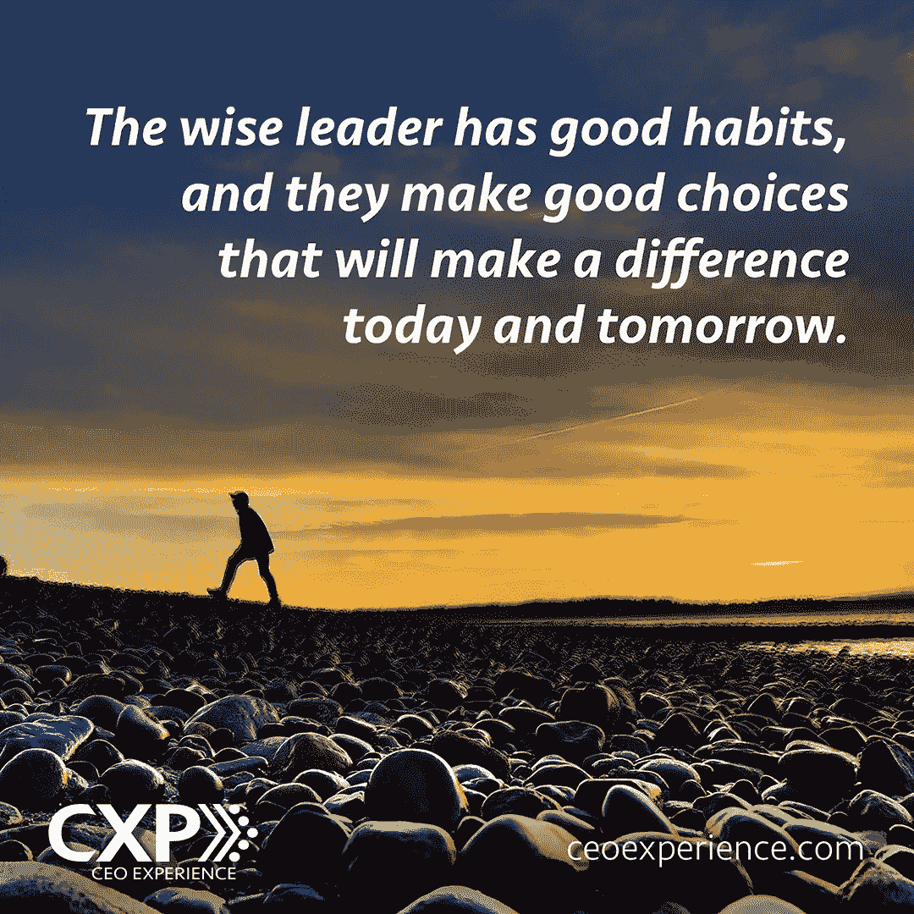

# 当你想放弃领导职位时，可以采取的 5 个行动

> 原文：<https://medium.com/swlh/5-actions-to-take-when-you-feel-like-quitting-leadership-bd1023c24bf2>

领导任何事情都是费力和有压力的。领导艺术要求我们尽最大努力走在前面，指出通往更好目的地的道路。在领导的艰难日子里，领导者通常很难保持新鲜感，也很难有足够的热情来正确地领导他人。在艰难时期，领导力最难的一个方面是你如何领导自己。伟大的领导者决定不放弃或让步，而是即使在他们不想领导的时候也要领导。当领导成为你最害怕的一种领导行为时，对领导者来说是非常沮丧的。

然而，在那些日子里，当你最不想做的事情就是领导时，你可以采取一些小行动，以正确的态度和头脑继续领导。

当你不喜欢的时候如何领导

1.利用你的愤怒和失望情绪。

在经历了最大的失望之后，领导者会经历他们最好的突破。你的愤怒和挫折可以成为加速你的领导力提升的工具。用你受伤和痛苦的感觉去联系你公司里受伤和痛苦的人。告诉你所带领的人你正在经历的感觉和情绪，看着他们在更深的层次上与你联系。

让你的挫折建立更深的动力和弹性，推动你找到下一个大的成功。失望不一定要让你失望，而是可以成为你领导命运下一步的约定。

2.回顾成功案例。

在精疲力尽和压力重重的时候，通读你收到的鼓励的信件和电子邮件会很有帮助。一句鼓励的话可以改变你的整个面貌。这些关于过去成功的话语给了你希望，也给了你作为领导者的价值。每位领导者都应该保留来自团队和客户的积极的笔记、电子邮件和信息。

有时候你能读到的最重要的鼓励信是你自己写给自己的。在压力大的日子里，养成一种习惯，给未来的自己写一张便条，写下你对自己和公司的目标、梦想和抱负。你发送给自己的那些信息可以成为你在未来最需要的时候需要的鼓励。

3.专注于只领导你自己。

去领导你必须开始领导。没有比领导自己更好的地方来实践领导力了。做几个关乎你人生的决定。先领导好自己。关注你的需求和成长领域，做出有助于你成为更好的领导者的决定。这是一个基本事实:当你更擅长领导自己时，你也会更擅长领导别人。

4。寻找一位导师或朋友。

干燥通常是你试图做太多事情的信号。当一个领导者过度扩张时，一切都会变得模糊。模糊的领导是糟糕的领导。在模糊的时代，领导者需要一个能够帮助他们更清晰地看待事物的导师或朋友。你可能需要找一位导师或朋友来讨论你面临的挣扎、挫折和困难。当你有一个可以求助的人时，他们通常可以帮助你决定下一步该做什么。

5.在你有强烈热情的领域中领先。

有时领导变得陈腐是因为领导者试图引导他们认为组织中其他人想要或需要做的事情。不要让组织中的其他人说服你将组织引向何方。带领你有激情和信念的地方。有史以来最伟大的领导者和领导决策都是带着信念和激情做出的。看看你的组织的过去的需求，并且搜索你的灵魂去发现那些领导领域，它们是你的核心价值的一部分。然后你会对领导你自己、你的组织和你的员工感到兴奋。

在你的生活中，你会有一两天不想领导别人。好的领导者会坚持度过那些黑暗的领导日子。人们引用古代受人尊敬的诗人塞缪尔·约翰逊的话说:“伟大的作品不是靠力量而是靠毅力完成的。”这些是一些有益的习惯，即使你不喜欢，你也会发现它们有助于你坚持领导。

关于作者:

肯戈斯内尔是首席执行官和首席执行官经验(CXP)的仆人领导人。他的公司为 CEOS 和领导者提供服务，帮助他们获得良好的体验，从而改变他们和他们的组织，使他们走得更快。肯是《CXP 首席执行官执行指南》的出版人，该指南旨在通过鼓励每月给自己一次学习务虚会来帮助领导者更快地学习。他每月一次的首席执行官务虚会已经帮助数千名首席执行官及其领导团队提高了战略、运营和人员成就。他是作家、主题演讲人、高管教练，也是首席执行官和成功商业领袖的战略伙伴。在 Twitter 上与 [@ken_gosnell](http://twitter.com/ken_gosnell) 联系。