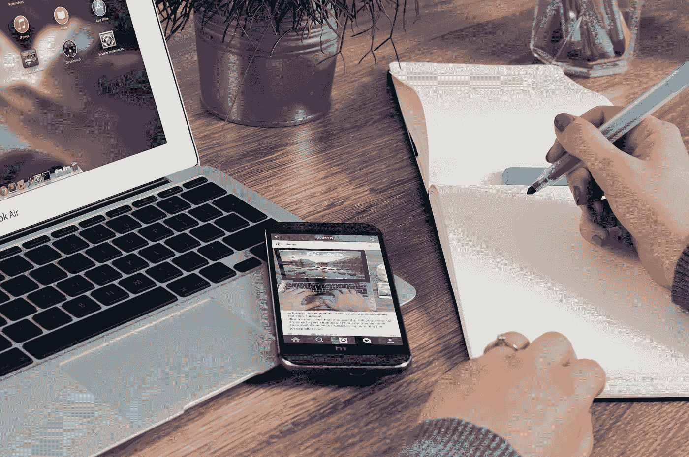

# 我每天使用 5 个 Android 应用程序来提高工作效率

> 原文：<https://medium.com/swlh/5-android-apps-i-use-daily-to-increase-productivity-45b1a3756e1b>

Image courtesy : [Pixels](https://www.pexels.com/)

一段时间以来，我一直在利用科技来保持工作和生活的平衡。由于 android 是我的日常驱动程序，我将分享 5 个帮助我节省时间和提高生产力的 android 应用程序。

# **#1。工作流程**

这个漂亮的笔记工具帮助我组织我的想法和笔记。记笔记对我来说是一项艰巨的任务，因为我总是得到新的想法，并花费宝贵的大脑空间来记忆它们。有了简单的基于公告的设计，workflowy 现在为我做了繁重的工作。如果你想要一个功能更丰富的解决方案(当然，复杂性会增加)，你也可以试试[概念](https://www.notion.so/)。

[下载工作流](https://play.google.com/store/apps/details?id=com.workflowy.android)

# **#2。大脑聚焦定时器**

如果你曾经连续工作很长时间，你应该试试**番茄工作法**。如果我能在很短的时间内完成很多工作，那将会产生奇迹。这个想法是工作 25 分钟，休息 5 分钟，以避免疲惫和重新集中注意力。大脑计时器，顾名思义就是一个计时器，为我设置和提醒那个时间段。

[下载大脑聚焦生产力计时器](https://play.google.com/store/apps/details?id=com.AT.PomodoroTimer)

# **#3。金钱情人**

理财是我落后的另一个领域。跟踪所有的交易最初感觉很忙乱，但我最终使用这个简单的资金跟踪应用程序做到了。界面很简单，它给出了一些不同时间跨度的图形信息，以检查我在哪里超支了。

[下载金钱情人](https://play.google.com/store/apps/details?id=com.bookmark.money)

# #4.旅行

在开始我的“旅程”之前，我从来没有想到自我反省是提高自己的一个如此强大的工具。我花一些时间写几行关于我的一天，并思考明天需要改进的地方。这有助于我找到我浪费时间的地方(以及我正在使用的一些手动时间跟踪方法)，并通过消除这些来提高我的生产率。还支持附图，万一我懒得打字。

[下载旅程](https://play.google.com/store/apps/details?id=com.journey.app)

# #5.顶部空间

冥想对我来说是一种提神醒脑的魔法。最棒的是，如果我有 3 分钟的空闲时间，我也能做到！！短视频是对会议的补充，它通常传达非常有用的信息，帮助我缓解压力，保持专注。

[下载顶空](https://play.google.com/store/apps/details?id=com.getsomeheadspace.android)

## 这篇文章发表在[《创业](https://medium.com/swlh)》上，这是 Medium 最大的创业刊物，有+415，678 人关注。

## 订阅接收[我们的头条新闻](http://growthsupply.com/the-startup-newsletter/)。

