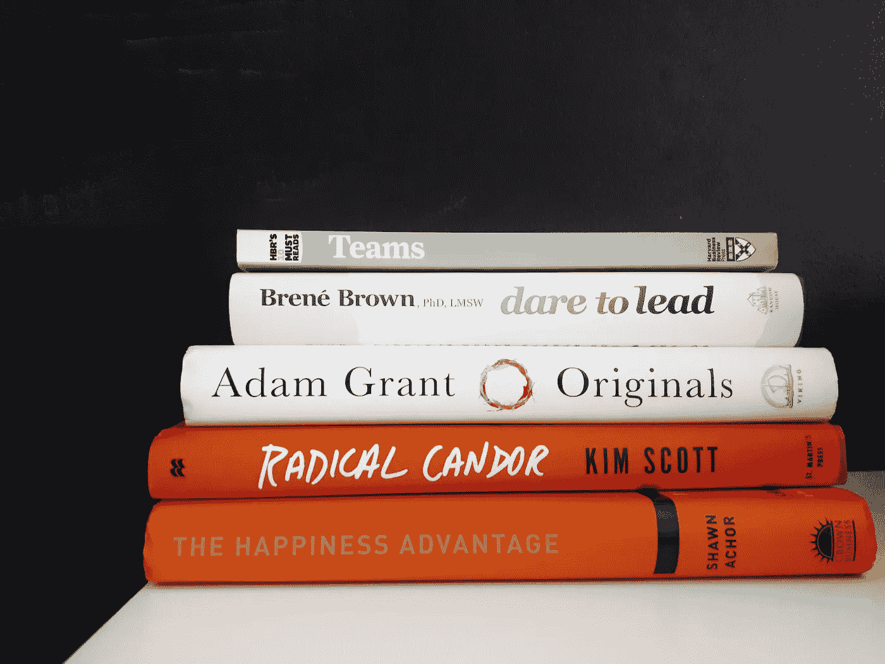

# 任何文化领袖都应该读的 5 本书。

> 原文：<https://medium.com/swlh/5-books-any-culture-leader-should-read-5c07929a70f6>

肖恩·阿克尔的快乐优势
肖恩·阿克尔是一位有趣的作家、演说家和积极心理学家，他曾在哈佛大学研究和教授快乐。他解释说，成功=幸福的规范是倒退的，实际上幸福=成功。他创造了七个适用的原则，让你和你的团队在工作中更快乐，以提高生产力、创造力和成功。

**金·斯科特** 金·斯科特长期以来一直在科技公司工作、领导和咨询，现在她已经为成为一名“牛逼老板”制定了一个框架她分解了在你的团队中建立牢固关系的三个核心原则:“个性化，完成任务，理解为什么重要。”她给传统的领导理论带来了真实、可信、人性化的成分。

亚当·格兰特是著名的组织心理学家。他的任何作品(TED Talk，他在 LinkedIn 上的文章，他的播客)都充满了创新公司文化尝试一些独特想法的真实例子。他的书 *Originals* 讨论了如何成为你的组织或行业的开拓者，让你的大胆想法被倾听和追求。我最喜欢的一章是关于打破群体思维，这是一个普遍的问题，团队陷入一致和服从，而不是挑战彼此和共同的理想。

**敢于被布琳·布朗领导(任何事都由她领导)** 我猜/希望你们中有 33%的人在读这篇文章时会想“咄，萨拉，每个人都知道布琳是个天才”，但我不断遇到不知道的人！所以对于你们中的其他 67%的人来说:Brene 是一名脆弱性研究员，所以她的所有书籍都涵盖了羞耻、勇气、联系、信任等主题——这些通常会让工作感觉良好的东西，她认为并教导我们这些是更好的工作、更好的生活、更好的自我理解、冲突管理、沟通等的基础因素。等等。等等。

《哈佛商业评论》团队必读的 10 本书
我喜欢一本 HBR 的好书，里面充满了开创性组织的案例研究。这个包括:(1)团队的新科学，(2)团队不工作，(3)纪律，(4)协作，(5)小赢，(6)情商，(7)多元文化，(8)决策，(9)“大师”团队，以及(10)管理斗争。

不服气？亚当·格兰特、肖恩·阿克尔和 T21·布伦·布朗都有 TED 演讲，所以你可以先睹为快。

你读过这些吗？我很想听听你们的想法！