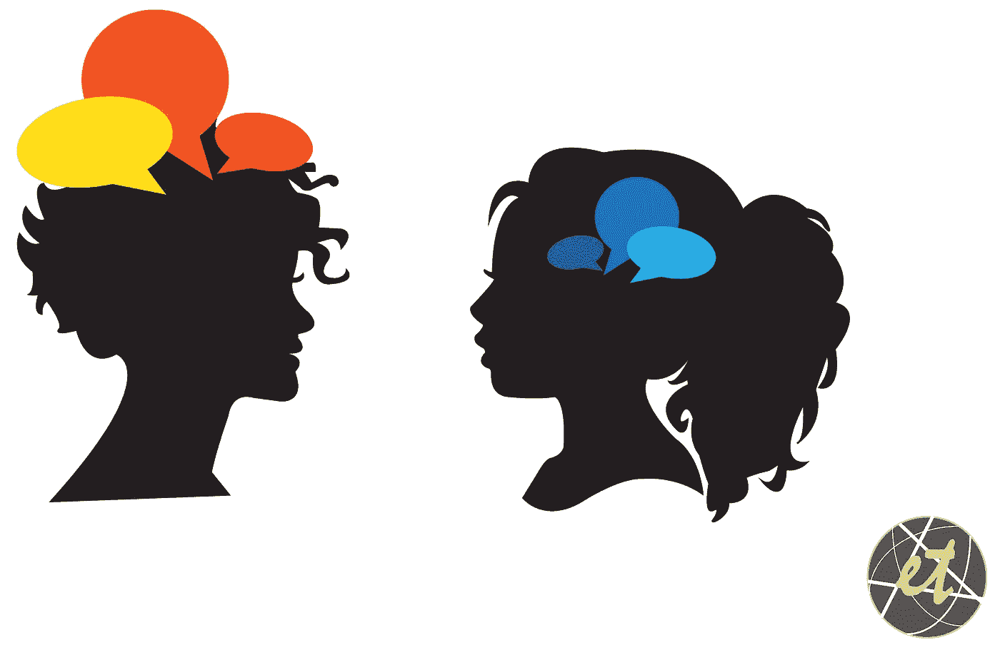

# 关于内向者和外向者的 5 个常见误区

> 原文：<https://medium.com/swlh/5-common-myths-about-introverts-and-extroverts-845a98dccf6c>

## 这出现在[千禧年的来源](https://themilsource.com/myths-introverts-extroverts/)

我们都想更多地了解是什么造就了我们。我有多有创造力？我是一个好的倾听者吗？我是更感性还是更有逻辑？问题层出不穷，但有一个问题比其他任何问题都更能定义我们的个性以及我们如何与这个世界互动: