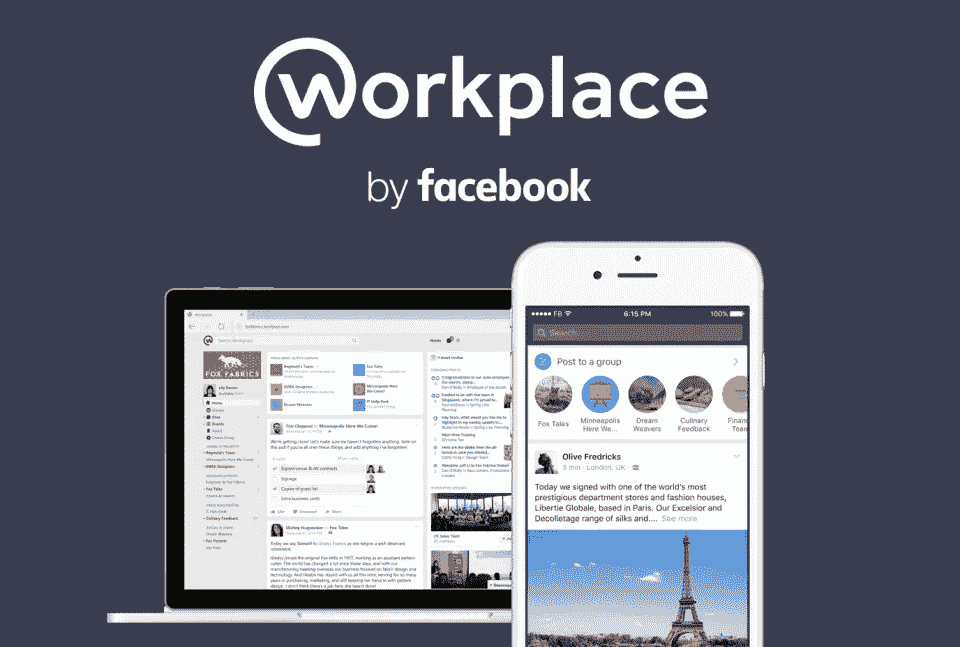
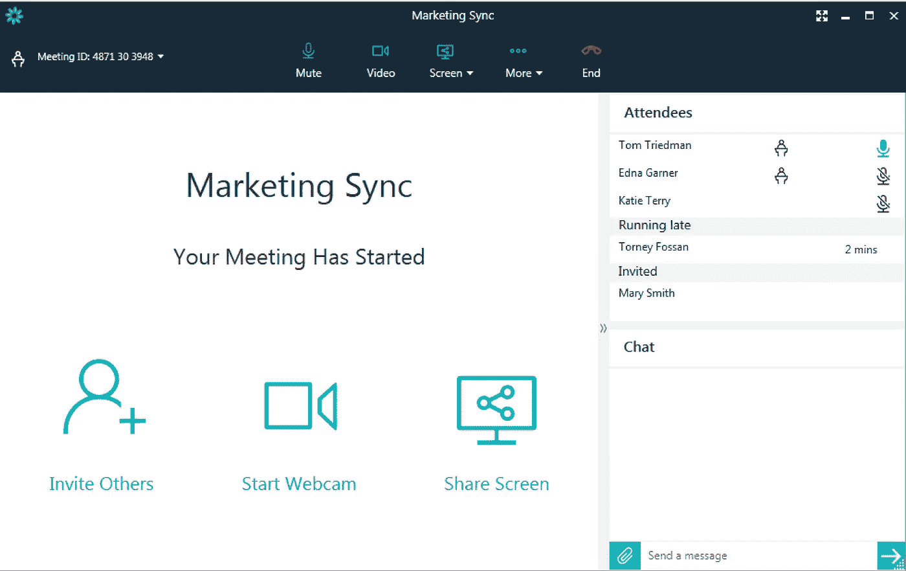
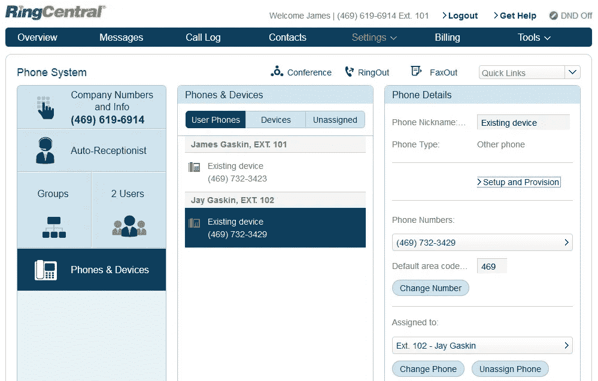
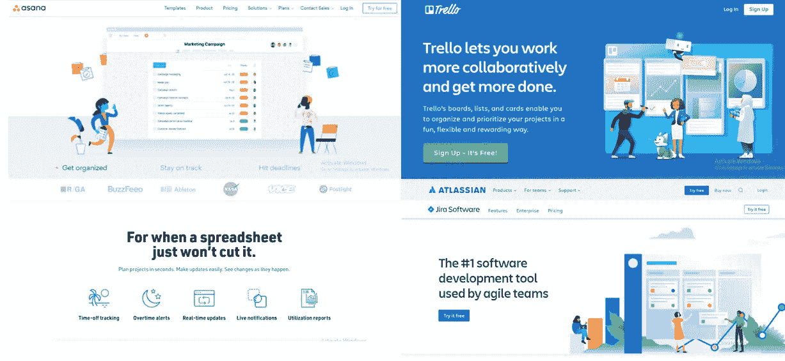
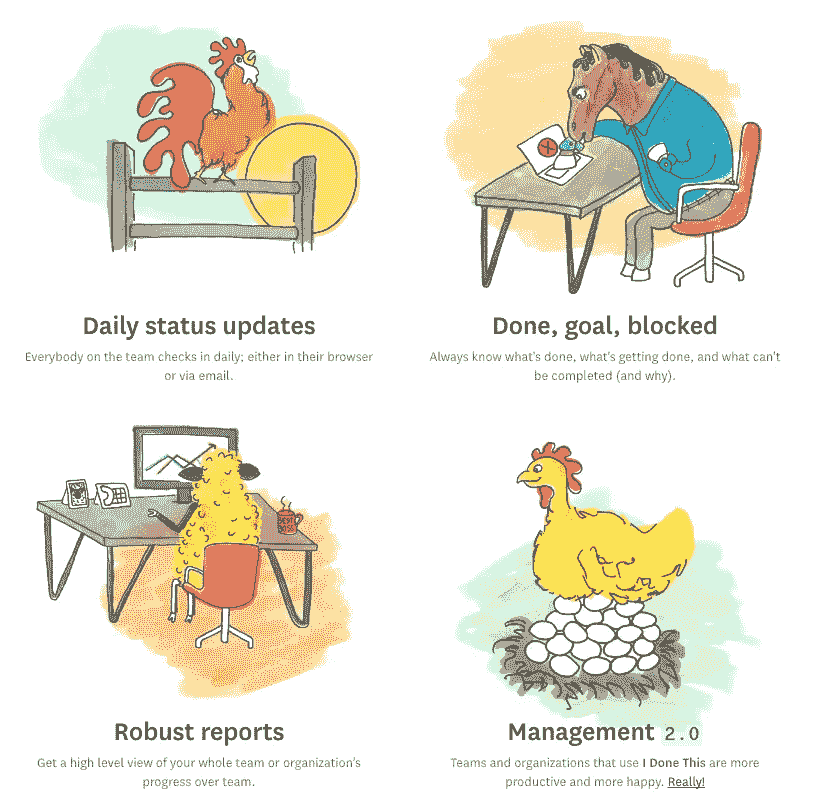

# 2019 年远程工作的 5 种有效方式

> 原文：<https://medium.com/swlh/5-effective-ways-for-remote-work-in-2019-c2d7b12b784>

当异地恋不成功时，我们归咎于“距离”导致的交流减少。但是当你有生意要做的时候，你如何逃离黑洞呢？我们不能不谈房间里的大象！深刻而清晰的沟通是我们在团队内部和团队之间以及员工和管理层之间建立联系的唯一途径。

真正意义上的世界是一个地球村，劳动力现在往往分散在世界各地。在这些情况下，团队中的每个人在一天结束时都在同一个“屏幕”上是最重要的。

> 远程完成工作不是夏威夷海滩上的笔记本电脑

远程工作获取需要周密的计划和深思熟虑。当前的远程工作人员有[370 万](http://globalworkplaceanalytics.com/telecommuting-statistics)名员工，预计在未来几年内将呈指数级增长！人才和潜在的广泛联系在世界各地有一个充满机会的海洋，雇用人们来完成工作，由你和你。雇佣良好的工作环境、更好的头脑和最好的技术。

我将远程通信分为五大类:

1.  闲谈
2.  会议和视频聊天
3.  项目管理
4.  计划者
5.  云存储

# 闲谈

团队聊天的主要好处是，它将您公司的所有通信保持在一个地方，使团队中的每个人都更容易通过群组或私人聊天进行相互交谈。Slack 现在已经成为正式交流的一种方式。人们几乎已经养成了像 Instagram 或脸书那样频繁检查 Slack 的习惯。但这不是关于职业的。是时候为银河系中的每颗恒星找到平行宇宙了。

## 1.脸书的《工作场所》

[**职场**](https://www.facebook.com/workplace) 出自脸书。脸书也这么做吗？是的。在内部，脸书自 2011 年以来一直使用 Workplace，然而，它在 2016 年才作为一个在线团队协作工具推出，使用脸书的功能进行工作。Workplace 提供了工作场所聊天、实时视频、新闻提要、多公司协作、人员目录、群组和其他脸书功能。Workplace 是一个简单的平台，通过熟悉的界面与您的远程团队进行交流。

## 2.群众

Flock 是一个商务信使，非常适合通过聊天快速做出决定。这款通信应用拥有众多功能，可提高生产力、效率和执行速度。它的界面使你能够通过聊天和视频电话与你的团队联系，管理待办事项，进行投票，甚至设置提醒。Flock 可以轻松地与 Trello、Twitter、Hubot 和 GitHub 等应用程序集成。

## 3.微软团队

[微软团队](http://products.office.com/en-us/microsoft-teams/group-chat-software)是软件即服务，与生产力巨头的 Office 365 订阅直接相关。它创建了一个基于聊天的工作空间，专注于实时协作。它包括聊天、会议、笔记、办公、规划、Power BI 以及扩展和应用程序。团队有线程持续聊天，可以是公开的或私人的。它还集成了该公司的 Skype 视频服务，此外，您还可以邀请客人加入您的聊天。如果你是一个专注于微软的企业，团队是一个很好的选择。

## 其他一些团队聊天应用

*   [Twist](https://zapier.com/blog/best-team-chat-app/#twist) 进行以对话为中心的线索式聊天
*   [谷歌视频聊天](https://zapier.com/blog/best-team-chat-app/#google)用于跟进对话
*   思科 Webex 团队在聊天中模仿想法
*   [Mattermost](https://zapier.com/blog/best-team-chat-app/#mattermost) 用于自主团队聊天
*   [聊天工具](https://zapier.com/blog/best-team-chat-app/#chatwork)用于跨团队聊天
*   [Ryver](https://zapier.com/blog/best-team-chat-app/#ryver) 为重要消息添加更多细节
*   [Zoho Cliq](https://zapier.com/blog/best-team-chat-app/#zoho) 用于同时在多个讨论中聊天

# 会议和视频聊天

2-3 年前，视频通话还只是 SKYPE 的专利。然而，事情注定要发展，我们发现、发明和探索了各种可用于视频通话和远程会议的平台。

## 1.亚马逊钟声

Amazon Chime 让您可以与 AWS 的安全人员见面、聊天和协作。您可以在您的设备上无缝工作，在办公桌上或在旅途中开会，确保您始终保持联系。您可以使用 Amazon Chime 进行在线会议、视频会议、通话、聊天，并在您的组织内外共享内容。

## 2.站立。io

[**单口相声**。io](https://standups.io/) 是运行专门为远程和分布式团队制作的每日视频单口相声的最佳方式。通过分享个人故事，帮助团队保持消息灵通并参与定期沟通。

## 3.中环会议

交互式屏幕共享、一键式日程安排以及与包括微软和谷歌、Dropbox、RingCentral Meetings 在内的大公司的大量集成选项，对于那些希望将大量不同支流引入同一条河流的远程企业来说，是一个明智的选择，因为它用户友好、可靠且几乎不需要维护

## 其他一些会议和视频通话应用

*   [不和谐](https://zapier.com/blog/best-team-chat-app/#discord)持续语音聊天
*   [思科 WebEx](https://www.webex.com/) 提供实时会议流
*   Skype for Business
*   谷歌二重奏

# 项目管理

1.  Asana
    Asana 的项目和任务管理非常适合远程团队，因为它提供了所有管理和跟踪任务的选项。
2.  Float
    [Float](https://www.float.com/) 是团队资源和项目跟踪的伟大工具。它易于使用，并可根据您的客户计费结构进行定制。非常适合小型团队！
3.  JIRA
    [JIRA](https://www.atlassian.com/software/jira) 能够流畅地管理开发和营销团队的工作冲刺。JIRA 是一个非常强大的项目和问题跟踪器。如果你是从一个小团队开始，试试下面的选项。
4.  Trello
    [Trello](https://trello.com/) 的易用性使其不仅成为项目和任务管理的绝佳工具，还能引领远程产品功能优先级会议。

# 计划者

记下待办事项的想法永远不会出错。以简单、简约和高效的方式将团队中分散在不同地点的事情排列起来的最有效的方法是创建一个虚拟的仪表板，上面有特定一天的待办事项。

1.  Google Keep
2.  iDoneThis 是一个有趣的工具，对于远程团队来说，它可以用来监视彼此的进度

# 云存储

所有工作完成！现在，让我们把工作分享给从巴黎到夏威夷的客户:P 不用说，企业爬着上网，使用云存储来轻松保存文件，而不再需要在没有保存工作的情况下关闭电脑

1.  谷歌驱动
    谷歌驱动时期
2.  [Dropbox](https://www.dropbox.com/)
    这是我合作过的大多数设计和开发团队的首选云存储。Dropbox 最近也发布了 Paper——一款类似于谷歌文档的独立应用，可以让你进行实时协作

附件

1.  通过视频通话让您的远程员工加入您的聚会，让他们感受到包容。
2.  如果可行，让团队中的每个人平等地参与决策过程。
3.  当你们在巴黎分手时，给他们送午餐或晚餐优惠券给你们当地的团队
4.  当你在夏威夷晒日光浴时，要注意远程工作者可能要面对的各种外部因素的热量😀
5.  夜间行动，倾听团队中的每一个意见，给那些值得的人诚实有效的信任，尽管是远程工作

快乐的远程工作者们！！干杯！

## 这篇文章发表在 [The Startup](https://medium.com/swlh) 上，这是 Medium 最大的创业刊物，有+431，678 人关注。

## 订阅接收[我们的头条新闻](https://growthsupply.com/the-startup-newsletter/)。

