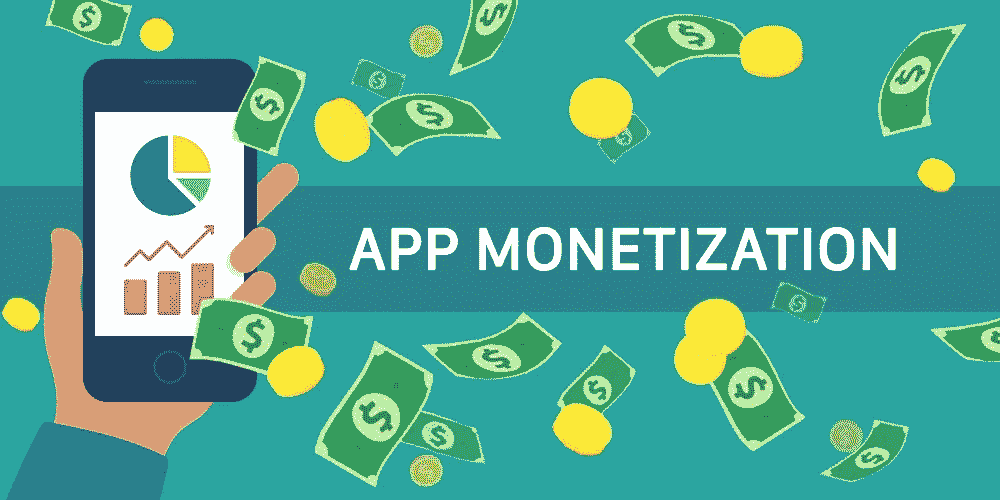
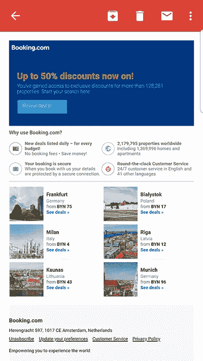
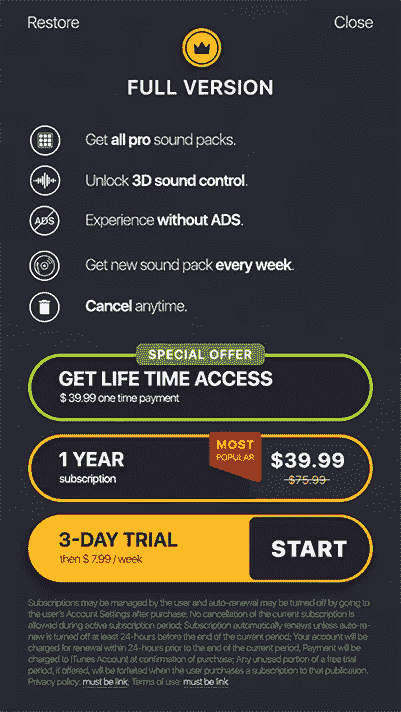
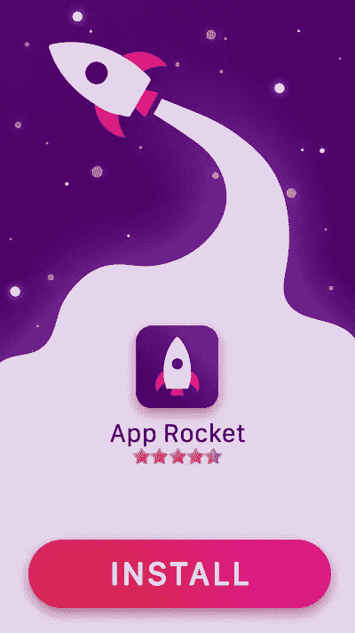
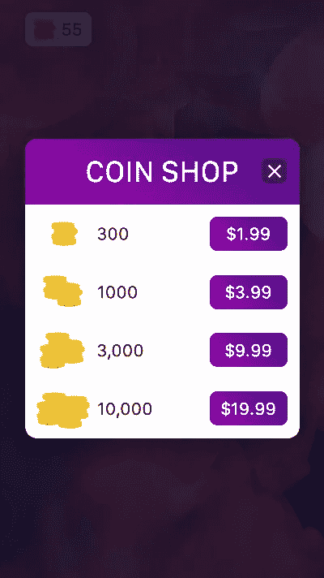
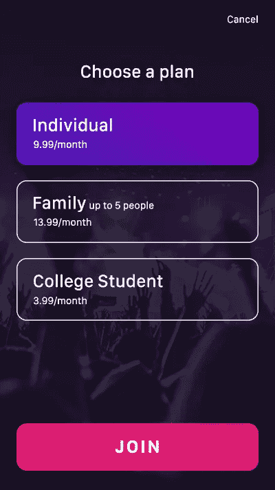

# 5 种在不惹恼用户的情况下实现移动应用货币化的方法

> 原文：<https://medium.com/swlh/5-efficient-methods-to-monetize-your-mobile-app-without-stressing-the-users-a21550cacc>

Statista [估计](https://www.statista.com/statistics/271644/worldwide-free-and-paid-mobile-app-store-downloads/)2017 年移动应用下载总量约为 1970 亿，而整个应用经济[预计](https://venturebeat.com/2016/02/10/the-app-economy-could-double-to-101b-by-2020-research-firm-says/)到 2020 年将达到 1010 亿美元。

记住这些数字，很明显移动应用程序开发是一个值得投资的有利可图的行业。然而，对于移动应用来说，有一条规则让快乐的未来看起来不那么光明:90/10 规则。这意味着，不到 10%的应用程序从应用程序安装中获得了 90%的净收入。正如康妮·古列尔莫(福布斯)[所说:“在付费应用中，大约 90%的应用每天被下载的次数少于 500 次——每天的收入少于 1250 美元”。](https://www.forbes.com/sites/connieguglielmo/2014/01/13/mobile-apps-may-not-pave-the-way-to-developer-riches-sales-average-less-than-1250-a-day/#27881f114890)

那么，如果你的应用程序很棒，你希望你的努力和辛勤工作得到回报，你会怎么做？货币化是增加收入的关键。如果做得好，适当的货币化方法不仅能让你的利润翻倍，还能提高客户忠诚度，增加你的受众。听起来不错？找出下面最有效的赚钱策略。

# 电子邮件

不要低估电子邮件，因为它们仍然是一个强大的营销工具。研究表明，在电子邮件营销上每花 1 美元，你就会得到 32 美元的回报。

在要求用户通过应用内订阅输入他们的电子邮件之前，确保你制定了一个可靠的营销策略。电子邮件可以用来通知用户有关促销的信息，作为通知，并有助于个性化(“第一个了解”策略)。

**最适合:**教育类应用、社交媒体类应用、旅游类应用、活动类应用、娱乐和生活类应用。

# 免费增值模式

这是最受欢迎的应用程序货币化策略之一。虽然你免费提供应用下载和体验，但某些功能将保持锁定——除非用户付费。

一个很好的例子是 Tinder 约会应用程序，你要么必须等待一定的时间才能获得更多的喜欢，要么你可以支付并继续无限量的游戏。

这种策略确实有效，因为它不会激怒用户，并提供完整的应用程序体验，但同时也是一种诱惑。然而，关于免费增值应用模式，有一个技巧。你必须确保你的应用足够好，能够吸引用户的注意力，并鼓励他们付费来解锁完整的应用功能。

**最适合:**游戏，有“进度”的 app。

# 应用内广告

广告是最可靠的赚钱策略——那么为什么不使用它呢？对于移动应用，有几种类型的应用内广告:

**间质**

这些应用程序具有全屏尺寸，能够很好地吸引用户的注意力。它们通常发生在应用程序内操作之间的暂停期间(例如，级别之间的转换)，因此不会打断用户的体验。此类广告提供了与广告互动(下载、播放)或跳过广告的选项。一方面，插播广告效果很好，但另一方面，不要太频繁地投放——否则，你会激怒用户。

**本土**

这是最流畅的 app 广告类型。原生广告与应用程序的内容相似，感觉它们是应用程序的一部分。这类广告通常带有“赞助”或“推荐给你”的标签，这样用户就知道内容是付费的。

**横幅**

这些广告位于应用程序的顶部或底部，应谨慎对待。它们是最令人分心和恼怒的广告类型，因为当用户与应用程序交互时，它们一直挂在那里。因此，要么横幅应该真正与你的应用程序相关，要么在使用之前三思。

**捕捉**

这种广告形式收集用户的电子邮件地址或其他联系方式，并经常提供奖励作为回报。虽然不适合所有类型的应用程序，但它对社交网络应用程序很有用。

**最适合**:所有类型的 app。

# 应用内购买

应用内购买模式类似于免费增值战略。用户可以免费使用该应用程序，但如果他们想增强游戏或获得一些额外的功能，他们必须付费。最受欢迎的例子之一是在游戏应用程序中购买宝石或硬币来继续游戏。

然而，在线零售商也可以在其应用程序中加入应用内购买的选项。在这种情况下，订购和结账的过程应该简单易行，以防止应用流失和购物车废弃。

**最适合**:游戏和电商 app。

# 捐款

订阅模式也类似于免费增值，最适合提供内容的应用:新闻、娱乐等。例如,《哈佛商业评论》网站只提供 4 篇免费阅读的文章——但如果你打算成为一名普通用户，你可以订阅定期接收内容，并获得无限量的文章。福布斯应用程序也是如此，它为不同的时间段提供不同的订阅套餐。

**最适合**:新闻、娱乐、生活类应用。

# 要记住的一件事

如果你想鼓励用户投资你的应用，你必须提供卓越的质量和卓越的用户体验。因此，在你开始考虑货币化之前，确保你已经考虑了以下几点:

*   正确识别你的目标受众
*   根据您的目标受众及其偏好选择合适的平台
*   遵循应用商店优化指南
*   测试你的应用程序，直到你 100%确定它的性能是完美的
*   制定一个坚实而清晰的营销策略

并且为了保证 app 的质量，慎重选择自己的开发公司。在[dash bounk](https://dashbouquet.com/)，我们专注于移动应用程序开发，我们已经成功交付了许多不同规模和复杂程度的项目。

[*德米特里·武科写的*](https://www.linkedin.com/in/dmitrybudko/%5C)

## 这篇文章发表在 [The Startup](https://medium.com/swlh) 上，这是 Medium 最大的创业刊物，拥有+411，714 名读者。

## 在这里订阅接收[我们的头条新闻](http://growthsupply.com/the-startup-newsletter/)。

