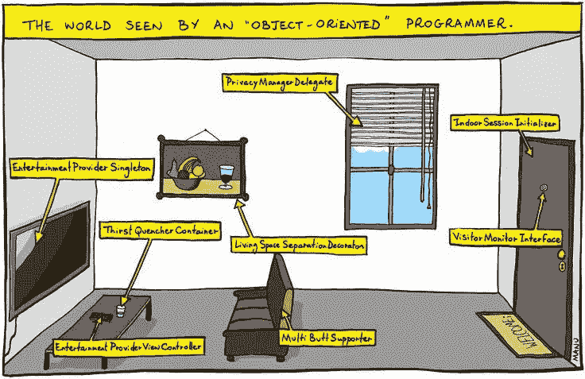
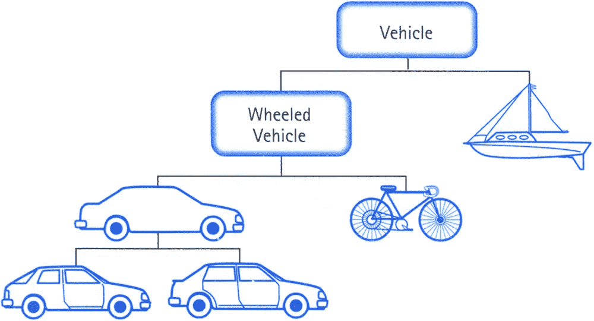
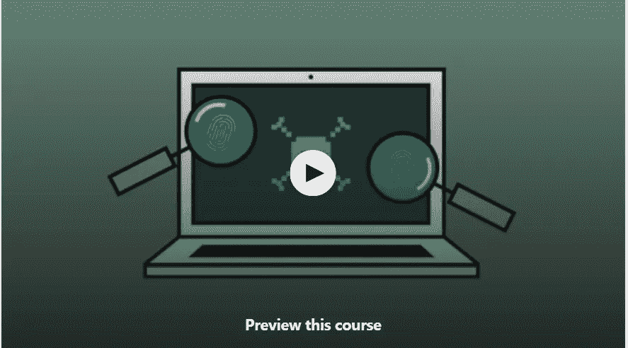
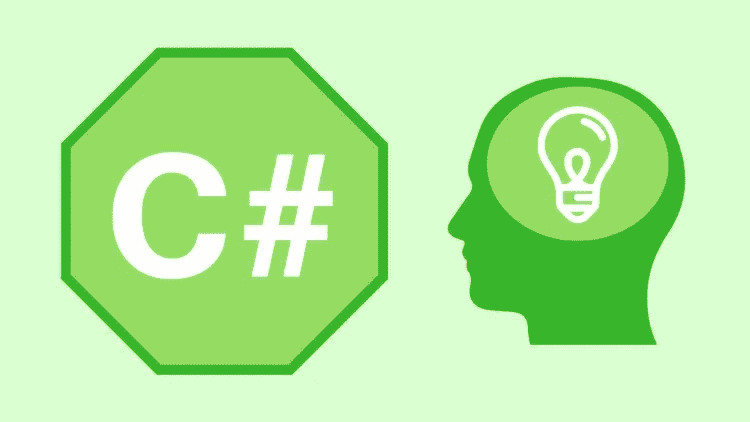
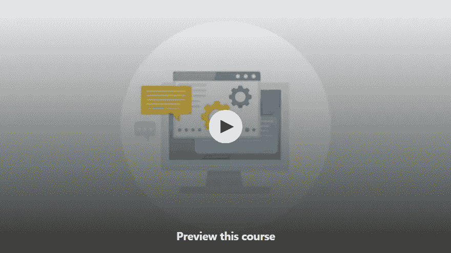
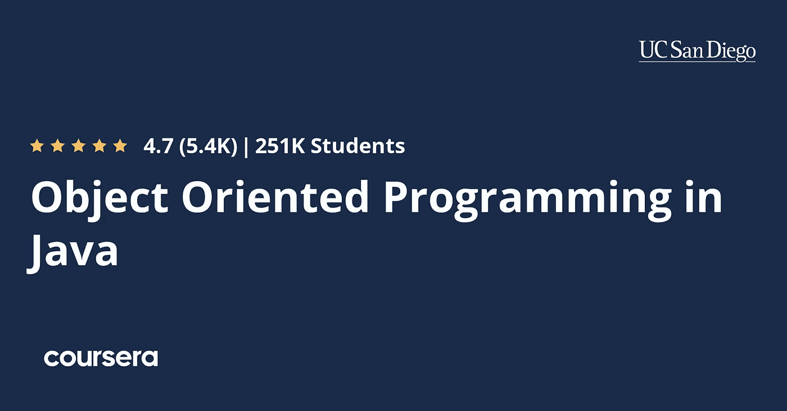

# Python、Java 和 JavaScript 的 7 个最佳免费面向对象编程在线课程

> 原文：<https://medium.com/swlh/5-free-object-oriented-programming-online-courses-for-programmers-156afd0a3a73>

## 一个免费在线课程的精选列表，学习使用不同的编程语言(如 Java、C#、Python、PHP 和 JavaScript)进行面向对象编程。

面向对象编程是一种范式，它允许你通过用类和对象来模拟现实世界来编写程序。它不仅使在编程世界中表现真实世界的事情更容易，而且允许你管理你的程序的复杂性。

尽管有几种编程范例，例如过程式和函数式，但我们今天编写的大多数代码都是面向对象的，一些最流行的编程语言也是面向对象的，例如 [Java](http://javarevisited.blogspot.sg/2017/11/top-5-free-java-courses-for-beginners.html) 、 [Python](http://www.java67.com/2018/02/5-free-python-online-courses-for-beginners.html) 、 [PHP](http://www.java67.com/2018/02/5-free-php-and-mysql-courses-for-web-developers.html) 和 [JavaScript](http://javarevisited.blogspot.sg/2017/02/top-5-javascript-books-to-learn-best-of-lot-must-read.html#axzz4skcM1VYj) 都支持面向对象编程。

我们大多数人在学习编程语言的时候都学习了面向对象编程，例如学习 [Java 或 Python](http://javarevisited.blogspot.sg/2013/11/java-vs-python-which-programming-laungage-to-learn-first.html#axzz55UE6mabh) 但是那时候我们的注意力大多停留在编程语言上，而不是真正理解 OOP 概念。这就是为什么许多程序员最终只知道如何声明一个类或实例化一个对象，而不知道类和对象的用途以及如何设计。这是你在工作中学习的东西，你需要在工作中解决现实世界的问题。例如，考虑一下流行的在线课程平台之一的 Udemy。

如果您认为 Udemy 应该如何存储课程、搜索课程并向用户推荐课程，如果您必须实施类似的解决方案，您会怎么做？在这里，你开始把课程看作一个类，每门课程都是该课程的一个实例。这就是“类是创建对象的蓝图”的定义开始有意义的地方。

简而言之，很好地理解 [OOP 基础](http://javarevisited.blogspot.sg/2010/10/fundamentals-of-object-oriented.html#axzz57Kv4wGXe)、 [OOP 设计原则](http://javarevisited.blogspot.sg/2012/03/10-object-oriented-design-principles.html#axzz57Kv4wGXe)和 [OOP 模式](http://javarevisited.blogspot.sg/2018/02/top-5-java-design-pattern-courses-for-developers.html#axzz57Kv4wGXe)对于编写一个健壮的程序来解决现实世界的问题是很重要的。

# 学习使用 Java、Python 和 JavaScript 进行面向对象编程的 7 门免费课程

在这篇文章中，我将分享一些免费的课程，你可以学习 OOP 基础或者提高你的面向对象编程技能。

我选择了不同语言的课程，例如，这个列表包含了在 [Java](http://www.java67.com/2018/08/top-10-free-java-courses-for-beginners-experienced-developers.html) 、 [Python](https://javarevisited.blogspot.com/2018/12/10-free-python-courses-for-programmers.html) 、 [PHP](http://www.java67.com/2018/02/5-free-php-and-mysql-courses-for-web-developers.html) 和 [JavaScript](http://www.java67.com/2018/04/top-5-free-javascript-courses-to-learn.html) 中学习 OOP 的课程。

你可以选择你最精通的语言的课程。这将帮助你专注于面向对象的编程，而不是编程语言及其语法。

## **1。** [面向对象编程(OOPs)JAVA 面试](http://bit.ly/2QYy92p)

这是 Udemy 提供的学习 Java 面向对象编程的免费课程。

它将向您介绍 Java 中一些基本的 OOP 概念，例如[类](http://www.java67.com/2017/06/can-you-make-class-static-in-java.html)、[对象](http://www.java67.com/2019/01/how-to-check-if-key-exits-in-hashmap-in-java.html)、[继承](http://www.java67.com/2016/03/top-21-java-inheritance-interview-Questions-Answer-Programming.html)、[多态性](http://javarevisited.blogspot.sg/2011/08/what-is-polymorphism-in-java-example.html)、[抽象](https://javarevisited.blogspot.com/2017/04/difference-between-abstraction-and-encapsulation-in-java-oop.html)、[封装](https://javarevisited.blogspot.com/2012/03/what-is-encapsulation-in-java-and-oops.html)，以及[关联](https://javarevisited.blogspot.com/2014/02/ifference-between-association-vs-composition-vs-aggregation.html#axzz5bnktTXS4)、[组合、](http://javarevisited.blogspot.sg/2013/06/why-favor-composition-over-inheritance-java-oops-design.html#axzz57Kv4wGXe)等。

您将学习如何在代码示例中使用这些[面向对象的编程概念](http://www.java67.com/2015/12/top-30-oops-concept-interview-questions-answers-java.html)，了解这些概念如何在需要用户输入的现实应用中使用，并理解在 Java 中掌握这些概念的好处。

> 这里是免费注册这门课程的链接— [面向对象编程(OOPs)JAVA 面试](http://bit.ly/2QYy92p)

在本课程结束时，您将创建自己的游戏(提高 OOP 技能的最佳方式之一)，了解如何以及何时应用基本的 Java 概念，并对专业 Java 开发人员每天使用的工具和逻辑有更深入的理解

## 2. [Python: OOP](http://bit.ly/2y3jr25) 【免费 Udemy 课程】

这是另一个从 Udemy 学习 Python 面向对象编程的免费课程。

[课程](http://bit.ly/2E0s5DL)不仅会教你如何使用类和对象构建代码，还会教你如何通过在类中捆绑属性和方法来进行面向对象的编程。

你还会学到支撑面向对象编程的四大支柱，它们是:
1。[抽象](http://javarevisited.blogspot.sg/2010/10/abstraction-in-java.html)
2。[封装](http://www.java67.com/2012/08/difference-between-abstraction-and-encapsulation-java-oops.html)
3。[多态性](http://javarevisited.blogspot.sg/2011/08/what-is-polymorphism-in-java-example.html)
4。[继承](http://www.java67.com/2012/08/what-is-inheritance-in-java-oops-programming-example.html)

本课程通过一些真实的例子详细介绍了所有这些内容。在本课程结束时，你将能够用 Python 编写自己的面向对象程序！

## [**3。**](https://click.linksynergy.com/fs-bin/click?id=JVFxdTr9V80&subid=0&offerid=323058.1&type=10&tmpid=14538&RD_PARM1=https%3A%2F%2Fwww.udemy.com%2Fbasics-of-object-oriented-programming-with-csharp%2F) **【免费】**【面向对象编程基础知识 C#】

这是另一个从 Udemy 学习对象或趋势基础的免费课程，但是使用 C#。如果你是一名 C#开发人员，那么你可以通过这门课程学习面向对象编程。

这门[课程](https://click.linksynergy.com/fs-bin/click?id=JVFxdTr9V80&subid=0&offerid=323058.1&type=10&tmpid=14538&RD_PARM1=https%3A%2F%2Fwww.udemy.com%2Fbasics-of-object-oriented-programming-with-csharp%2F)将在你的头脑中打下面向对象编程( [OOP](http://www.java67.com/2015/12/top-30-oops-concept-interview-questions-answers-java.html) )的基础，让你进步到更复杂、更系统、更干净的编程方法。

> 这里是免费注册本课程的链接— [用 C#进行面向对象编程的基础知识](https://click.linksynergy.com/fs-bin/click?id=JVFxdTr9V80&subid=0&offerid=323058.1&type=10&tmpid=14538&RD_PARM1=https%3A%2F%2Fwww.udemy.com%2Fbasics-of-object-oriented-programming-with-csharp%2F)

该课程面向至少有一些编码经验的学生，最好是 C#(但 Java 或任何其他类似语言也可接受)。

最后，你将建立一个项目“战士战争！”练习您的面向对象编程技能。

## 5.[高级面向对象的 JavaScript 和 ES6](https://click.linksynergy.com/deeplink?id=JVFxdTr9V80&mid=39197&murl=https%3A%2F%2Fwww.udemy.com%2Fcourse%2Fadvanced-and-object-oriented-javascript%2F) 【免费】

这个免费课程在 Udemy 上教授 JavaScript 和 ES 6 的 OOP 编程。JavaScript 是开发网站的强大语言之一，也被称为 web 的编程语言

[课程](https://click.linksynergy.com/deeplink?id=JVFxdTr9V80&mid=39197&murl=https%3A%2F%2Fwww.udemy.com%2Fcourse%2Fadvanced-and-object-oriented-javascript%2F)从简单的 OOP 概念开始，如类、对象、方法、属性、MVC、函数、数据抽象、数据绑定等。

之后，您将了解到一些高级主题，然后您就可以使用您所学的一切知识，使用面向对象的 JavaScript 和 ES 6 的酷功能创建一个功能性网站。

这里是免费报名本课程的链接— [**高级和面向对象 JavaScript 和 ES6**](https://click.linksynergy.com/deeplink?id=JVFxdTr9V80&mid=39197&murl=https%3A%2F%2Fwww.udemy.com%2Fcourse%2Fadvanced-and-object-oriented-javascript%2F)

## [⑥**⑥。面向对象设计的坚实原理**](http://pluralsight.pxf.io/c/1193463/424552/7490?u=https%3A%2F%2Fwww.pluralsight.com%2Fcourses%2Fprinciples-oo-design)

这是学习面向对象设计原理的一门很棒的课程，也是学习面向对象编程的重要一环。

这门[课程](http://pluralsight.pxf.io/c/1193463/424552/7490?u=https%3A%2F%2Fwww.pluralsight.com%2Fcourses%2Fprinciples-oo-design)介绍了创建精心编写的代码的基本原则，适合任何希望提高开发水平的人。

Bob 叔叔在他的经典著作[**Clean Code**](http://www.amazon.com/Clean-Code-Handbook-Software-Craftsmanship/dp/0132350882?tag=javamysqlanta-20)**中创造了坚实的原则(这是任何 Java 程序的必读书籍，如果你还没有读过，现在就去读)，它们是设计可维护的和健壮的 OOP 应用程序的基础。无论您是刚刚开始编写软件还是已经编写了多年，这些原则如果使用得当，可以改善应用程序的封装和耦合，使其在面对不断变化的需求时更易于管理和测试。**

****

## **7.[掌握面向对象编程概念](https://click.linksynergy.com/deeplink?id=JVFxdTr9V80&mid=39197&murl=https%3A%2F%2Fwww.udemy.com%2Fmaster-object-oriented-programming-concepts%2F)**

**在“掌握面向对象的编程概念”这门课程中，您将复习以前课程中涉及的对象和类的基础知识。

[这门课](https://www.codecademy.com/courses/intro-to-object-oriented-programming/0/1)最棒的地方在于，你会通过打字和做事来学习 OOP。您将被告知如何在第 7 行创建一个没有属性的自行车构造器，然后您需要编写代码并提交编译。

这种边做边学的方法可以确保你所学的东西都进入了你的大脑。**

**课程使用 Java 编程语言。所以如果你想学习使用 Java 的面向对象编程，这是最适合你的课程。**

****

## **7.[Coursera 上的 Java 面向对象编程](https://coursera.pxf.io/c/3294490/1164545/14726?u=https%3A%2F%2Fwww.coursera.org%2Flearn%2Fobject-oriented-java)**

**这是在 Coursera 上学习 Java 面向对象编程的一门非常棒的课程，Coursera 是领先的在线学习门户网站之一，它提供了来自耶鲁、斯坦福、密歇根大学等常青藤联盟大学的课程材料。**

**像任何 [*Coursera 课程*](https://coursera.pxf.io/c/3294490/1164545/14726?u=https%3A%2F%2Fwww.coursera.org%2F) 一样，它也是免费审核的，这意味着你可以免费加入，但如果你需要认证，就需要付费。这意味着如果你只是想用 Java 学习 OOP，它是完全免费的。**

**本课程也是多个专业或专业证书课程的一部分。完成本课程将计入您在以下任何计划中的学习:**

*   **[面向对象编程在 Java 中的专门化](https://coursera.pxf.io/c/3294490/1164545/14726?u=https%3A%2F%2Fwww.coursera.org%2Fspecializations%2Fjava-object-oriented)由杜克大学完成**
*   **面向对象的 Java 编程:数据结构和超越专门化**

**以下是加入本课程的链接—[**Java 面向对象编程**](https://coursera.pxf.io/c/3294490/1164545/14726?u=https%3A%2F%2Fwww.coursera.org%2Flearn%2Fobject-oriented-java)**

****

**如果你发现 Coursera 的课程很有用，因为它们是由世界各地知名的公司和大学创建的，我建议你加入 Coursera Plus 的订阅计划，它可以让你无限制地访问他们最受欢迎的课程、专业知识、专业证书和指导项目。它每年花费大约 399 美元，但是它完全物有所值，因为你可以获得无限的证书。**

** [## Coursera Plus |无限制访问 7，000 多门在线课程

### 用 Coursera Plus 投资你的职业目标。无限制访问 90%以上的课程、项目…

coursera.pxf.io](https://coursera.pxf.io/c/3294490/1164545/14726?u=https%3A%2F%2Fwww.coursera.org%2Fcourseraplus) 

以上就是在线学习面向对象编程的一些最好的免费课程。对于今天的程序员来说，很好地理解面向对象编程基础、设计原则和设计模式是必须的，每个初学编程的人都应该花一些时间在他们选择的编程语言(如 Java 或 Python)中学习这些。

其他**免费在线课程**你可能喜欢探索
[5 门免费课程学习 Git 和 Github](http://javarevisited.blogspot.sg/2018/01/5-free-git-courses-for-programmers-to-learn-online.html#axzz568Oo1Jao)
[5 门免费课程学习 Eclipse 和 JUnit 面向 Java 开发人员](http://www.java67.com/2018/02/5-free-eclipse-and-junit-online-courses-java-developers.html)
[5 门免费课程学习 Ruby 和 Rails](http://www.java67.com/2018/02/5-free-ruby-and-rails-courses-to-learn-online.html)
[5 门免费 Docker 课程面向 Java 和 DevOps 工程师](http://www.java67.com/2018/02/5-free-docker-courses-for-java-and-DevOps-engineers.html)
[5 门免费在线培训课程学习 Angular](http://www.java67.com/2018/01/top-5-free-angular-js-online-courses-for-web-developers.html)
[3 本书籍和课程学习 RESTful Web 服务 在 Java 中](http://www.java67.com/2018/02/3-books-and-courses-to-learn-restful-web-services-with-spring.html)
[面向 Java 和 Web 开发人员的 10 大 Pluralsight 课程](http://javarevisited.blogspot.sg/2017/12/top-10-pluralsight-courses-java-and-web-developers.html)
[学习 Servlet、JSP 和 JDBC 的 5 门免费课程](http://www.java67.com/2018/02/5-free-servlet-jsp-and-jdbc-online-courses-for-java-developers.html)

感谢您阅读本文。如果你喜欢这些数据库和 SQL 课程，请与你的朋友和同事分享。如果您有任何问题或反馈，请留言。

我的其他一些故事你觉得值得一读

 [## 我最喜欢的深入学习软件架构的课程——最好的

### 这些是学习软件架构和成为解决方案架构师的最佳课程

medium.com](/javarevisited/top-5-courses-to-learn-software-architecture-in-2020-best-of-lot-5d34ebc52e9)  [## 我最喜欢的免费课程&深入学习数据结构和算法的认证

### 为程序员学习数据结构和算法的一些最好的免费在线课程的精选列表。

medium.com](/free-code-camp/these-are-the-best-free-courses-to-learn-data-structures-and-algorithms-in-depth-4d52f0d6b35a)  [## 15 门免费 Python 课程，供初学者在线学习

### 学习 Python 的一些免费在线课程的精选列表。

medium.com](/swlh/5-free-python-courses-for-beginners-to-learn-online-e1ca90687caf) 

## 这篇文章发表在 [The Startup](https://medium.com/swlh) 上，这是 Medium 最大的创业刊物，拥有+406，714 名读者。

## 在这里订阅接收[我们的头条新闻](http://growthsupply.com/the-startup-newsletter/)。

**