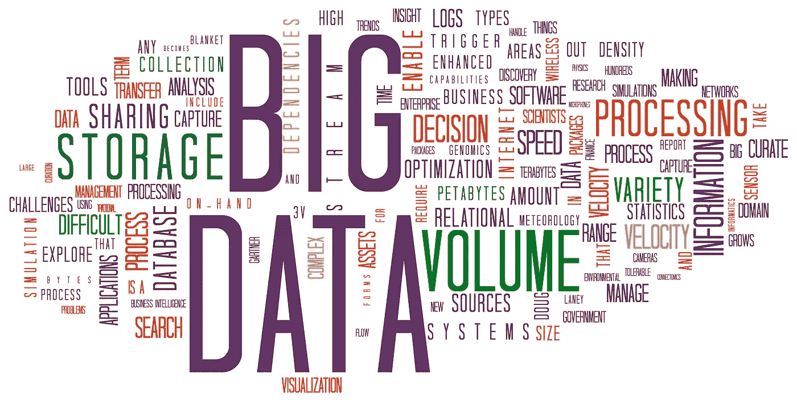
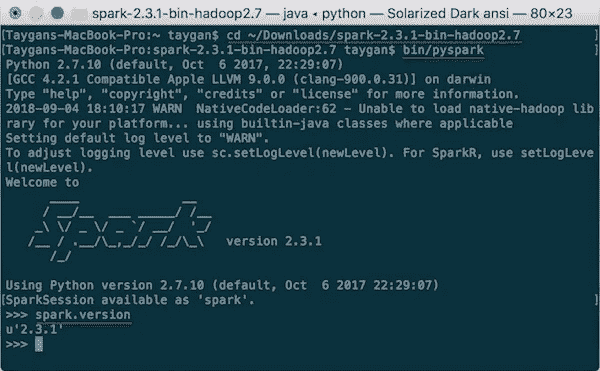
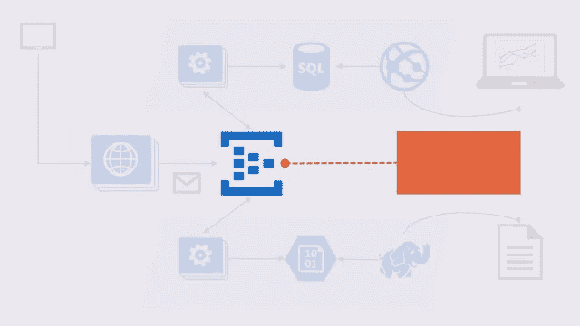

# 2023 年学习大数据、Hadoop 和 Spark 的 5 门免费在线课程

> 原文：<https://medium.com/swlh/5-free-online-courses-to-learn-big-data-hadoop-and-spark-in-2019-a553e6ccfe30>

如果你想在 2023 年学习大数据技术，如 [Hadoop](http://javarevisited.blogspot.sg/2018/04/top-5-hadoop-courses-to-learn-online.html) 、 [Apache Spark](http://javarevisited.blogspot.sg/2017/12/top-5-courses-to-learn-big-data-and.html) 和 [Apache Kafka](https://javarevisited.blogspot.com/2018/04/top-5-apache-kafka-course-to-learn.html) ，并且你正在寻找一些免费资源，如书籍、课程和教程，那么你来对地方了。

在这篇文章中，我将分享一些最好的免费在线课程，以按照您自己的速度学习 Hadoop 和来自 [Udemy](https://click.linksynergy.com/fs-bin/click?id=JVFxdTr9V80&offerid=323058.9410&type=3&subid=0) 和 [Pluralsight](https://pluralsight.pxf.io/c/1193463/424552/7490?u=https%3A%2F%2Fwww.pluralsight.com%2Flearn) 的 [Spark](http://www.java67.com/2018/04/5-free-apache-spark-course-for-java-scala-python-developers.html) 。

我个人喜欢在我有足够的知识选择合适的书或者报读稍微贵一点的课程之前，先从免费的资源开始。这也是我上网寻找免费资源并与你们分享的热情所在。

与[数据科学](http://javarevisited.blogspot.sg/2018/03/top-5-data-science-and-machine-learning-online-courses-to-learn-online.html)类似，大数据是我在 2023 年希望更好学习的另一个领域。大数据领域有很多工具、技术、框架和库，但我选择了更接近 Java 社区的一个，如 [Apache Hadoop](http://javarevisited.blogspot.sg/2018/04/top-5-hadoop-courses-to-learn-online.html) 、 [Apache Spark](http://www.java67.com/2018/04/5-free-apache-spark-course-for-java-scala-python-developers.html) 和 [Apache Kafka](https://javarevisited.blogspot.com/2018/04/top-5-apache-kafka-course-to-learn.html) 。

由于大数据不仅限于 Java，所以我也在 Apache Spark 上收录了免费的 Scala 课程。以防万一，如果你是一个 Scala 开发人员或学习 Scala 成为一个多语言程序员，这本身就是一个非常好的主意。

顺便说一句，如果你是新来的，那么你可能会想要查看更多关于 [Java](http://javarevisited.blogspot.sg/2017/11/top-5-free-java-courses-for-beginners.html) 、 [Spring](http://www.java67.com/2017/11/top-5-free-core-spring-mvc-courses-learn-online.html) 、 [Linux](http://www.java67.com/2018/02/5-free-linux-unix-courses-for-programmers-learn-online.html) 、 [Python](http://www.java67.com/2018/02/5-free-python-online-courses-for-beginners.html) 、 [SQL](http://www.java67.com/2018/02/5-free-database-and-sql-query-courses-programmers.html) 、 [Angular](http://www.java67.com/2018/01/top-5-free-angular-js-online-courses-for-web-developers.html) 、 [React](http://www.java67.com/2018/02/5-free-react-courses-for-web-developers.html) 、 [Oracle](http://www.java67.com/2018/02/5-free-oracle-and-microsoft-sql-server-online-courses.html) 、 [Eclipse](http://www.java67.com/2018/02/5-free-eclipse-and-junit-online-courses-java-developers.html) 、[Maven](http://www.java67.com/2018/02/6-free-maven-and-jenkins-online-courses-for-java-developers.html)

# 2023 年学习大数据、Hadoop 和 Spark 的前 5 门课程

事不宜迟，Udemy 和 Pluralsight 提供了几门免费的大数据课程，帮助您在 2023 年开启大数据的美丽世界之旅:

## [1。Hadoop 入门套件](https://click.linksynergy.com/fs-bin/click?id=JVFxdTr9V80&subid=0&offerid=323058.1&type=10&tmpid=14538&RD_PARM1=https%3A%2F%2Fwww.udemy.com%2Fhadoopstarterkit%2F)

如果你不知道，Apache Hadoop 是领先的大数据框架，它提供了一些实用程序，便于使用多台计算机来解决涉及大量数据的问题，例如谷歌搜索。它基于 [Map Reduce 模式](http://www.java67.com/2016/09/map-reduce-example-java8.html)，即你可以将一个大问题分成几个小问题，然后将每个节点的结果组合在一起，产生最终结果。

这是一门[学习 Hadoop 的绝佳课程](https://click.linksynergy.com/fs-bin/click?id=JVFxdTr9V80&subid=0&offerid=323058.1&type=10&tmpid=14538&RD_PARM1=https%3A%2F%2Fwww.udemy.com%2Fhadoopstarterkit%2F)。它以有趣和简单的方式解释了 Hadoop 的所有核心概念，如 HDFS、Map Reduce、Apache Pig 和 Hive 等。

**这里是免费注册的链接—** [Hadoop Starter Kit](https://click.linksynergy.com/fs-bin/click?id=JVFxdTr9V80&subid=0&offerid=323058.1&type=10&tmpid=14538&RD_PARM1=https%3A%2F%2Fwww.udemy.com%2Fhadoopstarterkit%2F)

如果你对大数据和 Hadoop 充满热情，那么这是一门很好的入门课程。它是免费的，您还可以访问多节点 Hadoop 培训集群，在课程中进行练习。

您还将学习使用 Apache Pig 和 Hive 从股票数据集中计算股票符号的最高收盘价。总的来说，这是一个学习 Hadoop 的极好的[实践课程。](https://click.linksynergy.com/fs-bin/click?id=JVFxdTr9V80&subid=0&offerid=323058.1&type=10&tmpid=14538&RD_PARM1=https%3A%2F%2Fwww.udemy.com%2Fhadoopstarterkit%2F)

## [2。Scala 和 Spark 2 —入门](https://click.linksynergy.com/fs-bin/click?id=JVFxdTr9V80&subid=0&offerid=323058.1&type=10&tmpid=14538&RD_PARM1=https%3A%2F%2Fwww.udemy.com%2Fscala-and-spark-2-getting-started%2F)

如果你正在考虑学习 Apache Spark，这是另一个伟大的大数据框架，在许多情况下用 Scala 编程语言提供了比 Hadoop 更好的吞吐量，那么这是一个很好的开始课程。

在本[课程](https://click.linksynergy.com/fs-bin/click?id=JVFxdTr9V80&subid=0&offerid=323058.1&type=10&tmpid=14538&RD_PARM1=https%3A%2F%2Fwww.udemy.com%2Fscala-and-spark-2-getting-started%2F)中，您将学习如何设置您的开发环境，使用 Scala 和 [IntelliJIDEA](https://itnext.io/top-5-intellijidea-and-android-studio-courses-for-java-and-android-programmers-afcc27309b60) 构建 Spark 应用。它附带了一个 Scala 插件，使得开发 Scala 应用程序变得非常容易。您还将运行如何在 IntelliJ IDEA 中集成 Spark。

**这里是免费注册的链接—** [Scala 和 Spark 2 —入门](https://click.linksynergy.com/fs-bin/click?id=JVFxdTr9V80&subid=0&offerid=323058.1&type=10&tmpid=14538&RD_PARM1=https%3A%2F%2Fwww.udemy.com%2Fscala-and-spark-2-getting-started%2F)

即使你是 Java 和 Scala 的新手，你也可以参加这个课程，因为它将指导你一步一步地从安装 Java、IntelliJIDEA 到 Apache Spark。

简而言之，一门很好的[关于 Apache Spark 与 Scala](https://click.linksynergy.com/fs-bin/click?id=JVFxdTr9V80&subid=0&offerid=323058.1&type=10&tmpid=14538&RD_PARM1=https%3A%2F%2Fwww.udemy.com%2Fscala-and-spark-2-getting-started%2F) 编程语言的入门课程。

## [3。大数据和 Hadoop 基础知识](https://click.linksynergy.com/fs-bin/click?id=JVFxdTr9V80&subid=0&offerid=323058.1&type=10&tmpid=14538&RD_PARM1=https%3A%2F%2Fwww.udemy.com%2Fbig-data-and-hadoop-essentials-free-tutorial%2F)

这是 Udemy 上最受欢迎的免费大数据和 Hadoop 课程之一，已有超过 80，000 名学生注册。这充分说明了课程的质量。

在本[课程](https://click.linksynergy.com/fs-bin/click?id=JVFxdTr9V80&subid=0&offerid=323058.1&type=10&tmpid=14538&RD_PARM1=https%3A%2F%2Fwww.udemy.com%2Fbig-data-and-hadoop-essentials-free-tutorial%2F)中，您将通过一些真实世界的例子来加深对大数据问题的理解。您将了解 Hadoop，并理解它为什么如此强大。

> 您还将了解数据科学和大数据之间的 ***差异*** ，这种差异经常让程序员在选择职业道路或理解工作描述时感到困惑。

**这里是免费注册的链接—** [大数据和 Hadoop 基础知识](https://click.linksynergy.com/fs-bin/click?id=JVFxdTr9V80&subid=0&offerid=323058.1&type=10&tmpid=14538&RD_PARM1=https%3A%2F%2Fwww.udemy.com%2Fbig-data-and-hadoop-essentials-free-tutorial%2F)

尽管这是一个非常短的课程，只有 45 分钟，但您将学到足够多的关于[大数据](http://javarevisited.blogspot.sg/2018/01/10-frameworks-java-and-web-developers-should-learn.html)和 Hadoop 的知识，开始您的旅程。

我强烈推荐[这门课](https://click.linksynergy.com/fs-bin/click?id=JVFxdTr9V80&subid=0&offerid=323058.1&type=10&tmpid=14538&RD_PARM1=https%3A%2F%2Fwww.udemy.com%2Fbig-data-and-hadoop-essentials-free-tutorial%2F)在你可以选修任何关于 BigData 和 Hadoop 的其他课程之前。

## [4。设置大数据开发环境](https://click.linksynergy.com/fs-bin/click?id=JVFxdTr9V80&subid=0&offerid=323058.1&type=10&tmpid=14538&RD_PARM1=https%3A%2F%2Fwww.udemy.com%2Fsetup-big-data-development-environment%2F)

开始大数据开发的主要挑战之一是设置自己的开发环境。由于大数据包含许多开源技术，如 Hadoop、Spark、Pig、Hive 等，因此获得端到端环境变得非常复杂。

本[课程](https://click.linksynergy.com/fs-bin/click?id=JVFxdTr9V80&subid=0&offerid=323058.1&type=10&tmpid=14538&RD_PARM1=https%3A%2F%2Fwww.udemy.com%2Fsetup-big-data-development-environment%2F)将教你如何使用 Cloudera 或 Hortonworks 等发行版在个人电脑或笔记本电脑上建立大数据开发环境。

> 无论是 Cloudera 还是 Hortonworks 都提供了虚拟机镜像，其中包含了预打包的所有大数据生态系统工具，这使得开始学习和进行开发变得非常容易。

您还将学习设置其他必要组件，如 [MySQL](https://javarevisited.blogspot.com/2018/05/top-5-mysql-courses-to-learn-online.html) 数据库和日志生成工具，并复习所有基本概念，如 HDFS、 [Map Reduce](http://www.java67.com/2016/09/map-reduce-example-java8.html) 、猪、蜂巢、 [Spark、](http://javarevisited.blogspot.sg/2018/04/top-5-java-frameworks-to-learn-in-2018_27.html)等。

**这里是免费报名的链接—** [设置大数据开发环境](https://click.linksynergy.com/fs-bin/click?id=JVFxdTr9V80&subid=0&offerid=323058.1&type=10&tmpid=14538&RD_PARM1=https%3A%2F%2Fwww.udemy.com%2Fsetup-big-data-development-environment%2F)

## [5。大数据:大图景](https://pluralsight.pxf.io/c/1193463/424552/7490?u=https%3A%2F%2Fwww.pluralsight.com%2Fcourses%2Fbigdata-bigpicture)

包括我在内的许多开发人员在学习一门新技术或编程语言时犯的一个错误是，在没有了解全局的情况下直接进入细节。

如果你知道某事存在的原因，比如问题，那么你就会更好地理解这项技术以及它如何解决问题。

这个[课程](https://pluralsight.pxf.io/c/1193463/424552/7490?u=https%3A%2F%2Fwww.pluralsight.com%2Fcourses%2Fbigdata-bigpicture)就是为了那个。它将告诉您构成整个大数据世界的概念、公司和技术，并帮助您了解如何利用大数据来解决您自己的业务问题。

**这里是报名链接—** [**大数据:大图**](https://pluralsight.pxf.io/c/1193463/424552/7490?u=https%3A%2F%2Fwww.pluralsight.com%2Fcourses%2Fbigdata-bigpicture)

讲师 Andrew Brust 是 ZDNet 的大数据记者，他对大数据[的概述与你从程序员或开发伙伴那里得到的不同。](http://www.java67.com/2018/01/top-10-web-mobile-and-big-data-framework-libraries-technologies-programmers-should-learn-in-2018.html)

顺便说一下，你需要一个 [**Pluralsight 会员**](https://pluralsight.pxf.io/c/1193463/424552/7490?u=https%3A%2F%2Fwww.pluralsight.com%2Fpricing) 才能加入这个课程，费用大约是每月 29 美元或每年 299 美元(14%的折扣)。如果你没有这个计划，我强烈推荐你加入，因为它能促进你的学习，而且作为一名程序员，你总是需要学习新的东西。

或者，你也可以使用他们的 **1** [**0 天免费试用**](https://pluralsight.pxf.io/c/1193463/424552/7490?u=https%3A%2F%2Fwww.pluralsight.com%2Flearn) 免费观看本课程。

以上就是一些学习大数据技术的**免费课程，比如 Hadoop 和 Apache Spark** 。你可以在舒适的办公室或家里学习这些课程。你也可以按照自己的节奏学习，不需要匆忙或去任何地方。

> 顺便说一句，在 Udemy 中，免费课程有时会变成付费课程，所以在你参加课程之前一定要检查一下，但是一旦你参加了这些课程，你将可以终身免费使用它们。

我通常会参加课程，以便在课程可用时免费获取，即使我没有足够的时间参加完整的课程。一旦我参加了那个课程，我随时可以回去学习。如果你对这些课程感兴趣，最好现在就报名，否则以后可能会有空。

其他**免费在线编程和开发课程**您可能想了解:

[5 门免费课程学习核心 Spring、Spring Boot、Spring MVC](http://www.java67.com/2017/11/top-5-free-core-spring-mvc-courses-learn-online.html)
5 门免费课程学习 Servlet、JSP、 和 JDBC
[5 门面向 Web 开发者的免费 JavaScript 课程](http://www.java67.com/2018/04/top-5-free-javascript-courses-to-learn.html)
[5 门面向 Java 和 DevOps 工程师的免费 Docker 课程](http://www.java67.com/2018/02/5-free-docker-courses-for-java-and-DevOps-engineers.html)
[5 门面向 Java 开发者的课程学习 Maven 和 Jenkins](http://www.java67.com/2018/02/6-free-maven-and-jenkins-online-courses-for-java-developers.html)
[5 门学习 Oracle 和微软 SQL Server 数据库的课程](http://www.java67.com/2018/02/5-free-oracle-and-microsoft-sql-server-online-courses.html)
[3 本书和课程学习 RESTful Web Services in Java](http://www.java67.com/2018/02/3-books-and-courses-to-learn-restful-web-services-with-spring.html)
[5 门课程学习区块链技术免费](http://www.java67.com/2018/02/5-free-blockchain-technology-courses.html) 面向 Java 和 C#开发者的 Webdriver 课程
[15 门免费课程学习 Python 编程](/swlh/5-free-python-courses-for-beginners-to-learn-online-e1ca90687caf)
[10 门课程学习 Angular Development](/javarevisited/10-courses-to-learn-angular-for-web-development-6da1bd2856dc)
[10 门免费 JavaScript 教程初学者](/javarevisited/my-favorite-free-tutorials-and-courses-to-learn-javascript-8f4d0a71faf2)

非常感谢您阅读这篇文章。如果您喜欢这些免费的大数据课程，请与您的朋友和同事分享。如果您有任何问题或反馈，请留言。

## 附:如果你只想从一门课程开始学习 DevOps，我认为[终极实践 Hadoop——驯服你的大数据！](https://click.linksynergy.com/fs-bin/click?id=JVFxdTr9V80&subid=0&offerid=634352.1&type=10&tmpid=14538&RD_PARM1=https%3A%2F%2Fwww.udemy.com%2Fthe-ultimate-hands-on-hadoop-tame-your-big-data%2F)是最好的入手。

 [## Hadoop 框架认证课程(MapReduce，HDFS，Pig)

### Hadoop 和“大数据”的世界可能令人生畏——数百种不同的技术以神秘的名称组成了…

udemy.com](https://click.linksynergy.com/fs-bin/click?id=JVFxdTr9V80&subid=0&offerid=634352.1&type=10&tmpid=14538&RD_PARM1=https%3A%2F%2Fwww.udemy.com%2Fthe-ultimate-hands-on-hadoop-tame-your-big-data%2F) 

## 您可能喜欢的其他媒体文章:

 [## 为 Fullstack 开发人员和 DevOps 学习 Docker、Kubernetes 和 AWS 的 15 大在线课程…

### 大家好，你可能听说过 Docker 和 Kubernetes 周围的嗡嗡声。他们从根本上改变了发展…

medium.com](/javarevisited/top-15-online-courses-to-learn-docker-kubernetes-and-aws-for-fullstack-developers-and-devops-d8cc4f16e773)  [## 我最喜欢的学习亚马逊网络服务(AWS)和云计算的初学者课程

### 大家好，如果你想学习亚马逊网络服务，俗称 AWS，并寻找一些优秀的资源…

medium.com](/javarevisited/top-10-courses-to-learn-amazon-web-services-aws-cloud-in-2020-best-and-free-317f10d7c21d)  [## 2023 年学习 Linux 命令行的 10 大课程——最好的免费课程

### 有没有想过为什么命令行仍然在使用，即使有数百种人性化的图形用户界面和工具…

medium.com](/javarevisited/top-10-courses-to-learn-linux-command-line-in-2020-best-and-free-f3ee4a78d0c0) 

## 这篇文章发表在[《创业](https://medium.com/swlh)》上，这是 Medium 最大的创业刊物，有+409714 人关注。

## 订阅接收[我们的头条新闻](http://growthsupply.com/the-startup-newsletter/)。

