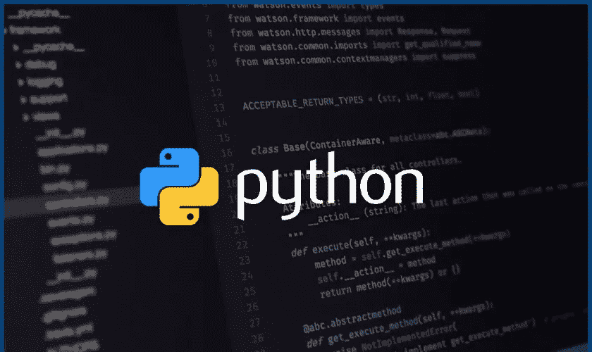
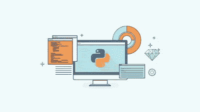
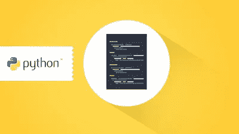
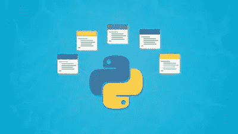
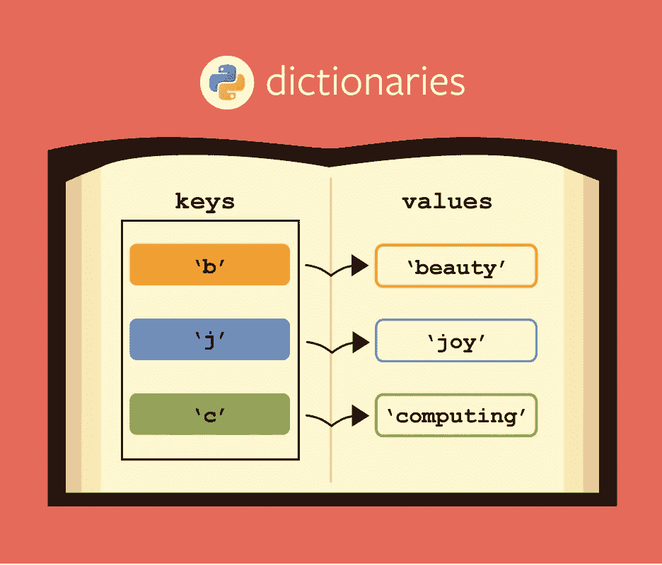
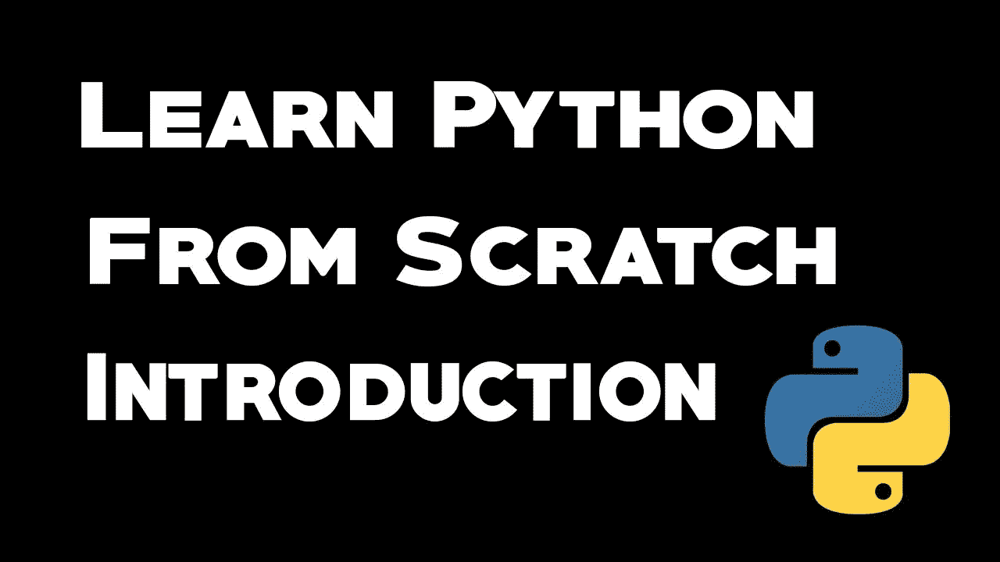
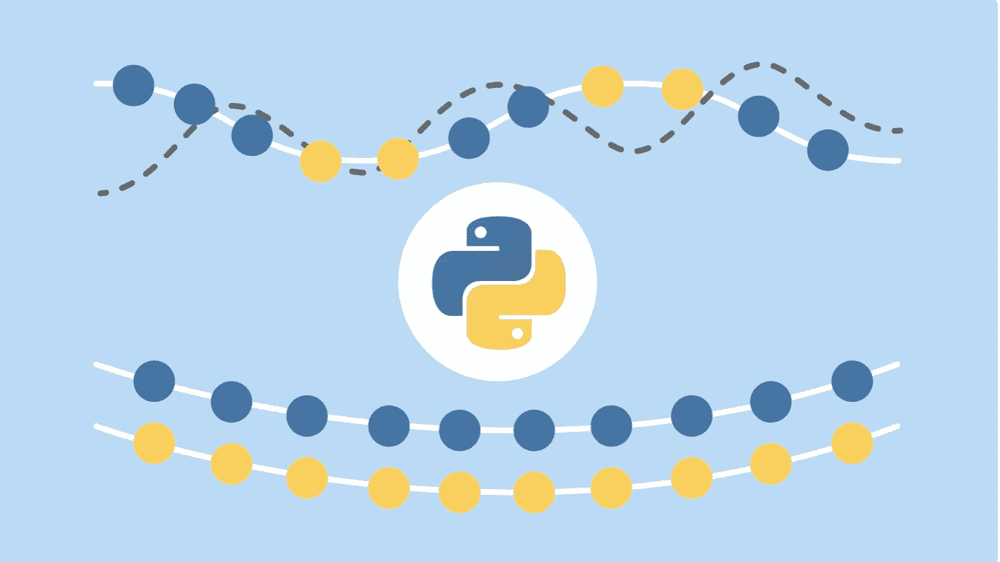
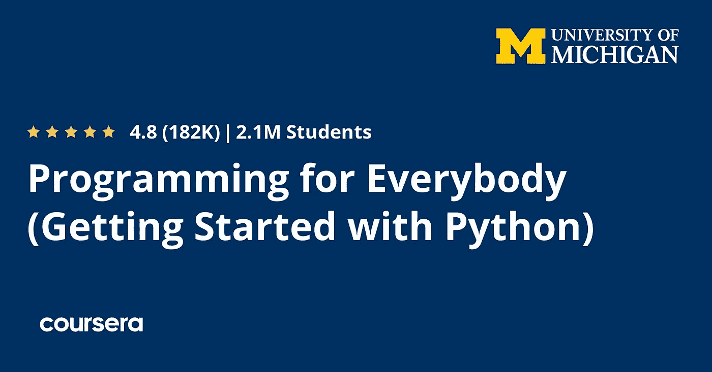
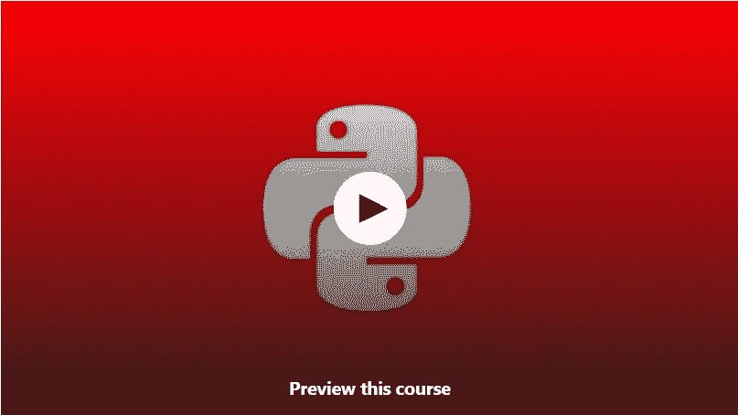
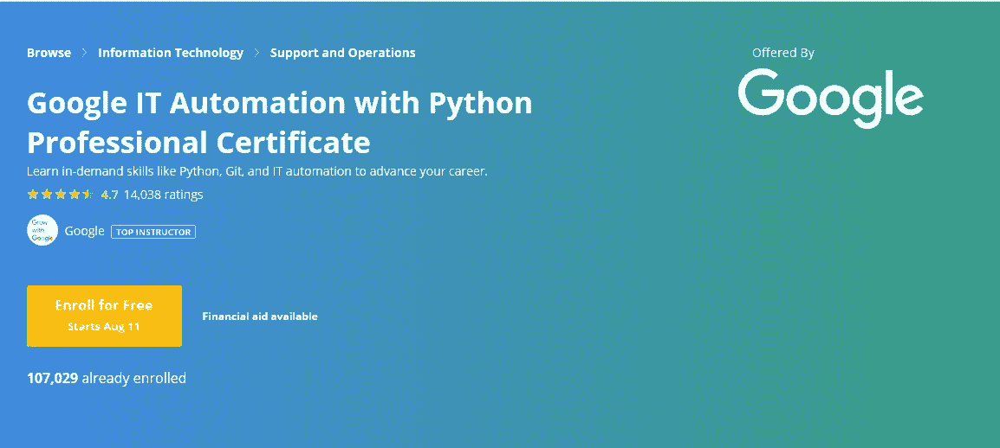

# 2023 年学习 Python 的 15 门最佳免费课程

> 原文：<https://medium.com/swlh/5-free-python-courses-for-beginners-to-learn-online-e1ca90687caf>

## 学习 Python 的一些免费在线课程的精选列表。

[Free Python Courses for Programmers and Developers](https://javarevisited.blogspot.com/2018/12/10-free-python-courses-for-programmers.html)

大家好，如果你是一个初学者，正在寻找一些免费的 Python 资源，以便在 2023 年开始你的编程之旅，那么你来对地方了。

早些时候，我已经分享了几本[免费的 Python 编程电子书](http://www.java67.com/2017/05/top-7-free-python-programming-books-pdf-online-download.html)，今天我将分享几本绝对**免费的 *Python 编程课程*！！**你可以参加这些[最好的在线课程，按照你自己的进度，在你自己的时间，在你的地方学习 Python](/better-programming/top-5-courses-to-learn-python-in-2018-best-of-lot-26644a99e7ec) 。

这是在线学习的一大优势，它所提供的灵活性令人惊叹。你只需要一台笔记本电脑或一部可以上网的智能手机，你就可以学习任何东西。

顺便说一下，在开始学习 [Python 编程](https://dzone.com/articles/why-every-programmer-should-learn-python)的课程之前，我想祝贺你做出了正确的决定，开始了你的 Python 编程之旅。

每天都有很多初学者，学生，编程入门的人问我这个问题。 [**应该从 Python 还是 Java 入手？**](http://javarevisited.blogspot.sg/2013/11/java-vs-python-which-programming-laungage-to-learn-first.html#axzz56FOC13f8)

> Python 很容易学，甚至比 Java 更容易。您还可以编写小的 Python 脚本来快速自动化您通常手动做的事情，这对初学者来说很有价值。

Python 也是强大的、功能丰富的和多用途的。比如可以用 Python 做 web 开发，可以用它来创建脚本，甚至可以用在[数据科学](https://javarevisited.blogspot.com/2018/10/top-8-python-libraries-for-data-science-machine-learning.html)和[机器学习](https://javarevisited.blogspot.com/2018/10/data-science-and-machine-learning-courses-using-python-and-R-programming.html)的空间里。

这使得学习 Python 成为一项重要的技能，将在你的整个职业生涯中受益。

我一直建议我所有的读者和学生跟着 [SQL](http://www.java67.com/2018/02/5-free-database-and-sql-query-courses-programmers.html) 和 [UNIX](http://www.java67.com/2018/02/5-free-linux-unix-courses-for-programmers-learn-online.html) 走，你也应该学习 Python。每个程序员都应该具备的伟大编程技能之一。这就是为什么我把它列为程序员的必备工具之一。

顺便说一句，如果你不介意为学习 Python 这样有价值的东西支付少量费用，那么你也可以查看完整的 Python 3 训练营。这不是免费的，但它完全值得你的时间和金钱。

 [## 完整的 Python 训练营:学习 Python 编程和代码

### 这是 Udemy 上最全面、最直接的 Python 编程语言课程！你是否…

udemy.com](https://click.linksynergy.com/deeplink?id=JVFxdTr9V80&mid=39197&murl=https%3A%2F%2Fwww.udemy.com%2Fcomplete-python-bootcamp%2F) 

# 学习 Python 编程的 15 门免费课程

既然你知道学习 Python 对你的编程生涯很有好处，那么是时候真正学习 Python 了。每当我开始一项新技术时，我通常会遵循我的 [3 点模型](http://javarevisited.blogspot.sg/2018/01/how-to-learn-spring-core-spring-mvc-boot-security-framework.html#axzz55IgfKjy8),比如参加在线课程、买书和做项目。通过这种方式，我不用去昂贵的教练班或训练营，就已经完全掌握了几种新技术，而且没有什么比免费资源更好的了。

过去我曾分享过学习 Python 的顶级[书籍](https://javarevisited.blogspot.com/2019/07/top-5-books-to-learn-python-in-2019.html)和[课程，今天我将分享一些你免费学习 Python 编程的最好的在线课程。

项目部分是你一旦学会 Python，通过浏览这些课程和书籍，就可以自己做的事情。](https://dev.to/javinpaul/7-python-online-courses-for-beginners-and-intermediate-programmers-1h4k)

## 1.Python 编程简介

如果你需要快速复习或者第一次学习 Python，那么这是最适合你的课程。

令人惊讶的是，讲师本人是一名 17 岁的学生，而且这门 Python 课程有超过 13 万名学生在 Udemy 注册，这足以说明这门课程的重要性。

这里是加入课程的链接:[**Python 编程简介**](https://click.linksynergy.com/fs-bin/click?id=JVFxdTr9V80&subid=0&offerid=562016.1&type=10&tmpid=14538&RD_PARM1=https%3A%2F%2Fwww.udemy.com%2Fpythonforbeginnersintro%2F)

这个课程是一个一站式商店，提供入门 Python 所需的一切知识，以及一些激励措施。

> 您将从 Python 的基础开始，学习字符串、变量，并了解数据类型。然后，您将学习其他基本的编程结构，例如 Python 中的循环和条件。

[课程](https://click.linksynergy.com/fs-bin/click?id=JVFxdTr9V80&subid=0&offerid=562016.1&type=10&tmpid=14538&RD_PARM1=https%3A%2F%2Fwww.udemy.com%2Fpythonforbeginnersintro%2F)也教你文件操作和功能。简而言之，这是对 Python 编程的一个快速而简单的介绍。

[**Introduction To Python Programming**](https://click.linksynergy.com/fs-bin/click?id=JVFxdTr9V80&subid=0&offerid=562016.1&type=10&tmpid=14538&RD_PARM1=https%3A%2F%2Fwww.udemy.com%2Fpythonforbeginnersintro%2F)

## 2.面向初学者的 Python

对于想学习 Python 和编程的人来说，这是另一个很好的 Python 入门课程。如果你没有任何编程经验也没关系。本课程从零开始 Python 编程，向您展示从如何设置 Python IDE 到如何使用列表理解的一切。

> 以下是免费加入课程的链接: [**初学 Python**](http://bit.ly/2CTK36X)

本课程最棒的部分是，每一个新概念都有源代码幻灯片和练习题供你学习。你也可以下载练习题的答案。这种边做边学的方法非常适合初学者，他们可以通过学习这门课程快速学习编程和 Python。

**Python for Beginners**

## 3.初学 python【Udemy 免费课程】

这是另一个在线学习 Python 的很棒的免费课程。该课程是专门为希望获得 Python 实践学习经验的初学者设计的。它从 Python 的基础开始教你编程概念。既然 Python 简单易学，也让学习编程变得简单。

> 以下是加入课程的链接: [Python 初学者](http://bit.ly/2Mi553A)

该课程还提供了许多练习题、编程讲座、完整体验的 PDF 笔记，一切都是免费的。

简而言之，这是一个伟大的 [Python 课程](http://bit.ly/2Mi553A)，面向那些热衷于学习编程的初学者，即使他们一生中没有写过一行代码，也想从 Python 开始。

**Programming with Python: Hands-On Introduction for Beginners**

## 4.面向绝对初学者的 Python

对于初学者来说，这是一个非常实用的 Python 课程，有很多例子和练习，对于来自不同背景、没有编程经验的人来说尤其有用。这门课程对于那些以前没有编程的人来说是非常理想的，但是对于那些想要学习 Python 的有经验的程序员来说也应该是可行的，只要他们不被一些额外的解释所冒犯。

> 这里是免费加入课程的链接: [**Python 绝对初学者**](http://bit.ly/2D29wye)
> 
> 你将从零开始，到课程结束时，你将知道如何编写 Python 程序，并学习关于列表、字典和其他必要的 [Python 数据结构](https://hackernoon.com/10-data-structure-algorithms-and-programming-courses-to-crack-any-coding-interview-e1c50b30b927)的基础知识。

您还将学习 Python 中的函数、模块和 lambda 表达式。

总的来说，这是一个不错的初学者课程，有 2.5 小时的免费内容。谈到社会证明，这门课程得到了近 7000 名学生的平均 4.3 分的评分。

[Python Programming for Absolute Beginners](http://bit.ly/python-programming-class)

## 5.完全初学者学习 Python 3.6

如果你想用 Python 学习面向对象编程，那么这是最适合你的课程。

这门[课程](http://bit.ly/2D6eE4u)将教你如何利用类和对象来构建你的 Python 代码。

通过学习如何在一个类内捆绑属性和方法，并通过一个对象实例化它们，你还将学习如何在 Python 中实现面向对象编程。

> 以下是加入课程的链接: [**学习 Python 3.6 适合全初学者**](http://bit.ly/2D6eE4u)

本课程结束后，你将能够用 Python 编写自己的 Python 3 程序！

**Learn Python 3 From Scratch**

## 6.[支教团队从零开始学习 Python](https://www.educative.io/courses/learn-python-from-scratch?affiliate_id=5073518643380224)

毫无疑问，Python 是当今最流行的编程语言，Python 程序员的需求量一直很大。随着它越来越受欢迎，它已经成为最接近每个程序员都必须知道的语言。

好消息是，这种交互式在线课程是一个完美的起点。本课程首先探索基本的构建模块，然后学习更高级的概念，如函数和循环。它也有有趣的测验和编码挑战，这也将有助于强化课程中涵盖的所有概念。

> 以下是加入课程的链接: [**从零开始学 Python**](https://www.educative.io/courses/learn-python-from-scratch?affiliate_id=5073518643380224)

最棒的是，它的 ***完全免费*** ，所以你不需要为任何东西付费。你需要创建一个帐户来加入 Educative 上的这个课程，顺便说一下，如果你需要更多的资源来学习 Python 编程，你也可以查看这个[免费 Python 编程课程](https://javarevisited.blogspot.com/2018/12/10-free-python-courses-for-programmers.html)的列表。

## 7.[面向所有人的编程(Python 入门)](https://coursera.pxf.io/c/3294490/1164545/14726?u=https%3A%2F%2Fwww.coursera.org%2Flearn%2Fpython)

这是 Python 上最受欢迎和最好的免费 Coursera 课程之一。事实证明，已经有超过 975，145 名学生注册入学。它由密歇根大学提供，密歇根大学不仅是美国，也是世界上最重要的学术机构之一。密歇根大学的平均课程费用约为 15，000 美元，但由于 Coursera 的帮助，你可以免费学习这门课程，但如果你想获得证书，那么你需要支付专业费用，如果我没错的话，每月费用约为 39 美元。

> 以下是加入课程的链接: [**Python 为大家准备**](https://coursera.pxf.io/c/3294490/1164545/14726?u=https%3A%2F%2Fwww.coursera.org%2Flearn%2Fpython)

顾名思义，本课程旨在教大家使用 Python 编程计算机的基础知识。它将向您展示如何从 Python 中的一系列简单指令构建一个程序的基础，这对于绝对的初学者来说非常有用。

这门课程没有先决条件，除了最简单的数学之外，它避开了所有内容。任何有一定计算机经验的人都应该能够掌握这门课程的内容。本课程将涵盖教材《Python 面向所有人》的第 1-5 章

本课程涵盖了 Python 最流行的版本 Python 3，为更高级的 Python 课程提供了一个很好的启动平台，如使用 Python 进行 Web 报废、访问数据库以及用 Python 进行数据分析。本课程也是针对每个人的 [**Python 专业**](https://coursera.pxf.io/c/3294490/1164545/14726?u=https%3A%2F%2Fwww.coursera.org%2Fspecializations%2Fpython) **n** 的一部分，这意味着完成本课程将计入您的认证。

 [## 面向所有人的 Python

### 学习用 Python 编程和分析数据。开发收集、清理、分析和可视化数据的程序…

coursera.pxf.io](https://coursera.pxf.io/c/3294490/1164545/14726?u=https%3A%2F%2Fwww.coursera.org%2Fspecializations%2Fpython) 

## 8.在 Codecademy 上学习 Python 2

如果你喜欢互动学习，那么没有比 [Codecademy](https://bit.ly/codecademypro) 更好的地方了。他们首先用尽可能少的词语教你理论，然后让你用这个概念在线编写代码。最棒的是你不需要做任何设置，比如在你的机器上安装 Python。

本课程将帮助您学习软件工程师、分析师、数据科学家和机器学习工程师等使用的世界上发展最快、最流行的编程语言的基础知识。

目前他们的 [**学 Python 2**](https://bit.ly/learnpython2withcodecademy) 课程是免费的，而 [**Python 3 课程**](https://bit.ly/learnpython3codecademy) 只对付费会员开放。如果你能负担得起并欣赏 CodeCademy，那就订阅吧，但是如果你不能直接从他们的 Python 2 课程开始，那么对于没有编程经验的初学者来说这是再好不过了。

 [## 学习 Python 3 | Codecademy

### 学习世界上最流行的编程语言的最新和最棒的版本！

codecademy.com](https://bit.ly/learnpython3codecademy) 

## 9.学习 Python——FreeCodeCamp 为初学者提供的完整课程[教程]

本课程将向您全面介绍 python 中的所有核心概念。跟随视频，你很快就会成为一名 python 程序员！你可以在 Youtube 上免费观看，这是目录

## 10.Coursera 提供免费的 Coursera Python 课程

Coursera 有很多免费课程可以深入学习 Python。这里有一些有趣的课程，也是 Coursera 上为每个人提供的 [**Python 专门化**](https://coursera.pxf.io/c/3294490/1164545/14726?u=https%3A%2F%2Fwww.coursera.org%2Fspecializations%2Fpython) 的一部分，其中包含 4 个深入学习 Python 的课程，如:

1.  [Python 数据结构](https://coursera.pxf.io/c/3294490/1164545/14726?u=https%3A%2F%2Fwww.coursera.org%2Flearn%2Fpython-data)
2.  [使用 Python 访问 Web 数据](https://coursera.pxf.io/c/3294490/1164545/14726?u=https%3A%2F%2Fwww.coursera.org%2Flearn%2Fpython-network-data)
3.  [通过 Python 使用数据库](https://coursera.pxf.io/c/3294490/1164545/14726?u=https%3A%2F%2Fwww.coursera.org%2Flearn%2Fpython-databases)
4.  [顶点项目:用 Python 检索、处理和可视化数据](https://coursera.pxf.io/c/3294490/1164545/14726?u=https%3A%2F%2Fwww.coursera.org%2Flearn%2Fpython-data-visualization)

所有课程都是**免费审核**，这意味着你可以免费加入并学习。但是，你不能参加作业和测验，也不会得到任何认证，直到你支付。

 [## 面向所有人的 Python

### 学习用 Python 编程和分析数据。开发收集、清理、分析和可视化数据的程序…

coursera.pxf.io](https://coursera.pxf.io/c/3294490/1164545/14726?u=https%3A%2F%2Fwww.coursera.org%2Fspecializations%2Fpython) 

## 11.学习 Python:构建虚拟助手

这是 Udemy 的另一个免费 Python 课程。这是一个基于项目的课程，学习和建立一些东西是非常好的。作为本课程的一部分，你将从基本的 python 到为你的计算机创建一个虚拟助手

以下是免费加入课程的链接: [***学习 Python:打造虚拟助手***](http://bit.ly/2lI6epr)

 [## 免费 Python 教程-学习 Python:构建虚拟助手

### 我是一个自学的程序员和学习爱好者。我的专长主要是人工智能(Keras)，红宝石…

bit.ly](http://bit.ly/2lI6epr) 

## 12.使用熊猫和 Python 学习数据分析

许多人正在学习数据分析，因为 Python 拥有一些最好的库来分析、规范化和可视化数据。在这个免费的 Python 教程中，你将使用 Pandas 和一些强大的数据分析技术学习数据分析和数据操作的基础知识

以下是免费加入课程的链接:[***利用熊猫和 Python 学习数据分析***](http://bit.ly/2Ml6Kpa)

 [## 免费数据分析教程-使用 Pandas 和 Python 学习数据分析(模块 2/3)

### 你对数据科学完全陌生吗？你是否听过机器学习、数据科学等这些热门词汇

bit.ly](http://bit.ly/2Ml6Kpa) 

## 13.[学习 Python——面向初学者的 Python 编程](https://click.linksynergy.com/deeplink?id=JVFxdTr9V80&mid=39197&murl=https%3A%2F%2Fwww.udemy.com%2Fcourse%2Fpython-introduction%2F)

这是 2023 年学习 Python 的又一个免费 Udemy 在线课程。在本课程中，您将通过免费练习从头开始学习 Python。

这个免费 Python 课程的好处是，讲师有一个平静而耐心的声音。看来他想让你学会如何做这件事。

他的步伐很正常，他的解释真的很棒。当他解释这些概念时，Python 对我来说看起来真的很简单，尽管这是我第一次概述。

讲座也很容易跟上和理解

**这里是免费加入课程的链接:** [学习 Python — Python 编程初学者](https://click.linksynergy.com/deeplink?id=JVFxdTr9V80&mid=39197&murl=https%3A%2F%2Fwww.udemy.com%2Fcourse%2Fpython-introduction%2F)

## 14.石头剪刀布 Python 教程

创建游戏可能是学习编码、逻辑和任何像 Python 这样的新编程语言的最好方法。它也给你一种创造有用的东西的感觉。

这是另一个免费的基于项目的课程，可以在家里或办公室在线学习 Python，它提供了用 Python 创建石头剪刀布程序的深度指导。

以下是免费加入课程的链接: [***石头剪刀布— Python 教程***](http://bit.ly/2OcNn2a)

 [## 免费 Python 教程-石头剪刀布- Python 教程

### 你好，我叫克里斯托弗·杨。我有一个拥有 1000 多名订户的 YouTube 频道，我每周都制作视频。我…

bit.ly](http://bit.ly/2OcNn2a) 

## 15.**尝试 Django 1.10 |创建 URL 缩短服务**

如果你想做网络开发，创建网站和网络应用，那么 Python 是一个很好的选择。它有很多很棒的框架，比如 Python 和 Flask，这使得创建 web 应用程序变得很容易。

这个免费的 Python 课程将教你 Django，它是最强大的 web 框架之一，使构建 web 应用程序变得容易，这也是它成为#1 Python 库的原因

以下是免费加入课程的链接: [***试试 Django 1.10 |创建网址缩短服务***](http://bit.ly/2xZSPip)

 [## 免费 Django 教程-尝试 Django 1.10 |创建一个 URL 缩短服务

### 这一切都始于一个想法。我想要自由...很糟糕。从工作中解脱，从无聊中解脱，最重要的是…

bit.ly](http://bit.ly/2xZSPip) 

## 16.[谷歌 IT 自动化与 Python 专业证书](https://coursera.pxf.io/c/3294490/1164545/14726?u=https%3A%2F%2Fwww.coursera.org%2Fprofessional-certificates%2Fgoogle-it-automation)

这是另一个免费的学习 Python 自动化的课程，来自强大的 Google。这个新的**Google IT Automation with Python Professional Certificate**旨在为 IT 专业人士提供可以帮助你推进职业发展的热门技能，包括 Python、Git 和 IT 自动化。

新的 IT 自动化与 Python 专业证书将为您提供最新的就业技能，帮助您将职业生涯提升到一个新的水平。

以下是免费加入课程的链接:[***Google IT Automation with Python***](https://coursera.pxf.io/c/3294490/1164545/14726?u=https%3A%2F%2Fwww.coursera.org%2Fprofessional-certificates%2Fgoogle-it-automation)

顺便说一句，如果你发现 Coursera 课程有用，因为它们是由世界各地知名的公司和大学创建的，我建议你加入 Coursera Plus****，**课程订阅计划，该计划提供他们最受欢迎的课程、专业、专业证书和指导项目。它每年花费大约 399 美元，但它完全值得你的钱，因为你可以获得无限的证书。**

** [## Coursera Plus |无限制访问 7，000 多门在线课程

### 用 Coursera Plus 投资你的职业目标。无限制访问 90%以上的课程、项目…

coursera.pxf.io](https://coursera.pxf.io/c/3294490/1164545/14726?u=https%3A%2F%2Fwww.coursera.org%2Fcourseraplus) 

这是针对初学者的最佳免费 Python 编程课程列表**。正如我以前说过的，Python 是一种令人敬畏的多用途编程语言，每个程序员都应该学习它。**

您可以通过编写脚本来使用 Python 实现自动化，可以进行面向对象的编程，甚至可以使用出色的 Python 库和模块探索 web 开发、数据科学和机器学习的世界。

Python 现在也是雇主最需要的编程语言，根据 Burning Glass 的数据，目前超过 53 万个美国职位要求精通 Python，包括 7.5 万个入门级工作。

其他**免费书籍和课程**面向程序员
[5 门免费学习核心 Java 的在线课程](http://javarevisited.blogspot.sg/2017/11/top-5-free-java-courses-for-beginners.html#axzz4zuIICRs9)
[5 门免费学习 Maven 和 Jenkins 的课程](http://www.java67.com/2018/02/6-free-maven-and-jenkins-online-courses-for-java-developers.html)
[5 门面向 Java 开发者学习 Android 的课程](http://javarevisited.blogspot.sg/2017/12/top-5-android-online-training-courses-for-Java-developers.html)
[5 门免费学习数据结构和算法的课程](http://javarevisited.blogspot.sg/2018/01/top-5-free-data-structure-and-algorithm-courses-java--c-programmers.html#axzz55lOcYrUM)
[5 门面向 Java 开发者的免费 Spring 框架课程](http://www.java67.com/2017/11/top-5-free-core-spring-mvc-courses-learn-online.html)
[5 门免费学习 Angular 的在线培训课程](http://www.java67.com/2018/01/top-5-free-angular-js-online-courses-for-web-developers.html) [面向 Java 和 Web 开发人员的 5 门 Node JS 课程](http://javarevisited.blogspot.sg/2018/01/top-5-nodejs-and-express-js-online-courses-for-web-developers.html)
[学习大数据和 Apache Spark 的 5 门课程](http://javarevisited.blogspot.com/2017/12/top-5-courses-to-learn-big-data-and.html)
[学习 Git 和 Github 的 5 门免费课程](http://javarevisited.blogspot.sg/2018/01/5-free-git-courses-for-programmers-to-learn-online.html#axzz568Oo1Jao)
[学习 Python 编程的 5 大网站](https://javarevisited.blogspot.com/2019/09/5-websites-to-learn-python-for-free.html)
[来自 Google 和微软的 Python 教程](/javarevisited/10-free-python-tutorials-and-courses-from-google-microsoft-and-coursera-for-beginners-96b9ad20b4e6)

感谢您阅读本文。如果你喜欢这些免费的 Python 课程，请与你的朋友和同事分享。如果您有任何问题或反馈，请留言。

**P.S.-** 虽然这些课程很好，但是它们不够全面，不足以涵盖程序员需要了解的关于 Python 的所有知识。如果您有这种感觉并且有兴趣了解更多，我建议您加入[**Complete Python 3 boot camp**](https://click.linksynergy.com/deeplink?id=JVFxdTr9V80&mid=39197&murl=https%3A%2F%2Fwww.udemy.com%2Fcomplete-python-bootcamp%2F)。这不是免费的，但完全值你的钱。

 [## Python 训练营:学习 Python 编程和代码培训

### 这是 Udemy 上 Python 编程语言最全面、最直接的课程！你是否…

udemy.com](https://click.linksynergy.com/deeplink?id=JVFxdTr9V80&mid=39197&murl=https%3A%2F%2Fwww.udemy.com%2Fcomplete-python-bootcamp%2F) 

## 这个故事发表在 [The Startup](https://medium.com/swlh) 上，这是 Medium 最大的创业出版物，紧随其后的是+415，678 人。

## 订阅以在此处接收[我们的热门故事](http://growthsupply.com/the-startup-newsletter/)。

**