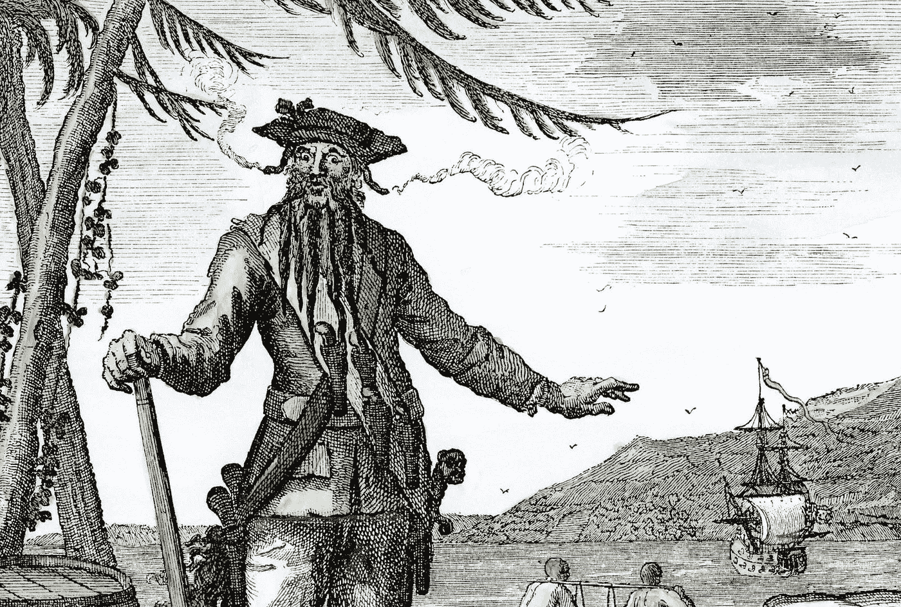

# 初创企业可以向盗版商学习的 5 条重要原则

> 原文：<https://medium.com/swlh/5-important-principles-start-ups-can-learn-from-pirates-49a83b7699c4>

18 世纪初充满了非凡的技术发展。蒸汽机 (1712 年)和[航天飞机](https://en.wikipedia.org/wiki/Flying_shuttle) (1733 年)开启了工业化进程，改变了世界及其力量平衡。

然而，在这一时期，公民和社会进步的速度并不一致。西班牙继承的[战争](https://en.wikipedia.org/wiki/War_of_the_Spanish_Succession)蹂躏了欧洲…