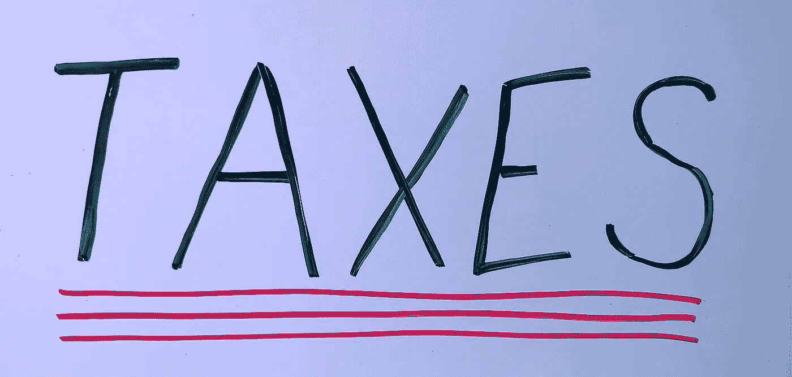

# 职业生涯的 5 个重要税务建议

> 原文：<https://medium.com/swlh/5-important-tax-tips-for-your-career-eb5d02dfe48f>

俗话说，在这个世界上只有两件事是确定的……死亡和税收！

原因是，如果你住在已知的文明世界的任何地方，你都要纳税。许多不同种类的税。

你有所得税，销售税，财产税，工资税，车辆税，土地转让税，汽油税，碳税，招待税，糖税，资本收益税，甚至死亡税…是的，当你离开这个世界时，他们甚至会对你的遗产征税。你明白了…

> …死亡和税收。

当你把所有的收入加在一起时，普通的北美人通常要支付超过 50%或更多的税收。

我想强调一下你在开始工作[生涯](https://www.careeryearacademy.com/curriculum)时最有可能遇到的主要问题。

# **销售税**

无论什么时候你买什么东西，你都很有可能要为此交税。在加拿大，我们有称为 GST 和 PST 的联邦税，也就是省税。在美国，我们通常有州销售税。

某些省份将这些结合在一起，称之为 HST(协调销售税)。在欧洲，许多国家的价格中已经包含了税，所以标签上的价格是含税的，而你在北美购买的大多数东西都会额外增加税。

一些例外，如食品杂货和药品必需品在大多数司法管辖区不征税，但例外情况很少。

除了意识到它们之外，你对此无能为力。除非你拥有一家企业，否则你很难收回其中任何一家。

# **所得税**

当你开始你的工作生涯时，你将被征收所得税。在北美，最常见的是所谓的累进税。

也就是说，你挣得越多，付出越多。不仅仅是总收入，还有收入的百分比。

例如，在加拿大，如果你的年收入低于 46，605 美元，联邦所得税的起征点是你收入的 15%，如果你的年收入超过 205，842 美元，联邦所得税的起征点是 33%。

此外，各省的所得税差别很大，安大略省最高为 13.16%，而魁北克省最低为 15%，最高为 25.75%。

因此，在所有条件相同的情况下，如果不考虑扣除因素，你在魁北克挣 110，000 美元，你将支付超过 55，000 美元的所得税。

我记得我侄子第一次从西部油田工作回来的时候。他 20 岁，这是他的第一份真正的工作。他对每小时赚 30 美元感到非常兴奋，认为他要发财了。买了一辆卡车，还没拿到钱就开始花。

但是当他回家后，他拿着工资条来找我，抱怨他的公司没有给他足够的工资。经过更仔细的检查，我不得不向他指出他们没有犯错误。

他几乎一半的薪水被用来支付所得税、就业保险、社会保障、加拿大的 CPP(强制退休储蓄计划)、医疗保险费用、工会费用等。

他每两周 2500 美元的薪水降到了 1400 美元左右。

# 其他税收

当你在生活中前进的时候，有许多其他的税你必须知道。购买房屋时的土地转让税和随后的财产税。

车辆税，以及各种各样的牌照，也是各种形式的税。

这里的要点是，随着你的发展，税收可能会成为人们的一个很大的负担，加拿大和美国的税法都非常复杂。

雇佣适当的税务和遗产规划服务是非常值得的。

虽然很复杂，但如果你知道自己在做什么，有很多方法可以合法、道德地利用税法。

创业是其中之一，利用现有的避税投资是另一个。

找一个好的税务专员，从年轻开始。你将在职业生涯中投入大量的时间和精力，如果不必要的话，你最不想做的事情就是缴纳过多的*税。*

> *所以这里有 **5 个重要的税务建议**来帮助你在职业生涯中成长。*

# ***1。付给他们钱——不要试图欺骗政府***

*后果是严重的，不支付你的欠税是不值得的。试图逃离世界上最强大的组织(政府)是徒劳的。*

*适当的规划将帮助你避免支付太多，但根据当前的税法支付你所欠的。税务员最终总会回来找你麻烦，所以要遵守规则。*

# *2.**找一个好的会计和税务专家***

*你可能倾向于自己做，但有许多方法，一个好的税务专家将能够找到合法的扣除，你可能不知道自己。*

*价格和成本是有区别的。一个好的专家可能比一个低质量的专家有更高的价格，但最终，从长远来看，它最终会花费很多倍。*

*例如，在审计的情况下，你不想独自代表自己。你的会计师知道行话，也知道系统是如何运作的，所以让他们来处理吧。*

*这只是不值得的压力，以处理持续的(我要说讨厌的)收入加拿大或国税局代理人打电话给你，而通过审计。*

*这些代理人有一项工作要做，那就是收取税款，他们往往会做得很好。*

*你可能不会去法庭为自己辩护，所以为什么要冒险自己去接受审计呢？*

# *3.**保留好你的开支记录和收据***

*在审计的情况下，你要做好准备和准备。这也是一个好的会计公司会帮助你的地方。如果你曾经有过通过审计的特权(你能感觉到讽刺吗),把你所有的文件整理好，保留好你的索赔记录和手头的所有收据，你将能在大多数情况下很快结束对你的审计。*

*但另一方面，如果你没有把你的东西保持有序，审计员很容易发现错误，你需要补缴税款、利息和罚款，这些往往比实际欠税金额要高。*

# *4.**尽你所能使用各种策略来减少你的税务负担***

*从长远来看，即使少交几个百分点的税也能产生巨大的影响，因为你可以用这些钱来投资。*

*缴纳公平份额的税款是好的，但每个政府都有法律、伦理和道德上的税收激励措施来鼓励某些行为，因此了解这些行为将有助于减少欠税。*

*为什么要多付钱呢？*

# *5.你住在哪里很重要*

*你住在哪里将对你必须支付的税额有很大的影响，因为各省和州的税率不同，所以要明智地选择。*

*我记得几年前从魁北克省搬到安大略省。我在魁北克生活了一整年，并以较高的税率纳税，然后在 12 月搬到安大略省，在那里我可以申报我的税收，因为我在下一个财年的 1 月 1 日之前住在那里(至少当时是这样的)。*

*通过这样做，我最终获得了数千美元的退税，因为我现在的税率较低。*

*这将非常困难，甚至可以说几乎不可能，除非你生活在岩石下，让任何人在他们的生活中逃避纳税。*

*这里的目标是尽量减少它对你和你的财务未来的影响。我完全赞成支付我应得的份额，只是不要超过我必须支付的份额！*

*在你的生活中实施这 5 个简单而重要的税务建议，你就会走上正轨。*

**PS…我不是税务顾问，也不与任何税务或会计事务所有关联。我只是一个学金融的学生，想给那些想了解这个主题的人提供一些信息。**

*[www.careeryearacademy.com](http://www.careeryearacademy.com)*