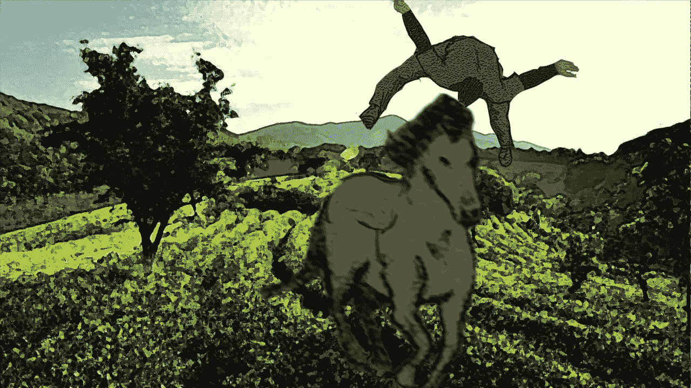

# 评估思维的 5 个关键

> 原文：<https://medium.com/swlh/5-keys-to-an-evaluative-mind-d9842cfb2c4f>

## 一个中国传奇告诉我们如何做出更好的现代决策

一个古老的传说讲述了一个聪明的中国农民的故事。由于他看待事物的方式，人们认为他是一个古怪的人。有一次，他的一匹马跑了。他的朋友聚集在他周围安慰他。“那太糟糕了，”他们说。“我们为你难过。”“你怎么知道不好？”老人问他们。几天后，这匹马回来了，还带了两匹野马。这使得邻居们都跑了。“好，好！”他们说，和他一起高兴。“你怎么知道是好的？”老人问他们。他们也无法回答这个问题。所以他们不再说了。在训练两匹野马时，这个人的儿子被摔了下来，摔断了腿。邻居们又来同情他。“哦，那太糟糕了，”他们说。"我们同情你和你的不幸。"“你怎么知道这样不好？”老人又说。就在第二天，一个领主和他的军队穿过这片土地，征召所有强壮的年轻人为他们而战。但不是老人的儿子。他身体不健全。[在这里听](https://vimeo.com/100449835)已故英美哲学家和西方东方哲学普及者[艾伦·沃茨](https://en.wikipedia.org/wiki/Alan_Watts)讲述农民的故事和寓意*没有好，也没有坏，只是思想使然。*

人类思维很快做出决定，比如“好主意”或“坏主意”；毕竟，它确实有助于判断草丛中的沙沙声是稀树草原上的狮子(逃跑:好主意)还是仅仅是风(逃跑:坏主意)。花时间停下来思考可能意味着我们最终会成为午餐。现代生活每天需要成百上千的决定。很多时候，需要在没有所有信息的情况下做出决定。或者也许所有的信息都是不可知的，“因为正如我们所知，有已知的已知；有些事情我们知道我们知道。我们也知道有已知的未知；也就是说，我们知道有些事情我们不知道”，唐纳德·拉姆斯菲尔德在为乔治·布什政府担任美国国防部长时，就缺乏将伊拉克政府与大规模杀伤性武器联系起来的证据开玩笑说。

那么，在没有所有信息的情况下，我们如何进行评估和决策呢？启发式——经常在你的潜意识中运行的实验性的、试错式的学习过程。为了做出更好的决策，评估的启发式学习*过程*在商业和管理、体育和教练、军事和教育等不同领域越来越普及。然而，动物王国上下的物种使用启发式学习过程从过去的决策中学习，并将这些知识应用到未来的决策中。大多数动物不会停下来思考草丛中的沙沙声；大多数动物都是糟糕的决策者。将启发法引入你的意识思维，并将过程应用到评估性思维中，可以带来更好的决策。

# 1.先探索。

[回想一下，大脑以两种截然不同的模式工作](http://www.matthewhirschey.com/articles/exploratory-mind)，探索模式和评估模式；神经科学的研究通常称之为集中模式和分散模式。因为大脑默认了之前看到的东西(这里也是启发法)，而不是为新的东西努力工作，它准备好了快速从产生想法的状态切换到评估想法的状态。抵制急于下结论和评估结果的冲动。像中国农民一样，获取尽可能多的信息。将探索性思维和评估性思维分开将会产生更多的[，从而更好的](https://www.matthewhirschey.com/articles/exploratory-mind)，可以评估的想法。

# 2.结果不等于决定。

最好的决策者将一个过程应用到他们的决策中，尤其是在未知或不可知信息的情况下。扑克是一种典型的游戏，玩家做出快速、高风险的决定，每手牌都充满不确定性。“象棋和扑克的一个关键区别是，象棋有正确答案，没有偶然性，没有随机性；这完全是客观的，没有主观性，”安妮·杜克在她的新书《下注中的思考》中说。

> “扑克则相反，你必须考虑其他玩家在想什么，做什么，思考你在想什么。”

杜克继续写道，“过程通常是不透明的，我们看不到它们的内部，也不知道所有的细节，所以我们使用结果作为启发，作为捷径，作为过程的代理。”扑克玩家称之为“结果”。“结果会扭曲你对决策和过程是否好的看法。”杜克，一个世界系列扑克手镯冠军，2004 年冠军锦标赛的冠军，和唯一一个赢得全国广播公司全国扑克单挑冠军的女性，形容这是一个致命的，决策错误。

相反，决策的成功和结果与做出决策的过程无关。在扑克和生活中，运气是最重要的因素。在扑克中抽一对 a 是幸运的。当你逃跑的马带着另外两匹马回到农场时，这是幸运的，但当你摔断腿时，这是不幸的。“运气是我们解释短期结果的一种方式，”杜克说。杜克认为，“人类的天性是把好的东西归功于运气，把坏的结果归因于运气，这是一种自私自利的偏见，以保持长期的身份认同”。但是这里存在着我们学习的短路，我们的启发式。杜克又说，“如果有运气的成分，而且是真正的运气，那就没什么好学的了。但如果我们只是用运气来解释我们的决定，或者走捷径，那么讨论运气就没有意义，因为它只是运气。”

相反，杜克大学将一个独立于结果的过程应用到她的决策中。在 *Thinking in Bets* 中，她讲述了无数次她应用自己的过程来评估自己的玩法，却输了的扑克游戏；相反，她讲述了自己在牌局中做了一个糟糕的决定，并且赢了。随着她成为一名更好的球员，她知道了成功和决定的结果与做出决定的过程无关，尤其是在不确定和偶然的情况下。

# 3.得到残酷的反馈。

我们是我们最糟糕的批评家。我们没有花足够的时间去探索(见第一点)；我们很快将“好”的结果归功于自己，将“坏”的结果归咎于运气不好(见第二点)。当我们最终将怀疑指向内心时，我们就成了自己原型的囚犯，从先前事件的角度来评价一切。当评估一个想法或行动过程时，你花费的时间和经历越多，通常意味着你对它越着迷。你需要帮助。

> “获得反馈是原创思维的关键要素，”

沃顿商学院(Wharton Business school)组织心理学家、《纽约时报》(NewYork Times)畅销书《T2》原著[《T4》概要 ]的作者亚当·格兰特(Adam Grant)说。“创作伙伴是最好的法官；格兰特说:“同事们不厌恶风险，更重要的是，他们没有任何投资。

反馈必须非常诚实。在 Annie Duke 的扑克生涯早期，她收到了严厉的反馈。杜克回忆说，有一次她“结果”并哀叹她在某一方面运气不好。她的朋友，也是最终的导师说，“我不想听。我不想伤害你的感情。如果你无法控制结果，我没什么好说的。”但在这种情况下，她可以控制结果，但不承认自己的错误。杜克大学最终成立了一个伙伴玩家小组，他们有一个“寻求真理的宪章”来:

1.  注重准确性胜于确认:奖励寻求真相；
2.  行为问责:没有结果；
3.  对想法的多样性持开放态度:没有好想法，也没有坏想法

杜克说，虽然残酷的反馈可能让人不舒服，但“从长远来看，更客观的人会赢得更有偏见的人的支持”。

# 4.用概率来思考。

“60%的情况下，每次都管用，”喜剧电影《主播》中的人物布莱恩·范塔那[说过一句著名的话](https://giphy.com/gifs/school-college-anchorman-ff9YGm7pp82cw)。虽然这种说法的数学可能有问题，但 Fantana 是用概率来思考的。概率思维是试图使用统计和数学工具来估计一个场景的任何结果的可能性[1]。在这个充满不确定性的世界里，运用[概率思维](https://en.wikipedia.org/wiki/Probabilistic_logic)可以带来更好的评估过程和更好的决策。

杜克说:“关键是要接受生活是不确定的(非黑即白)这一观点，并从概率的角度去思考。”。“我们对一个话题了解得越少，或者涉及的运气越多，我们就越不确定。”杜克建议表达不确定性，比如讨论时:事实(恐龙是群居动物)；预测(其他星球上有生命吗？);以及未来的决策(我认为如果我解雇总裁，公司会更好)。杜克说，通过采取客观的立场，以概率的方式思考，降低百分比信心比从对到错，从确定到不确定，从好到坏更容易。此外，以概率思考意味着你不太可能屈服于动机推理——一种寻找证据来支持预先形成的概念的逻辑。[艾德。注意:目前我有 80%的把握这是一个好主意，但有 20%的把握我能成功。]

这在逻辑上是如何工作的？杜克讲述了军事机构如何在“情景规划”中使用概率思维。在这种类型的计划中，一个决策的所有可能结果都被考虑到了(再次参见第 1 点)。然后，一个场景规划决策树列出了所有可能的结果，并对每一个发生的情况应用概率。即使考虑最不可能的结果也能让决策者考虑到所有可能的空间，[避免只看到灯柱下](http://www.matthewhirschey.com/articles/exploratory-mind)，并考虑每种结果的可能性。场景规划练习产生每个结果的预期概率(通过乘以相关场景的概率)和决策的评估逻辑。

人类对可能结果的统计可能性的直觉存在严重缺陷。行为经济学的研究，特别是阿莫斯·特沃斯基和 2002 年诺贝尔经济学奖得主丹尼尔·卡内曼的研究[脚注 2]表明，偏见劫持了基本原理和逻辑。直觉非常依赖的一种偏见是“可用性启发式”。一个人对一种情况的判断是通过一种结果的主观可能性来看待的，仅仅基于这个人以前的其他经验。这是“可用性”部分。直觉导致对真实概率的错误估计，因为人类的判断被难忘的事件严重扭曲。我们不能只依靠直觉；我们需要统计数据。

评估通常意味着我们无法提前知道决策的结果。“但这是关于承认我们正在预测未来，”杜克说。“猜猜也可以。”避免极端，采用概率思维和不确定性语言是远离偏见和走向更好的评估思维的步骤。

# 5.从过程中学习。

“当反馈在时间上与决策和行动紧密联系时，学习就会发生，”每一本心理学 101 书中都写道。尽管这是一种严重的巴甫洛夫式或斯基宁式的世界观，但人们普遍认为，为了学习，你需要有结果。把一只老鼠放在盒子里，它跑一个迷宫，在迷宫的尽头，老鼠找到了奶酪；然后它会想出如何更快地跑完迷宫。学习。这个由决定、行动、结果和奖励或惩罚组成的循环就是学习如何发生的。

在建立评估和决策的过程中，包括评估你的评估的步骤——非常元——意味着你可以从你的过程中学习并变得更好。在之后评估*一个决定经常与结果联系在一起，因为你已经知道了决定的结果。一些最优秀的决策者会在*做出决策之前*评估决策过程。怎么会？让你未来的自己参与决策。杜克说，“未来的美国可以影响现在的美国，基于过去的美国决策。”Duke 举了一个她使用的叫做 10-10-10 的过程的例子。她问自己以下问题:“当前的决定在 10 分钟、10 个月、10 年后会有什么后果？”这个问题促使她将未来的自己加入到当前的决策中。例如，通过将后悔转移到决定之前，她会做出避免未来后悔的决定。这里的关键是考虑长远。从过去的决定中学习意味着你可以预测未来的自己会对当前的决定说些什么。*

做到这一点的一个捷径是制定一个尤利西斯契约——过去的你和现在的你做一个交易，以防止未来的你做出糟糕的决定。在荷马的《奥德赛》中，英雄尤利西斯和他的船员必须驶过塞壬，这些美丽的女人唱着如此迷人的歌曲，任何听到她们的男人都会如此着迷，以至于他们会驾驶他们的船直接撞上岛上的岩石并淹死。尤利西斯设计了一个计划，通过指示他的船员把他绑在船的桅杆上，用剑顶着他，只有当他们驶过岛屿时才释放他，来听到塞壬的歌声。他用蜡塞住船员的耳朵，让他们安全通过，尤利西斯是唯一活着讲述美丽塞壬之歌的人。

尤利西斯契约本质上是你与自己建立的避免将来后悔的个人规则。奥德修斯确信无论他当时对他的船员说什么，他们都不会释放他或让他控制这艘船。他想避免将来对那个决定感到后悔。个人规则是做出更好决策的简单启发。比如我不把会议安排在 X 时间之前；我每餐都吃 Y 蔬菜；我每个月会存下 Z 美元。规则并不是将评估从决策过程中移除，而是将你未来的自己招募到当前的决策中。如果你想保护更多的时间，吃得更健康，或者为退休做计划，这些合同或规则是为你认为未来重要的事情做出更好的当前决策的一种方式。

但是你不可能在每种情况下为你做出的每一个决定都制定一个规则。因此，建立一个从决策中学习的过程更实际。从决策中学习的一个主要例子是由军事战略家和美国空军飞行员约翰·伯伊德提出的“观察-定位-决策-行动”( OODA)循环。OODA 回路最初是由 Boyd 设计的，作为朝鲜战争中在空对空战斗中智胜敌人米格-15 战斗机的实用概念。OODA 循环的四个步骤是:

1.  观察:收集信息
2.  定向:分析和综合数据，形成当前的心理观点；在决定和行动之前，这是这个模型的一个定义元素
3.  决定:根据这个观点决定最佳行动
4.  表演:做吧

最重要的一步是在 4 之后，这太循环回到 1 了。它被称为 OODA 循环是有道理的。事实上，Boyd 的 OODA 循环包括在流程的任何时刻返回到步骤 1 [。根据 Boyd 的说法,[在混战中]胜利的关键是能够创造出比对手更快做出适当决定的局面。虽然这种结构最初是一种在空对空战斗中取得成功的理论，但它后来被应用到其他领域，从法律和医学到政治和体育，也就是说，因为它在混乱或混乱的情况下应用理性思维结构，以做出如何行动的更好决定。评估型思维的学习过程发生在决策(和行动)之前、之中和之后，并且不断更新。](http://en.wikipedia.org/wiki/OODA_loop#/media/File:OODA.Boyd.svg)

众所周知，人类的大脑擅长错误地记住你当时的想法。所谓的后见之明偏差，描述了我们如何无法准确地记住过去的事情，并对其应用错误的叙述。虽然人类的大脑能够做出一些令人印象深刻的壮举，但在精神上把我们自己带回到那个时间和地点来回忆我们对一个决定或一个事件的想法却不在其中。写下你的过程，比如在“[决策日志](https://www.dejournal.co)”中，可以克服这种认知缺陷。记录评估和最终决策的过程，可以让我们在未来的某一天回到决策时。你探索过所有的可能性吗？反馈有多残酷？你认为结果会是什么？你的概率准确吗？有了这个记录，你就结束了学习循环，并获得了关于你的评估过程和决策的反馈。[艾德。注意:我目前有 30%的把握会采用这种做法。]

评估过程本质上是你如何在未知的环境中做出选择的决定；有两个截然不同的步骤:在你做出决定之前，有一个对选择做出决定的过程；在你做出决定之后，通过重新评估决定来更新你的过程。非常唐纳德·拉姆斯菲尔德式的。

既定流程是培养评估思维和更稳健决策的关键。确定性的表达是我们正走向一个不恰当决策的标志，比如农场村民说“哦，那太糟糕了。”坏是结论，不是理由。而且特别没用，因为太确定了。断定某事是坏的也违背了概率语言。就像中国的农民一样，唯一可以确定的是不确定性就在前方，结果既不好也不坏，只是想法使然。

# 进一步阅读

1.[概率思维的心智模型](https://fs.blog/2018/05/probabilistic-thinking/)在[法南街](https://fs.blog)

2.丹尼尔·卡内曼与阿莫斯·特沃斯基有着长期的合作，并且[写道](https://www.amazon.com/gp/product/0374533555/ref=as_li_qf_asin_il_tl?imprToken=Z4uIrAIUxviydvb6V0lu8Q&slotNum=0&ie=UTF8&tag=farnamstreet-20&creative=9325&linkCode=w61&creativeASIN=0374533555&linkId=cfde62ced157869fce2abd88c75acc81)他相信如果特沃斯基没有在 1996 年因转移性黑色素瘤过早死亡的话，他会与卡尼曼分享该奖项。

[*马修·赫希*](https://medium.com/u/a2e9bb1fc23c?source=post_page-----d9842cfb2c4f--------------------------------) *是一位科学家、学者和企业家。他的研究兴趣包括新陈代谢和营养传感，以及从糖尿病&肥胖到癌症和衰老等人类疾病。他在 matthewhirschey.com**写作，在那里他探索创造力的科学。你可以阅读他的文章或者* [*加入他的简讯*](https://www.matthewhirschey.com/newsletter) *探索科学与创意交汇处的思想。*

*本文原载于*[*https://www.matthewhirschey.com*](https://www.matthewhirschey.com/articles/5-keys-to-an-evaluative-mind)