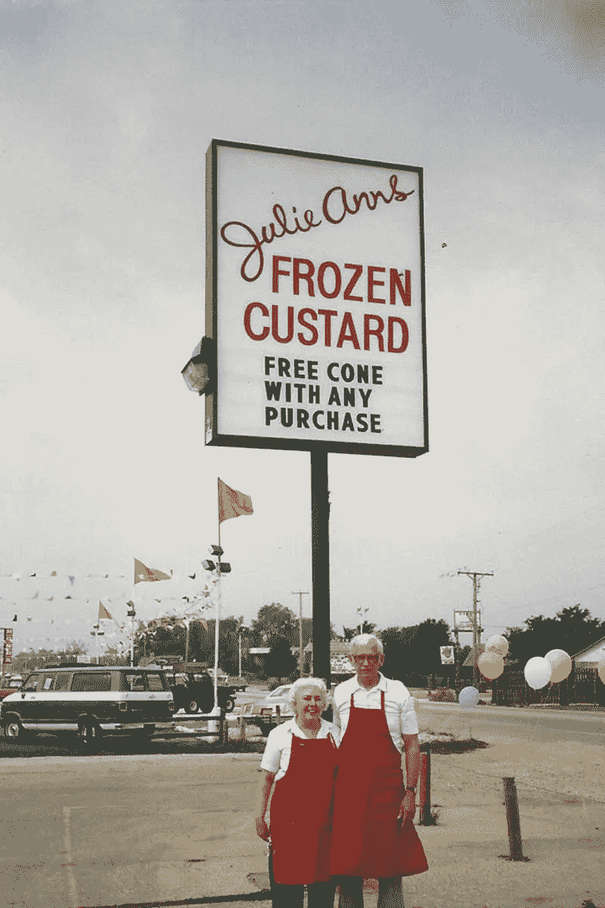
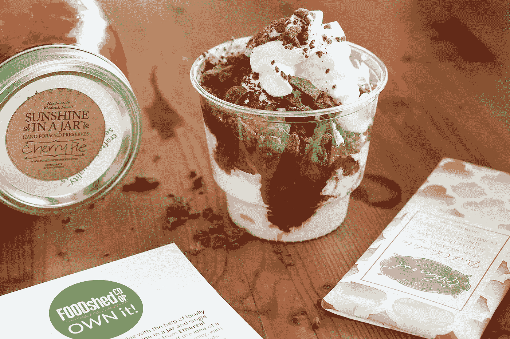
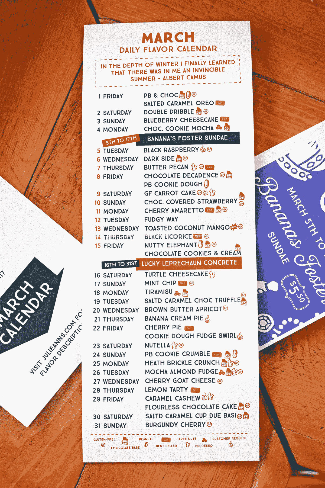
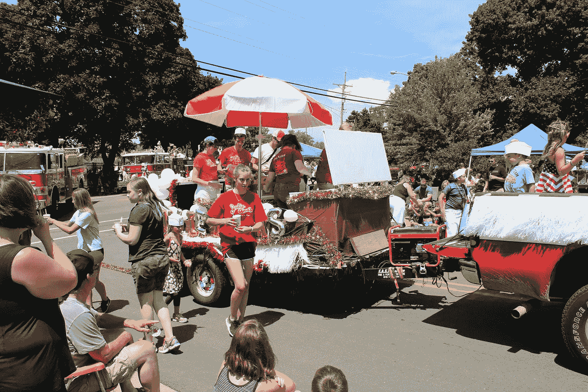
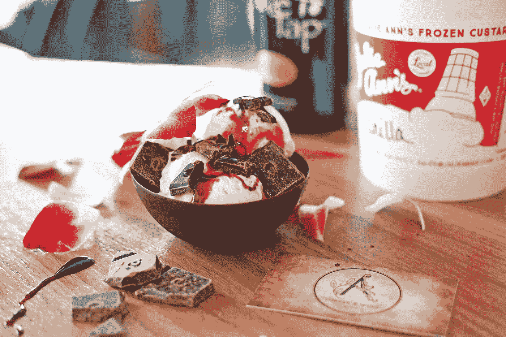
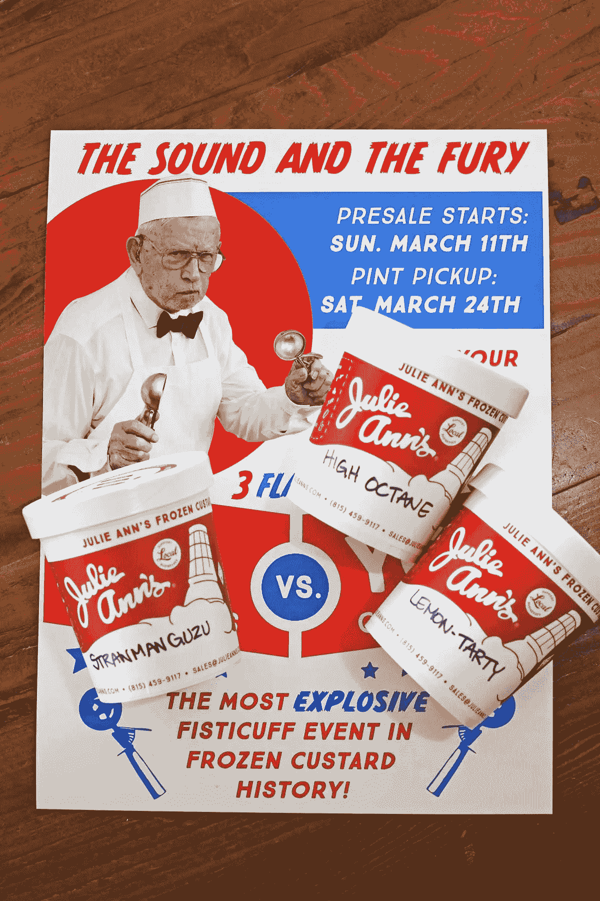
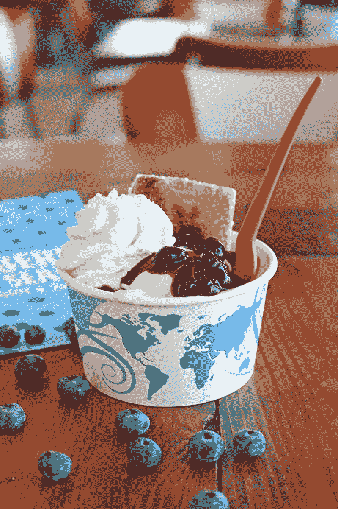

# 我从帮助建立我的家庭餐馆品牌中学到的 5 个教训

> 原文：<https://medium.com/swlh/5-lessons-i-learned-from-helping-build-my-familys-restaurant-brand-c3306629c511>

Back in 1985, My Grandparents, John and Mary on opening day for their place, Julie Ann’s.

# 一位业内人士关注增长黑客、文化、社交媒体、优惠券和菜单设计

那是 1991 年，在密尔沃基的郊区。我喜欢治疗、游泳和自行车。12 岁的时候，我觉得自己很酷。然后，我们的父母让我们坐下来，告诉我们，我们要搬到芝加哥郊区，接管我祖父母的冷冻蛋羹餐厅，名为[朱莉·安餐厅。](https://julieanns.com)

再见了，酷小子。欢迎来到餐厅。

我称之为“苦差事”,因为当你不清理桌子和服务顾客的时候，你要做的是菜单、工资单、招聘、人事活动，以及确保晚上高峰时一切顺利。

你几乎每天都在餐馆工作，很少有休息时间。**家庭经营的餐馆就像和你爸爸一起创业一样。**

28 年过去了，事情又回到了原点，我们已经准备好开始下一阶段的旅程。

我写这封信是为了分享对我们有用的东西，并提升只保留给特许经营、连锁和餐饮集团的关于餐饮营销的对话。

An early local mashup sundae with [Ethereal Chocolates](https://www.etherealconfections.com/), [Sunshine in a Jar Preserves](https://sunshinepreserves.com/), and [Foodshed Co-op](http://www.foodshed.coop/).

# 第一课:成长或死亡，改变或死亡。

虽然一些餐馆可能多年来都有同样的菜单，而且他们似乎做得不错，但我们的餐馆需要赶上今天的时代精神。自 90 年代末以来，商业模式和菜单没有真正改变过。

我们认为，如果我们的月同比销售额没有增长，我们就会慢慢死去。

因此，我们有条不紊地建立了一种变革、协作的文化，以及一种“全员参与”的职业道德。

对于一家已经强大了 30 多年的公司来说，改变不可能在一夜之间发生。

> 事实上，在我们的文化(和业务)转变的开始，我们发现一些长期员工抵制变化，并试图破坏新的想法，因为他们认为他们在保护业务。

习惯于一种做事方式的员工经常会招募其他员工加入谣言工厂，使得改变更加困难。有趣的是，那些不能(以积极的方式)拥抱变化的人最终会淘汰自己。当他们看到变化没有停止时，他们感到压力很大，不得不退出。

我们通过每周群发短信解决了这个问题。我们让员工知道我们在做什么以及为什么做。这有助于他们应对不断变化的本质，给他们时间来吸收我们正在做的事情，并为接下来的事情做好心理准备。

Our March 2019 [Monthly Flavor Calendar.](https://julieanns.com/flavors/)

# 第二课:让菜单(和定价模式)不那么永久。

在朱莉·安的店里，和许多冰冻蛋羹店一样，我们会做香草、巧克力和 1 到 3 种日常口味。因此，我们制定了一个月历来计划整个月的风味和特色菜。

老实说，这是一项疯狂的努力，我们花了很多年才掌握。我们带回受欢迎的口味，客户的要求，季节性水果和节日风格的口味。但是，我们总是留有余地去尝试大约 5 种新口味，看看有什么能坚持下去。

当你提供复杂的食物时，你需要临时的菜单。我们有每月的每日风味日历和大粉笔板来展示我们的圣代、奶昔和具体价格。我们每月印刷新菜单，每年更换粉笔板。这使得我们可以相当容易地玩定价模型。

许多人会认为临时的、不断变化的菜单会给顾客带来困难，但我们发现这为我们的社交媒体工作增加了很多价值。如果我们有新的项目，我们会发布。新口味？我们把它和它背后的故事贴在一起。

> 顾客喜欢被告知新的和令人惊奇的事情。他们希望你带他们去购物。

**我们不断变化的菜单的好处:**

*   这是有机社交媒体增长的最大来源
*   我们与当地企业和制造商一起创造合作口味和圣代
*   我们创造限时供应的季节性“热门商品”(比如水果、口味和假期)
*   我们在混合中加入竞赛和事件来增加刺激
*   当我们更新内部菜单时，我们可以改进和简化定价模式
*   我们可以对市场做出反应，而不用担心疏远我们的客户

We won first place for our Root Beer Float Float where we handed out thousands of fresh floats along with 3,000 free cone coupons. We went through 4 kegs of Sprecher Root Beer ON THE FLOAT. What a riot!

# 第三课:我们不打折。句号。

我从优惠券书店、Yelp、Groupon 那里接到了无数的电话，我的回答总是一样的。不用了，谢谢。

我宁愿分发免费的甜筒让人们进门，或者在我们的奖励计划中提供免费的东西，而不是打折。原因如下:

1.  制造优质产品通常需要优质原料。如果你把利润降低太多，那么你就不得不提高价格，或者裁员，或者使用劣质原料。**这是一场逐底竞争。**
2.  建立一个卓越的品牌需要出色的客户，他们能够欣赏我们为业务付出的额外努力。打折吸引了那些寻求交易的人和他们的朋友。我们发现这些类型只有在有优惠券或折扣的情况下才会出现。
3.  一个合适的品牌体验需要银行里的钱来设计、印刷和建造东西(比如食品车和更多的位置)。
4.  Groupon、Yelp 和优惠券销售人员不知道什么时候停止打电话！他们把事情看得太远，成为一个彻底的烦恼。给他们一英寸，他们拿一英里。

**请记住，本课程不适用于员工、军人、高管，也不适用于我们提供的折扣和筹款机会。*

Here’s a recent local collaboration with [Aroma Coffee](https://www.facebook.com/AROMAcoffeeandwine/), [The Olive Tap](https://www.theolivetap.com/crystal-lake-illinois/), and [Askinosie Chocolate](https://www.askinosie.com/).

# 第四课:社交媒体是一项团队合作运动。

如果你认为你可以处理好管理一个成功的地方的日常琐事，而且还有时间管理社交媒体运营，那么你将会猛然醒悟… **就像我已故的朋友楼说的，“你会有一个很长的人生。”**

对我这样一个销售人员和营销人员来说，这仍然是一个难以接受的教训。我希望一切看起来完美，自动化，提供恰到好处的感觉…

在这段旅程的某个地方，我没有时间来发布这么多，令我惊讶的是，**我们的工作人员从我停止的地方开始，奇迹开始发生了。**

现在，我觉得我的工作是减少对日常社交媒体职责的担心(尽管当它开始变得乏味时，我会尝试提供投入)，并将注意力集中在更大的合作和营销工作上。

我仍然觉得我们的游戏有很大的改进，但现在我致力于“不可编程的时刻”,如彩绘壁画，活动中的酷东西等。

Here’s a contest we do featuring my 95 Year Old Grandfather, John (I still can’t believe he posed for the camera). We battle our customers to see who can come up with the best new flavors and hand out a scoop-style trophy that we display at the shop.

# 第五课:成为更好的企业建立品牌

我们总是试图预测客户的感受、需求和欲望。从音乐，到当地采购的原料，到与面包师和农民的合作，到面筋和不含乳制品的产品选择，再到如何让食物尽可能新鲜…

我们聊了很多关于享受蛋羹**的感觉和扔掉塑料的遗憾。**

所以，我们开始研究堆肥。在我们这个地区，很少有餐馆使用它们，主要是因为它们很贵，很难找到合适的尺寸，而且交货时间很长。

大约 3 年前，我们决定在不提高价格的情况下，用可堆肥产品替换我们的杯子、碗、吸管和勺子。

这一过程要求我们减少尺寸选项的数量，库存额外的箱子(因为订单交付周期不明确)，雇用额外的分销商，并遭受财务打击。

虽然很少有人对杯子和勺子发表评论，但我们对发展业务和减少对环境的影响感觉更好。我们还认为，我们的客户会注意到，而不需要任何人说什么，也不需要吹嘘。**更多的是一种不言而喻的冷静因素。**

Here was a sundae with did with [Tom’s Farm in Huntley, IL](https://www.tomsfarmmarket.com/) during blueberry season, you can see we made the transition to [Eco-Products](https://www.ecoproducts.com/) compostable sundae cups and spoons.

# 回到地面…

是时候回到[朱莉·安的](https://julieanns.com/)和[湖畔营销](https://madebylakeside.com/)了。我会在我们推出 1953 年国际地铁冷冻蛋羹卡车并进行巡演后写更多。如果你曾经去过伊利诺伊州的水晶湖，顺便去商店打个招呼。我们将很高兴见到你。**查看即将推出的视频…**

Thanks to our friends at McHenry County Living for this lovely video! We are putting the finishing touches on “Mary Lou”. I’m the guy with the Dead hat on! ;-) Cheers!

## 这篇文章发表在 [The Startup](https://medium.com/swlh) 上，这是 Medium 最大的创业刊物，拥有+435，678 名读者。

## 订阅接收[我们的头条](https://growthsupply.com/the-startup-newsletter/)。

