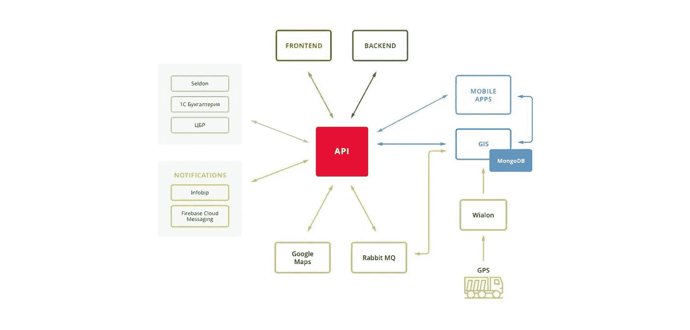
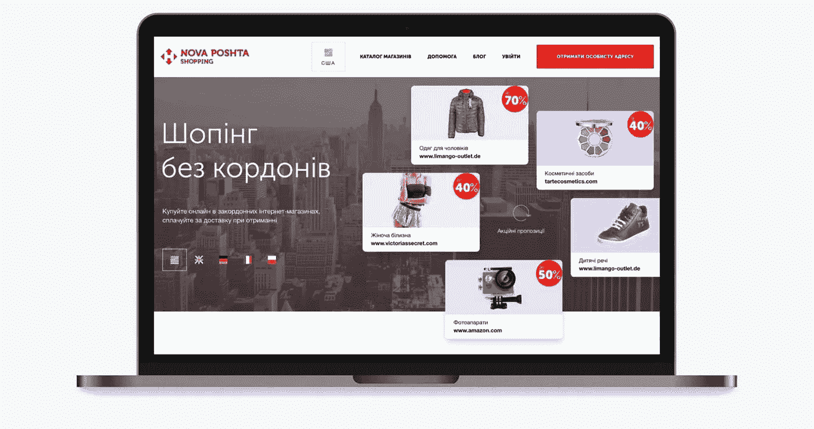

# 2019 年提升运输和物流业务的 5 种先进数字解决方案

> 原文：<https://medium.com/swlh/5-progressive-digital-solutions-to-upscale-your-transport-and-logistics-business-in-2019-83cd10ad79ed>

自动化是客运和货运发展的主要先决条件。随着新运营模式的引入，今天的物流变得更加复杂。客户期望更快的服务和更高的透明度。因此，即使是中小型运输企业也将注意力转向数字解决方案，希望最大限度地减少人工管理、文书工作和拖沓。

反过来，数字市场也尽最大努力满足日益增长的需求，提供数百种工具满足各种口味。对于不熟悉技术的普通企业主来说，试图整理所有可用的软件产品可能会导致眩晕。

[作为运输和物流 IT 解决方案开发领域公认的专家](https://clutch.co/web-developers?sort_bef_combine=field_pp_reviews_count_value%20DESC&field_pp_min_project_size_value=All&field_pp_hrly_rate_range_value=All&field_pp_size_people_value=All&field_pp_cs_small_biz_value=&field_pp_cs_midmarket_value=&field_pp_cs_enterprise_value=&field_pp_if_advertising_value=&field_pp_if_automotive_value=&field_pp_if_arts_value=&field_pp_if_bizservices_value=&field_pp_if_conproducts_value=&field_pp_if_education_value=&field_pp_if_natural_resources_value=&field_pp_if_finservices_value=&field_pp_if_gambling_value=&field_pp_if_gaming_value=&field_pp_if_government_value=&field_pp_if_healthcare_value=&field_pp_if_hospitality_value=&field_pp_if_it_value=&field_pp_if_legal_value=&field_pp_if_manufacturing_value=&field_pp_if_media_value=&field_pp_if_nonprofit_value=&field_pp_if_realestate_value=&field_pp_if_retail_value=&field_pp_if_telecom_value=&field_pp_if_transportation_value=&field_pp_if_utilities_value=&field_pp_if_other_value=&country=All&state=&distance%5Bpostal_code%5D=&distance%5Bcountr)，我们在 Stfalcon.com[的](https://stfalcon.com/)发现了当今运输行业最需要和最有用的数字产品类型，并乐意与离合器博客的读者分享这一知识。

在本文中，我们将简要分析运输和物流不同领域的 5 种 IT 解决方案:运输和车队管理系统、包裹运送系统、在线预订系统，以及作为调度员、司机和客户之间主要联系方式的移动应用程序。

# TMS 和 FMS:在路上留意你的车辆

TMS (运输管理系统)和 FMS(车队管理系统)是两个非常相似的数字产品，功能经常交叉。它们的使用范围包括配送、车辆租赁、客运等。正如本文所描述的所有自动化系统一样，它们既可以单独使用，也可以集成到公司的 [ERP](https://stfalcon.com/en/blog/post/ERP-software-development) (企业资源计划系统)中。

FMS 主要依靠远程信息处理和基于卫星的通信从车辆收集实时信息，用于途中跟踪和运输过程监控。这些信息被进一步分发到其他软件应用程序，如 TMS，以帮助后台提高工作效率。使用的技术包括 GPS(全球定位系统)、GIS(地理信息系统)、IoT(物联网)和远程信息处理设备。收集的数据包括车辆状况、驾驶员的表现和驾驶性能、停车次数、路线合规性、运输条件(例如温度)和油耗。

TMS 是一个在线平台，旨在优化运输公司的日常运营。它有助于收集和分析与运输过程相关的各种数据，并将其转化为工作优化决策。TMS 的核心是电子数据交换，即计算机与计算机之间的文件、发票、报告等的交换。以标准化的电子格式。它是在 API 的帮助下实现的，API 将各种服务集成到一个可供不同方使用的单一协调系统中。根据您的业务需求，它可以包含不同的成分。例如，下面是 Stfalcon.com 为[智能种子](https://stfalcon.com/en/portfolio/smartseeds-ru)货物运输平台开发的 TMS 架构:

# 包裹运送系统:为来自世界任何角落的客户服务

据统计数据显示，每年有超过 10 亿次的网上购物，而且这个数字还在持续增长。考虑到这一点，对包裹和包裹转运服务的需求也在增加。包裹运送系统帮助您与客户进行快速、透明和愉快的合作。

通常，它是一个由管理面板和用户平台组成的双向服务。用户可以选择购物项目，安排订单和付款，并跟踪他们的包裹递送。内容管理员和仓库操作员使用管理仪表板来填充站点和管理仓库。对于更复杂的解决方案，可以将成熟的仓库管理系统集成到服务中。如果您从不同的国家交付货物，您可能会想到一个多站点，每个站点代表一个单独的国家，就像我们为乌克兰最大的货运服务 Nova Poshta 所做的那样。您可以在图片中看到此服务的国家页面示例。Nova Poshta 货运服务开发的完整案例可在[这里](https://stfalcon.com/en/portfolio/npshopping-ua)找到。

# 客运网上订票:通过互联网售票

一个[在线订票系统](https://stfalcon.com/en/blog/post/online-booking-system)(或称机票预订系统)是一个软件，它允许你的顾客从他们的电脑或手机上在线购买机票，而不需要去钱柜。他们可以使用交互式座位地图更方便地选择最佳日期和座位，无需离开网站即可支付，这使得这种服务越来越受旅行者的欢迎。由于所有的信息和时间表都是自动更新的，网上订票系统为你节省了大量的时间和人力。该系统可以集成到你的网站，甚至社交媒体页面。

在线预订系统最广泛的功能包括预订管理、编制乘客名单和跟踪客户详细信息，但是通过定制开发，您可以决定哪些功能对您的公司是必要的。在为德国客运公司开发[预订网站时，我们包含了以下组件:旅行计划，有机会控制线路之间的换乘、乘客量监控、灵活定价和销售分析工具、借助 D3.js 的数据可视化、电子邮件和 SMS 乘客提醒、管理代理和合作伙伴、在线路线监控、地理信息系统。加密和 SSL 安全协议保证了信息的安全性。](https://stfalcon.com/en/portfolio/meinfernbus-de)

# 移动的力量:全天候保持联系

除非你的车队 100 %由无人驾驶汽车组成，你的仓库完全由机器人操作，否则人类互动将永远是你的一个问题。即使你与员工的交流是即时的，你能说你与客户的互动也是即时的吗？幸运的是，今天，手机让你更容易随时保持联系和传递信息，即使你不在线。应用程序用于交流和执行交易、车辆的位置和可用性，以获取环境传感器数据，并实现直接商店交付。

在运输行业，有两种应用最普遍:客户应用和员工内部使用的应用。后者的一个例子是一个司机应用程序，允许从司机的角度管理运输过程。例如，由于有了 [SmartSeeds 应用程序](https://stfalcon.com/en/portfolio/smartseeds-ru)，司机可以报告请求完成的状态，并在出现意外情况时向调度员提供准确及时的信息。

在仓库管理中，应用程序有助于最大限度地减少不准确性和错误。配有扫描仪，它们有助于自动记录货物和存储的 id 和设备位置识别，采购跟踪和补货。应用程序也可以用于条形码扫描或作为[图像识别设备](https://stfalcon.com/en/blog/post/ml-kit-firebase-image-recognition)。

# 还在犹豫选什么？联系开发团队

我们简要分析了交通部门最普遍的数字解决方案类型及其功能。主要参数软件帮助运输和物流公司跟踪路线优化、车辆可用性和状况、员工绩效、库存以及与客户的互动。如今市场上有许多现成的 IT 产品，我们希望有了建议的指导原则，您将更容易确定哪种解决方案最适合您的需求。

【Stfalcon.com】原载于**。**

**

## *这篇文章发表在 [The Startup](https://medium.com/swlh) 上，这是 Medium 最大的创业刊物，拥有+411，714 名读者。*

## *在此订阅接收[我们的头条新闻](http://growthsupply.com/the-startup-newsletter/)。*

**