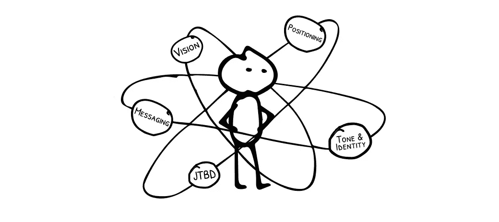
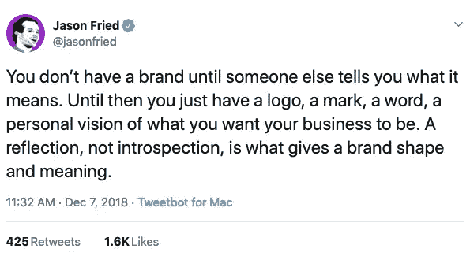

# 打造以客户为中心的品牌的 5 个问题

> 原文：<https://medium.com/swlh/5-questions-to-create-a-customer-centered-brand-9c3b2e9f949f>

当我们想到“品牌”时，脑海中会浮现出很多词汇和概念。

*   一个承诺
*   你的名声
*   一次经历
*   思维捷径

不管你选择如何描述它，这些想法都依赖于一个共同的元素:你的客户。

该列表可以改写为:

*   对客户的承诺
*   *你在顾客心目中的声誉*
*   **向您的客户提供的体验**
*   ***帮助你的顾客记住你的一条心理捷径***

***记住这一点，作为一家企业，你为发展自己的品牌所做的一切都应该围绕着你如何联系和吸引你的目标客户。***

***当然，挑战在于你无法控制客户会如何解读你的工作。***

***正如 Basecamp 的 Jason Fried 指出的那样，在某种程度上，解释或反思就是一切。因为你的顾客决定了你企业的价值和成功，他们对你品牌的看法才是最重要的。***

******

***Via [Twitter](https://twitter.com/jasonfried/status/1071125270101417984)***

***然而，这条推文中缺少的是客户对你创造的东西的反应。***

***根据我对 Basecamp 的了解，他们在早期很少考虑这个问题。他们制造产品，把它们放在那里，让人们随心所欲地诠释他们的作品。***

***这是许多企业的默认路径:提出一个想法，分享它，然后等待市场来决定它的价值…和你的品牌。***

***这里的问题又是暗示，因为你的品牌存在于你的顾客心中，这意味着你的企业在等式中没有力量。你不应该花时间打造你的品牌，因为它不在你的控制之内。***

***这种想法充其量只能减缓你的进步，在最坏的情况下会在你的道路上制造不必要的障碍。***

# ***客户会看到、记住并信任你吗？***

***竞争格局只会越来越激烈。消费者对企业的评估越来越复杂。***

***作为消费者，我们曾经让大多数代表从电视和世界各地评估公司。***

***但现在，我们正致力于品牌曝光。***

******

***Photo by [Becca Tapert](https://unsplash.com/photos/QofjUnxy9LY?utm_source=unsplash&utm_medium=referral&utm_content=creditCopyText) on [Unsplash](https://unsplash.com/?utm_source=unsplash&utm_medium=referral&utm_content=creditCopyText)***

***根据 2018 年尼尔森报告，成年人每天花 11 个小时看屏幕。***

***无论是在社交网站、YouTube、谷歌搜索，还是传统的电视上，我们几乎一直在接触新产品和服务。***

***在过去，也许你可以用一个更慢的反馈循环来发展你的品牌。但是有了这些噪音，每一次客户互动的溢价就更高了。如果你有机会抓住某人的注意力，你需要让它有价值。***

***这就是为什么以客户为中心的品牌是至关重要的。***

***它让你专注于尽可能多地了解你的客户*，然后利用这些信息来告知你如何展示你的品牌。****

***它能让你改善你如何看待你的业务和客户如何看待它之间的一致性。***

***它通过你言行一致来建立信任。***

*****这有助于缩小你和顾客之间的距离。*****

***是的，你总是需要顾客的反馈。是的，你的品牌会随着你看到你的观众的反应和了解他们最关心的事情而发展。***

***但是今天你可以采取*的行动来加速这一过程，并与你的客户建立更牢固、更有效的关系。****

# ***针对您的品牌的 5 个问题***

*****为了建立以客户为中心的品牌，你的企业需要考虑以下 5 个问题:*****

1.  ***[**愿景**](https://mapandfire.com/field-guide/purpose/?utm_source=blog&utm_medium=article&utm_campaign=customer-centered#vision-statement) **:** 如果你成功地实现了自己的目标，你的**客户**的生活会有什么变化？***
2.  ***[**要做的工作**](https://mapandfire.com/field-guide/customers/?utm_source=blog&utm_medium=article&utm_campaign=customer-centered#jobs-to-be-done) **:** 你的**客户**需要你的业务的情况是怎样的，他们使用你的业务的动机是什么，以及他们想要的结果是什么？***
3.  ***[**定位**](https://mapandfire.com/field-guide/competition/?utm_source=blog&utm_medium=article&utm_campaign=customer-centered#competitive-position) **:** 你所提供的哪些元素将为你的企业在竞争格局中以及在你的**客户的心目中创造独特的地位**？***
4.  ***[**语气&身份**](https://mapandfire.com/field-guide/brand/?utm_source=blog&utm_medium=article&utm_campaign=customer-centered#brand-identity) **:** 你将如何沟通和展示你的品牌，以说明你的**客户**的价值？***
5.  ***[**信息传递**](https://mapandfire.com/field-guide/marketing/?utm_source=blog&utm_medium=article&utm_campaign=customer-centered#4-forces-that-affect-change) **:** 你会用什么词来传达你所提供的东西，并鼓励**客户**从他们现在做的任何事情转向参与你的业务？***

*****当你改进这些问题的答案时，你可以期待 3 种结果:*****

1.  *****明确**谁是你的客户，以及你的企业如何最好地满足他们的需求。***
2.  *****专注**这样你和你的团队投入的所有努力都以同样的方式朝着同样的目标前进。***
3.  *****一致性**你的业务以各种方式表现自己，这样客户就能围绕你提供的东西建立期望和信任。***

***花些时间思考这些想法可以帮助一家初创公司创建一个更有效的发布会，或者推动一家老牌企业获得新的增长。***

***不管你存在了多久，你的品牌总是能从更多地以顾客为中心中受益。***

# ***创建你自己的以顾客为中心的品牌***

***想要帮助你的企业创建一个以客户为中心的品牌吗？[了解有关品牌指南流程的更多信息，下载免费资源，或直接联系 Map & Fire。](https://mapandfire.com/?utm_source=blog&utm_medium=article&utm_campaign=customer-centered)***

# ***如果你读到这里，请在下面给这个故事一些掌声:)***

******

****原载于 2019 年 3 月 21 日 mapandfire.com**T21*[。](https://mapandfire.com/blog/5-questions-to-create-a-customer-centered-brand/)***

****

## **这篇文章发表在 [The Startup](https://medium.com/swlh) 上，这是 Medium 最大的创业刊物，拥有+436，678 名读者。**

## **在这里订阅接收[我们的头条新闻](https://growthsupply.com/the-startup-newsletter/)。**

****