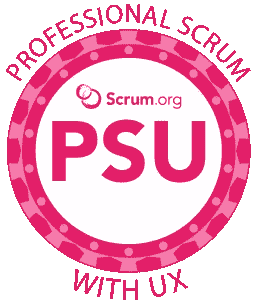

# 将 UX 与敏捷和 Scrum 相结合的 5 条规则

> 原文：<https://medium.com/swlh/5-rules-for-integrating-ux-with-agile-scrum-b048babb9a89>

After more than a year of work, I’m thrilled to announce the launch of this joint effort between Scrum.org, Josh Seiden and myself. The Professional Scrum with UX certified class starts to answer the questions scrum practitioners from all disciplines have been asking. How does design work fit into sprints? What does “done” mean for non-software tasks? How many backlogs should we have? What is dual-track agile? All these questions are answered in the class and [they are being offered worldwide](https://www.scrum.org/classes?country=All&proximity=&scrumorg_geocoder_postal=&uid=&type%5B%5D=200&scrumorg_geocoder_postal_state=1&field_course_language_value=&proximity-lat=&proximity-lng=) now. See you there? [Learn more.](https://www.scrum.org/courses/professional-scrum-user-experience-training)

*(本文是* [*的续篇下面是 2018 年 10 月出版的《UX 设计如何与敏捷和 Scrum 融合》*](/swlh/here-is-how-ux-design-integrates-with-agile-and-scrum-4f3cf8c10e24) *。它也首次出现在我每月一次的时事通讯中。* [*在这里报名*](https://continuouslearning.beehiiv.com) *加入 40k 其他人。)*

当我开始我的职业生涯时，软件是装在盒子里的。如果这对你来说听起来很奇怪，你要知道当我还是个孩子的时候，我爸爸会把 20 世纪 70 年代软件的穿孔卡片带回家。