# 计算客户终身价值的 5 种简单方法

> 原文：<https://medium.com/swlh/5-simple-ways-to-calculate-customer-lifetime-value-5f49b1a12723>

想知道如何赢得客户，提高利润，并节省您的预算？在所有指标中，有一个特殊的指标可以告诉你，在客户生命周期中，客户给你的公司带来了什么价值。让我们打开客户终身价值(CLV)指标，并为您的企业充分利用它。

# 什么是客户终身价值？

**客户终身价值** (CLV 或 LTV 的“终身价值”)帮助您预测未来收入，衡量长期业务成功。CLV 告诉你，在建立关系的过程中，你的公司可以从一个典型的客户那里获得多少利润。更重要的是，CLV 帮助你估算出为了留住一个客户，你应该投资多少。

实际上，这个数目取决于你的利润。一家公司可能花费 1 美元来留住一个客户，而另一家公司花费 50 美元。为了弄清楚你应该投资多少，你需要计算你的企业的客户终身价值。

根据[营销指标](https://www.forbes.com/sites/patrickhull/2013/12/06/tools-for-entrepreneurs-to-retain-clients/#3cdd22982443)，有 5-20%的可能性你会把你的产品或服务卖给一个新的消费者，而把它卖给一个现有客户的可能性大约是 60-70%。保留比收购便宜得多。因此，成功的营销人员不仅仅关注获取新客户的策略。他们还制定策略来留住顾客，并刺激他们购买更多商品。CLV 让你了解你的推广支出，在此基础上，你可以进一步优化和规划你的预算。此外，CLV 为如何鼓励消费者增加支出提供了有益的见解。

了解客户的终身价值可以让您回答以下问题:

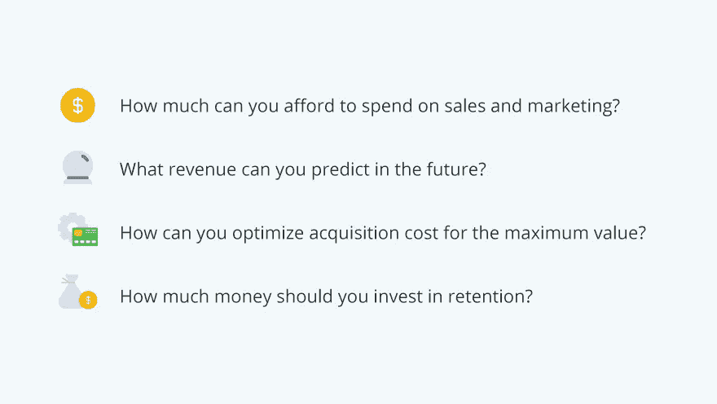

让我们看几个大公司如何采用 CLV 结果的例子。

# CLV 案例研究

早在 2013 年，[消费者情报研究合作伙伴](https://www.fool.com/investing/general/2014/04/21/whats-a-prime-member-worth-to-amazoncom.aspx)估计**亚马逊 Prime** 会员每年在亚马逊上花费 1340 美元，是非 Prime 购物者花费的两倍。基于这一客户终身价值指标，亚马逊开始关注 Prime 用户，并在过去四年中增加了公司的利润。

**网飞**是你应该学习如何计算客户终身价值的另一个好例子。在 2007 年，他们发现一个典型的订户和他们呆了 25 个月，CLV 是 291.25 美元。这有助于他们判断观众是否不耐烦。在分析统计数据后，网飞决定实施在线流媒体。这让会员们在等待新的 DVD 邮件时感到满意。通过这种方式，网飞设法提高了 4%的保留率，并出租了第 10 亿张 DVD。

同样，**星巴克**表明，通过提高顾客满意度，你可以增加终身价值和利润。商业内幕的一项[研究显示，星巴克在收购上的花费不应超过 CLV 平均水平 14099 美元。](https://www.businessinsider.com/lifetime-value-of-a-starbucks-customer-2016-1)

这就是衡量客户终身价值如何改变现实生活中的企业。准备好试试了吗？

# 如何计算客户的终身价值

衡量客户终身价值的方法有很多，具体选择取决于你的资源和业务。我们挑选了五种值得注意的方法来指导你。

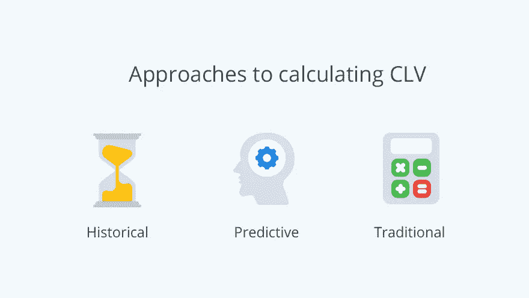

# 计算 CLV 的历史和队列方法

历史方法是基于你的客户在过去购买的总利润。做这个计算并不困难，因为你只需要以前购买的数据。使用历史方法有两种计算 CLV 的方法:确定每个用户的平均收入(ARPU)和使用群组分析。

# 方法 1

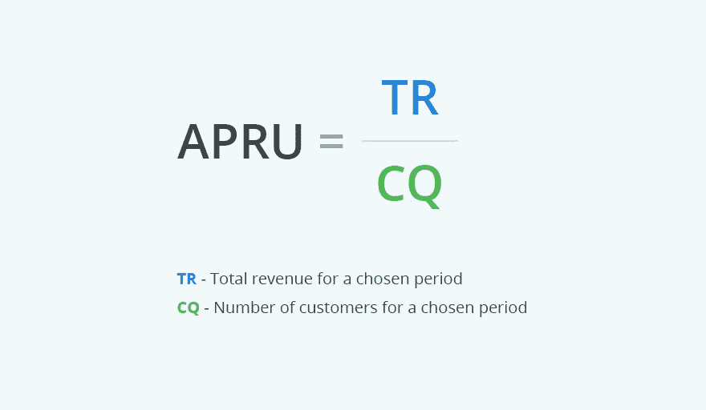

让我们假设 20 个客户在三个月的时间里带来了 1240 美元的利润。

ARPU (3 个月)= 1240 美元/20 = 62 美元

看看这些客户一年后会给我们带来什么。

**ARPU (12 个月)= ARPU (3 个月)× 4 = 62 美元×4 =每位客户每年 248 美元**

历史 CLV 等于一年的 ARPU，根据我们的数据是 248 美元。让我们看看用另一种方法能做些什么。

# 方法 2

群组分析进一步发展了 ARPU 的方法。群体是一组具有相似特征的顾客，他们在顾客旅程中的同一个月进行了第一次购买。使用群组分析，您可以计算每个群组的平均收入，而不是每个用户的平均收入。

以上述示例为例，我们将计算从 2018 年 1 月加入的名为**的客户群和从 2018 年 3 月**加入的名为**的客户群的每月 ARPU。**

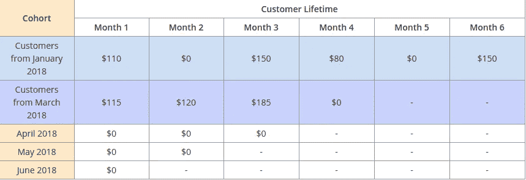

这张表显示每月的购买量不同。假设你的同伴没有那么不同。在这种情况下，三月队列也可能在一段时间内保持沉默。

除了计算 CLV，群组分析还可以帮助你找到忠实客户的数量，通过找到购买下降的点来提高终身价值，并准确评估广告活动的表现。你可以在我们关于群组分析的文章中读到更多。

# 这些方法的缺点是

这两种方法虽然简单，但还是不能用于预测。只有当你的客户有相似的偏好并且在你的公司呆了相同的时间，历史方法才是有效的。他们没有考虑客户行为的变化。因此，如果你的客户改变他们的兴趣和购买方式，这将影响结果。

# 计算 CLV 的预测方法

这种方法旨在对客户的交易行为进行建模，并预测他们未来可能会做什么。它比历史 CLV 更精确，因为它应用了可以预测客户总价值的算法。与过去的购买一样，这种方法解释了顾客的行为。同样，有许多方法可以计算预测 CLV。下面，我们回顾一下最简单的等式。

# 方法 3

别晕了！这是计算 CLV 最复杂但最精确的方法。您需要计算一些指标，并将其代入该公式:

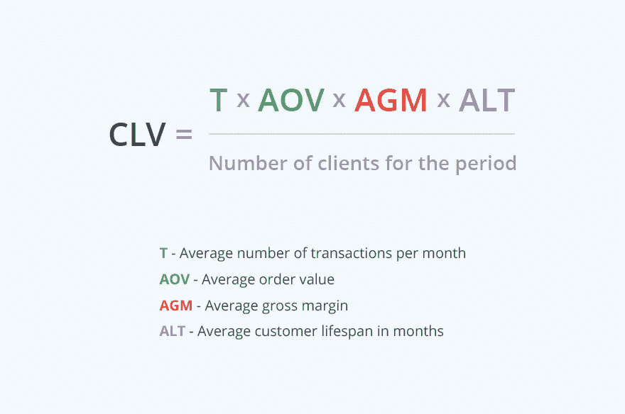

现在，我们将弄清楚如何计算您需要插入该公式的指标。

1.  首先，我们将计算平均事务数(T):

周期:6 个月
总交易数:120
T = 120 / 6 = 20

2.AOV 是订单的平均值，或者说是每份订单的平均收入。

总收入(11 月):12，000 美元
订单数量:20
AOV = 12，000 美元/20 = 600 美元

3.AGM 是平均毛利率，它告诉你每笔销售中哪部分是你的实际利润，哪部分是成本(用百分比表示)。我们需要执行两步计算来获得 AGM。

1.  确定每月的毛利润(GM)百分比:

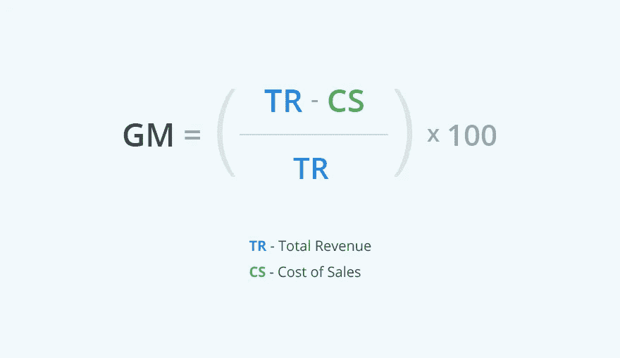

示例:

总收入(11 月):12，000 美元
销售成本:8，000 美元
毛利率(%)=((12，000 美元—8，000 美元)/(12，000 美元)× 100 = 33%

2.让我们用六个月的时间来计算平均值:

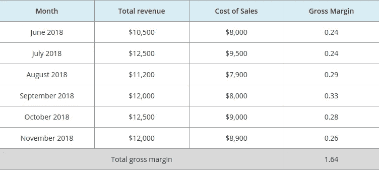

总毛利率:1.64
AGV = 1.64 / 6 = 0.27，即 27%

4.ALT 代表客户的平均寿命，它告诉你一般客户在你的公司工作了多久。

要得到这个数字，请使用以下公式:

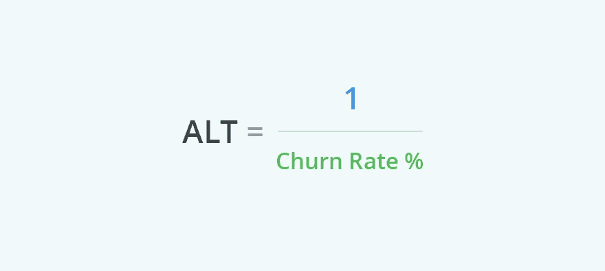

要测量您的流失率，请使用以下公式:

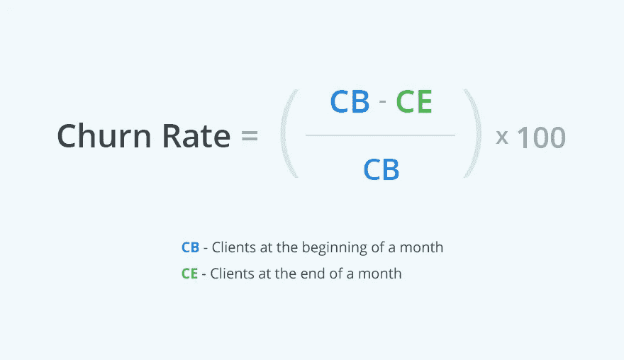

假设你在 11 月初有 200 个客户，在 11 月底有 150 个客户。

流失率(%)=(200–150)/200 = 50/200 = 0.25，或 25%
ALT = 1 / 25% = 1 / 0.25 = 4 个月

最后，我们有了 CLV 预测公式的所有指标:

*   每月平均交易次数(T) = 20
*   平均订单价值(AOV)= 600 美元
*   平均毛利润(AGM) = 27%
*   平均客户生命周期月数(ALT) = 4 个月

**CLV(总计)= 20×600 美元×27%×4 = 129.6 万美元**

现在，我们应该考虑最近一个月，即 11 月底的现有客户总数，它是 150。

**预测的 CLV = 129.6 万美元/150 = 8640 美元**

# 方法 3 的缺点是

尽管这种方法比历史模型更好，但您仍然需要考虑到预测可能会产生误导。我们只是根据月度数据猜测客户寿命。为了得到更准确的结果，你应该根据你的行业和商业策略调整 CLV。

# 计算 CLV 的传统方法

# 方法 4

如果你没有固定的年销售额，你可以依靠传统的 CLV 公式。可以考虑折扣率、单个客户每个生命周期的平均毛利率和保留率。

公式是:

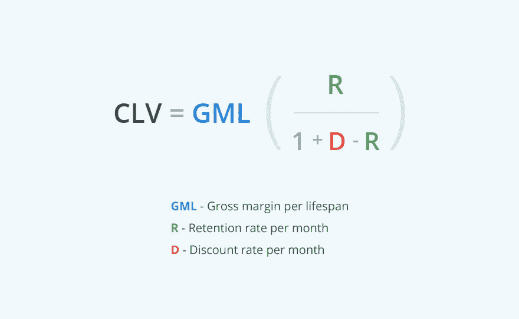

1.  GML 是你在客户生命周期中从他们那里得到的平均利润。

**GML =毛利率(%) ×每个客户的平均总收入**

毛利率:27%(上例)
平均总收入:900 美元(上例)

**GML = 0.27×900 美元= 243 美元**

2.r 是月留存率。

保留率 R 是与前一时期相比，在特定时期内重复购买的客户的百分比。为了计算你的月收入，你需要这些数据:

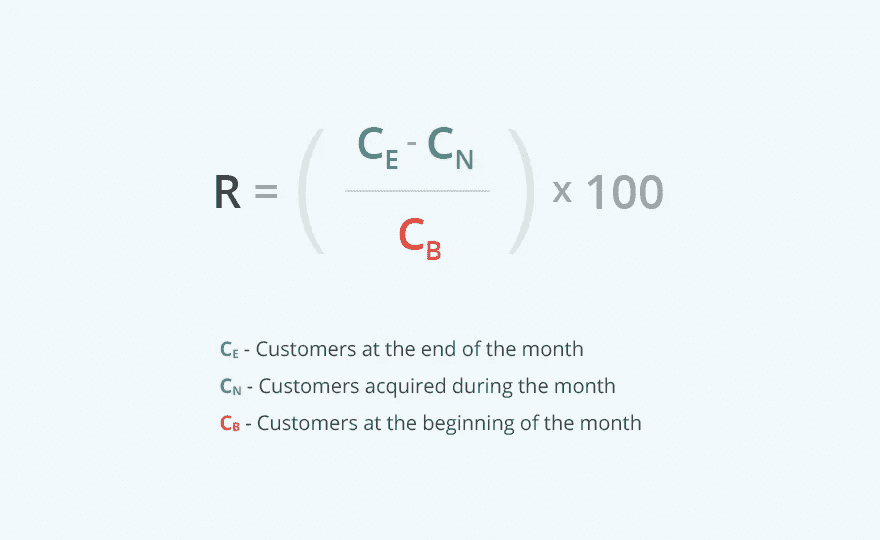

让我们假设在 11 月你有:

CE = 250
CN = 50
CB = 220

r =((250–50)/220)×100 =(200/220)×100 = 0.9×100 = 90%

3.d 是贴现率。我们将接受标准的 10%折扣率。

现在我们有了计算传统 CLV 所需的所有数据:

**CLV = $ 243×(0.9/(1+0.1–0.9))= $ 243×(0.9/0.2)= $ 243×4.5 = $ 1093.50**

这个公式涵盖了特定时期内收入的所有可能变化。为了将通货膨胀考虑在内，随后的每一年都应按贴现率进行调整。

# 谷歌分析中的客户终身价值

许多营销人员使用谷歌分析来跟踪重要数据。该服务提供了一项功能，可帮助您在 90 天的收购期内，通过许多会议的参与度和收入指标来衡量客户的价值。

# 方法 5

谷歌分析中的 LTV 报告可以根据页面浏览量、目标、事件和趋势，告诉你用户在与公司互动的第一阶段的行为数据。基本上，你只需点击按钮[生成一份报告](https://support.google.com/analytics/answer/6182550?hl=en)，谷歌分析就会为你分解。

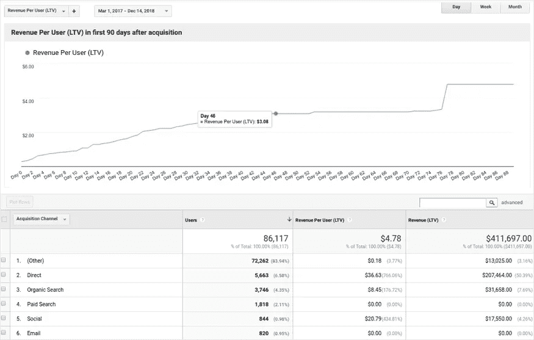

# 需要考虑的事项:

*   这是一个相对较新的附加组件(2017 年发布)，不考虑长寿命。相反，它只根据过去 90 天的情况做出结论。
*   谷歌分析是一个基于 cookie 的平台。如果用户选择退出 cookie 跟踪，他们将从您的数据中消失。
*   Google Analytics 统计所有渠道的潜在客户和订户。这意味着你不会确切知道每个用户花了多少钱。
*   谷歌分析无法清楚地看到哪个客户进行了重复购买。没有办法核实顾客是否花了 100 美元或 1000 美元。

谷歌分析是一个有效的数据收集工具，但计算 CLV 需要真实客户的数据，不能只通过网络指标来完成。

我的 CLV 正常吗？对 CLV 来说没有什么比“正常”更好的了。如果你的生意还活着，任何 CLV 都是正常的。你应该专注于如何在业务发展的任何阶段提高这一指标。如果你想要一个来自上面的信号，这里有一些有趣的统计数据:如果你的 CLV 是你的 CAC 的三倍，那么一切都很好。如果没有，你有很多事情要做来改善这种情况。

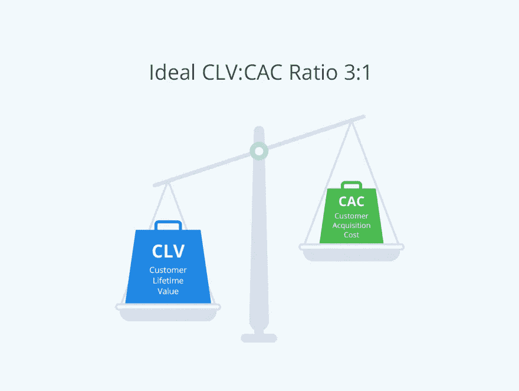

# CLV 完蛋了。下一步是什么？

如果你认为 CLV 有点难，只要努力尝试，计算它，并以对你的业务有价值的见解的形式收获回报。

将您的 CLV 结果与收购成本进行比较，看看您的营销努力是否有利可图:

*   如果 CLV 高于收购成本，由于重复购买或高保留率，你可能处于一个良好的状态。不过解读也要看你所处的行业和毛利率。
*   如果你发现你的成本只占毛利润的一小部分(即低于 10%)，你可能在营销上的花费不够。因此，你可以投资更多来发展。

如果你的 CLV 等于或接近你的收购成本，那就是另一回事了。这意味着你的企业在一个客户身上的花费几乎和它获得的一样多。当你想吸引新客户时，这可能是一种策略。然而，这总是一个警告信号，告诉你你的营销努力是无效的。所以想想提升自己的终身价值吧。一种方法是通过[客户群](https://www.owox.com/blog/success-stories/butik/)使用 [OWOX BI 管道](https://www.owox.com/products/bi/pipeline/google-analytics-to-google-bigquery-streaming/)。

顾客终身价值可以有多种解释。这个标准可以帮助你找到平衡点。你可以算出为了留住现有客户和获得新客户需要投资多少。

为了让你对 CLV 监控可能带来的好处有个概念，看看这些由 [Criteo](https://www.criteo.com/wp-content/uploads/2018/03/Criteo-UK-Commerce-Marketing-Forum.pdf) 提供的统计数据:

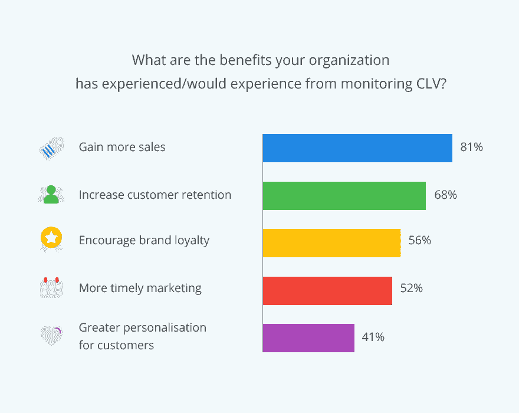

# 一锤定音

当然，为了优化成本，需要考虑许多重要的指标。简单地通过计算终身价值，你可以全方位地改善你的业务。你会从 CLV 的调查中得到如何建立客户忠诚度和增加销售额的想法。如果你让顾客满意，他们会停留更长时间，继续从你这里购买。

来源[https://www . owox . com/blog/use-cases/customer-life-value/](https://www.owox.com/blog/use-cases/customer-lifetime-value/)

## 这篇文章发表在[《创业](https://medium.com/swlh)》上，这是 Medium 最大的创业刊物，有+435，678 人关注。

## 在这里订阅接收[我们的头条新闻](https://growthsupply.com/the-startup-newsletter/)。

