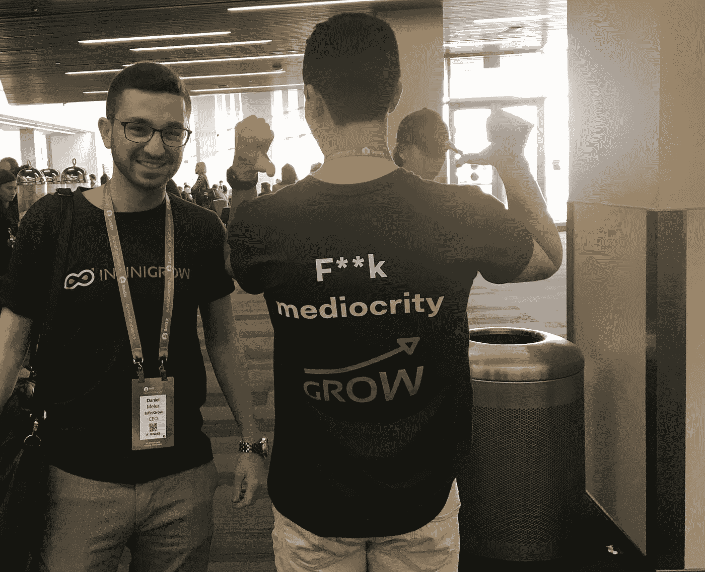
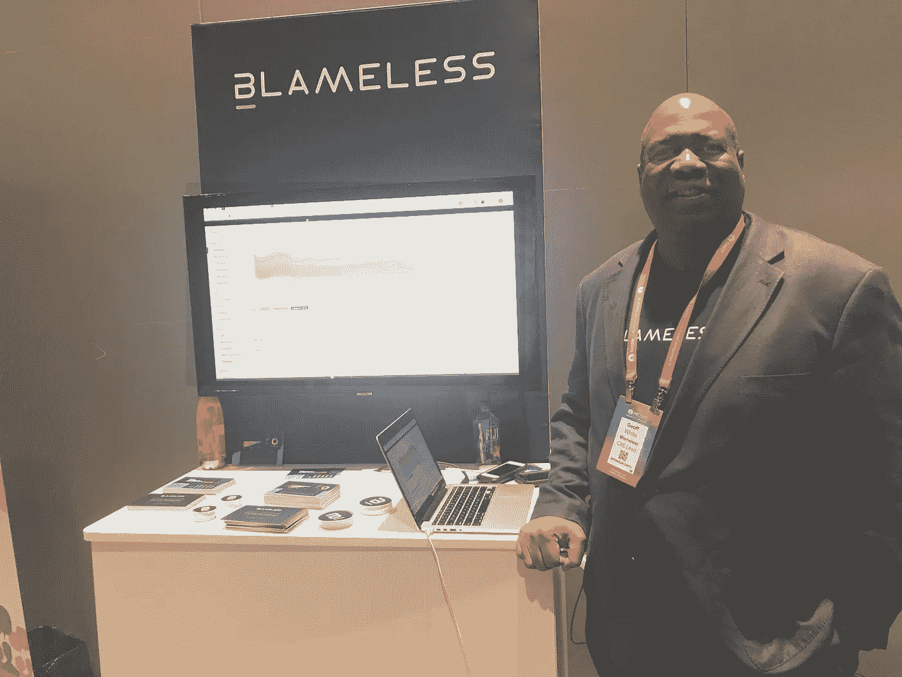
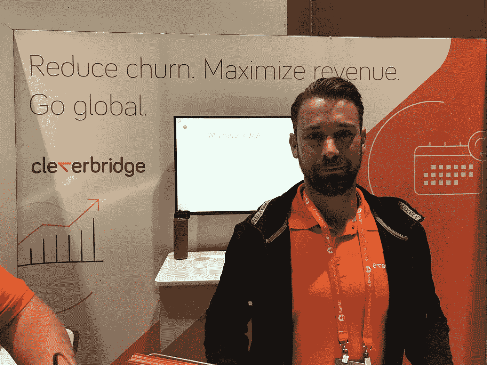
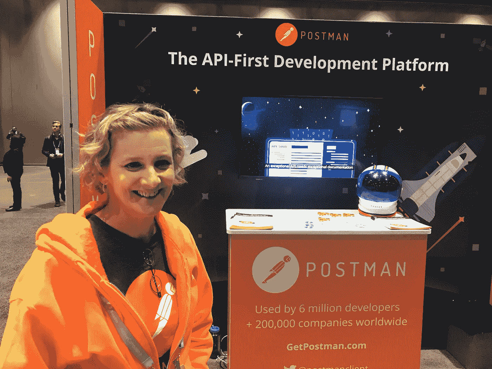
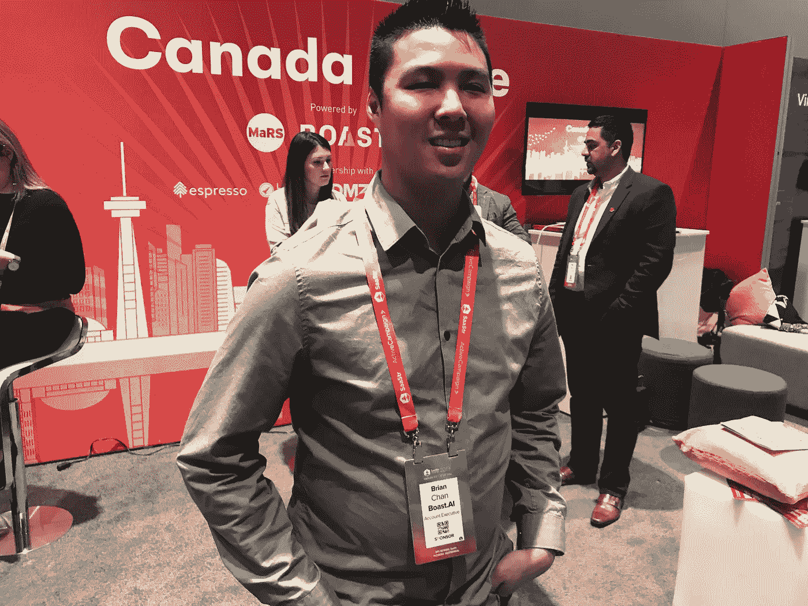
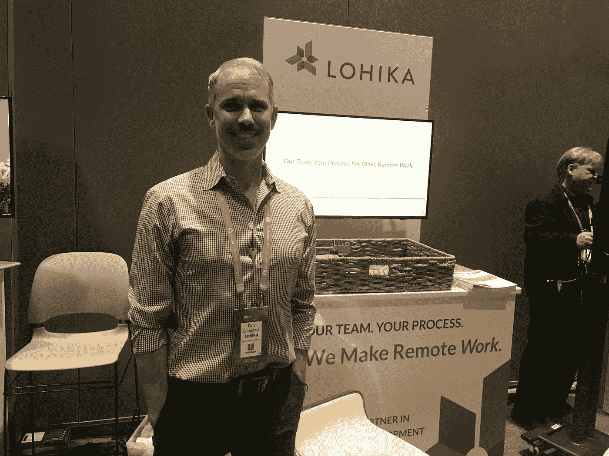

# 我在 2019 年 SaaStr 年会上听到的最好的音高

> 原文：<https://medium.com/swlh/5-standout-pitches-from-saastr-annual-2019-a56aeb24bbb7>

## 5 这超越了“我们是一个做 x、y、z 的 ___ 平台。”

One of the many startup pitches at SaaStr Annual 2019

两周前，我发现自己拿到了一张 SaaStr Annual 的门票，于是我在赞助商区闲逛，聆听 SaaS 大大小小初创公司的推介。

会议室是一个很好的地方，可以用来衡量一家公司的宣传(也叫战略叙事)渗透到了什么程度，因为它们通常由销售、营销和产品人员组成。或者还没有进入这些行列:一位销售代表告诉我，如果我想听一个真正好的版本，那太糟糕了，因为他的首席执行官很快就会回来，他真的很擅长这个。

正如你可能预料的那样，我听到的大多是以产品为中心的描述:“我们是一个做 x、y 和 z 的 __ 平台。”但正如

[Blameless CRE Lead Geoff White](https://medium.com/u/5a3bd01d25cc#1.杰夫·怀特，CRE 负责人，无可指责</h1><figure class=)

[正如我经常说的，一个好的推介不是从你的公司、你的产品或者任何关于你的东西开始的。相反，它始于*客户世界的变化，这种变化创造了机会和风险*。](https://medium.com/u/5a3bd01d25cc#1.杰夫·怀特，CRE 负责人，无可指责</h1><figure class=)

[杰夫遵循这个秘诀，以一个问题开始他的推销:](https://medium.com/u/5a3bd01d25cc#1.杰夫·怀特，CRE 负责人，无可指责</h1><figure class=)

> [你知道无过失验尸吗？](https://medium.com/u/5a3bd01d25cc#1.杰夫·怀特，CRE 负责人，无可指责</h1><figure class=)

[我没有，所以杰夫解释道:](https://medium.com/u/5a3bd01d25cc#1.杰夫·怀特，CRE 负责人，无可指责</h1><figure class=)

> [这是一种网站可靠性工程的方法，谷歌在过去几年里一直支持这种方法，而且越来越多的团队正在采用这种方法。基本上，当出现问题时，如果他们事后不指责，不指责，他们会更有效地恢复和学习。](https://medium.com/u/5a3bd01d25cc#1.杰夫·怀特，CRE 负责人，无可指责</h1><figure class=)

[通过从改变开始——并将其与利害关系联系起来——Geoff 将世界分为获胜的网站可靠性工程师(像谷歌一样，他们不会在事后分析中指责谁)和失败的工程师(会指责谁)。](https://medium.com/u/5a3bd01d25cc#1.杰夫·怀特，CRE 负责人，无可指责</h1><figure class=)

[做到这一点后，Geoff 不再推销产品。相反，他是属于胜利者俱乐部的成员。同样，无可指责的功能不再是脱离实体的能力，而是用来杀死任何想要加入该俱乐部的站点可靠性工程师的障碍的武器。(我在这里写了更多关于以变化开始投球的好处](https://medium.com/u/5a3bd01d25cc#1.杰夫·怀特，CRE 负责人，无可指责</h1><figure class=)[。)](http://I help CEOs align their leadership teams around a strategic story — to power success in sales, marketing, fundraising, product, and recruiting. Clients include teams backed by Andreessen Horowitz, KPCB, GV, and other top venture firms. I’ve also led strategic storytelling training at Salesforce, Square, Uber, Yelp, VMware and General Assembly. To learn more or get in touch, visit http://andyraskin.com.)

# #2.[

Cleverbridge Sr. Business Developer Tarmo Van der Goot](https://medium.com/u/40497e879be4#3.Tarmo Van der Goot，Cleverbridge 高级业务开发人员</h1><figure class=) 

[你如何与一个已经抓住了类别故事的竞争对手竞争？这对 Cleverbridge 和其他与 Zuora 一起参与订阅计费领域的公司来说是一个挑战，Zuora 于去年上市，这在很大程度上要归功于一个简单而强大的故事。(我分析了为什么佐拉的故事适用于](https://medium.com/u/40497e879be4#3.Tarmo Van der Goot，Cleverbridge 高级业务开发人员</h1><figure class=)[我见过的最伟大的销售团队](/the-mission/the-greatest-sales-deck-ive-ever-seen-4f4ef3391ba0)。)

当塔尔莫向我推销时，我告诉他，他的故事听起来与佐拉的相似，他同意了。所以我直截了当地问他:你如何与他们区分开来？

“我喜欢说，如果我们两个都在向同一个客户推销，我们中的一个就不属于这里，”塔尔莫回答道。“我们将变得更轻，实现速度更快，更适合电子商务客户。”

我无法评价这是否属实，但我喜欢 Cleverbridge 已经确定了一个目标受众，它认为自己在实现订阅经济这块乐土上大放异彩。

(我想知道，如果 Cleverbridge 有一个对其目标产生独特影响的新变化，它是否会做得更好——例如，“现在，订阅经济已经进入了电子商务。”)

# #4.Kasey Byrne，邮差营销副总裁

Postman VP Marketing Kasey Byrne

我曾经在 Mashery——TIBCO 现在拥有的 API 管理平台——负责产品营销，我意识到在这个类别中构建一个故事有多难。(至少现在人们知道 API *是什么*——在我混日子里，当我在鸡尾酒会上解释我做了什么时，大多数人只是走开了。)

Kasey 从 Postman 的创始人的故事开始，他厌倦了执行 curl 命令来检索网页，然后为开发人员添加更多功能来构建 API。创始人的故事在推销中并不总是有效，但我认为凯西很好地利用了这个故事来获得信任和建立共鸣。

# #5.Brian Chan，客户经理，自夸. ai

Boast.ai Account Executive Brian Chan

布莱恩的推介从纯粹的产品描述开始——how sause . ai 帮助公司获得研发的税收抵免，这通常需要复杂的文档。

然而，当他提到客户世界的变化时，事情变得更有趣了。

“美国国税局最近将 R&D 税收减免列入了审计触发器的‘十几个黑名单’，”Brian 说。

现在我明白为什么 saush . ai 突然变得重要了。顺便说一下，从改变开始也适用于筹款活动。投资者会想，“为什么以前没人这么做过？”当你开始改变时，他们更有可能嗅到机会。

# 荣誉奖:Tom Scopazzi，Lohika 销售总监

Lohika Sales Director Tom Scopazzi

汤姆·加纳在这里获得了荣誉奖，因为他的推销方法虽然没有遵循我的任何建议，但却帮助[洛西卡](https://medium.com/u/d40fc855fad3?source=post_page-----a56aeb24bbb7--------------------------------)从同类人中脱颖而出，这些人通常试图听起来像他们不是的东西。

“我不打算打扮它，”汤姆说。“我们是一家开发商店。”

尽管如此，汤姆，我敢打赌，我们可以做得更好的变化，股份和应许之地。

**关于安迪·拉斯金:** *我帮助首席执行官们围绕一个战略故事来调整他们的领导团队——在销售、营销、筹款、产品和招聘方面取得成功。客户包括安德森·霍洛维茨、KPCB、GV 和其他顶级风险投资公司支持的团队。我还在 Salesforce、Square、IBM、优步、Yelp、VMware 和 General Assembly 领导过战略故事讲述培训。欲了解更多信息或取得联系，请访问*[*http://andyraskin.com*](http://andyraskin.com)*。*

## 这篇文章发表在 [The Startup](https://medium.com/swlh) 上，这是 Medium 最大的创业刊物，拥有+426，678 名读者。订阅接收[我们的头条](https://growthsupply.com/the-startup-newsletter/)。

